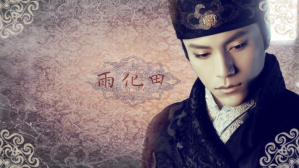

从小到大，周边总有一帮同学、朋友在对武侠剧呈现出无比高涨的热情，而我总是选择避而远之。当毫无兴趣的我在有意无意听那些人谈论经典武侠剧和人物角色之后，充其量只记得什么金庸、小龙女等几个名字而已……

我排斥武侠剧的原因是我无法忍受打斗场面的虚假，我始终无法明白虽然存在轻功，电视里的人为什么可以一直飞那么高；武功高强的人在死的时候会爆炸；两人明明离得很远，为什么运一股气就有那么大的能量；更可笑的是把手放在胸前转几下，贴在人家的后背上还可以传输能量……

我根本无法用所学到的科学知识来给自己一个合理解释，相比之下，还不如去看那些都市生活剧，倒来的真实一些。

hillway有个同事很喜欢看武侠片，只要一有新片上映，就会去电影院里看。前段时候，他邀请我们去电影院看《龙门飞甲》，我丝毫没有兴趣。hillway说那些虚假的打斗不需要理会，这样演才觉得精彩好看嘛。可能是这个原因吧，但是看得时候我还是会“转牛角尖”。

昨晚上，在如释重负之后，同意和hillway一起看他很期待的《龙门飞甲》，我想武打动作片估计也是在不断的演变，有所改进了吧。的确，电影里的武打动作已经没有小时候看的那么夸张，虽然还有一些飞来飞去的镜头，黑风暴里的星空旋转漂移大战让人摸不到边际，也算是精彩了。

自认为这部电影有两大笑点：第一个是李宇春的帽子，就像百叶窗一样，一拉就上去了，真是高科技产品呀，看着太欢乐了。第二个是西厂一个中毒的老士兵服解药，人家都讲了这一包只能解一半的毒，好家伙，一包解药有一大半他都蹭到自己的脸上了。

整场电影下来，感觉这些演员拍戏的时候应该都挺辛苦的。情节上，范晓萱演的宫女真是让人疑惑，之前平平淡淡的忽然变成了卧底，总觉得是为了情节复杂而生拉硬扯，倒不如宫女演到底，与情节也无碍。

江湖是一个神秘莫测的地方，里面有很多的恩怨情仇，武侠们杀富济贫，一腔豪情却又要了断情根，与女主角反复纠结……打打杀杀之余再来些感情戏润色润色，间或说些看上去颇有诗意和哲理的话，以示自己的洒脱和遗世独立，硬生生地把自己逼到一个高高的档次上，下不来又活受罪……

最后，关于武侠剧还有一个疑惑：那些没有组织没有背景，单枪匹马的江湖侠客整天默默跟在人家后面打抱不平，也不去工作，到哪里来的钱维持生计呢？别人赠送的？从那些邪恶的富豪家中弄来的？

