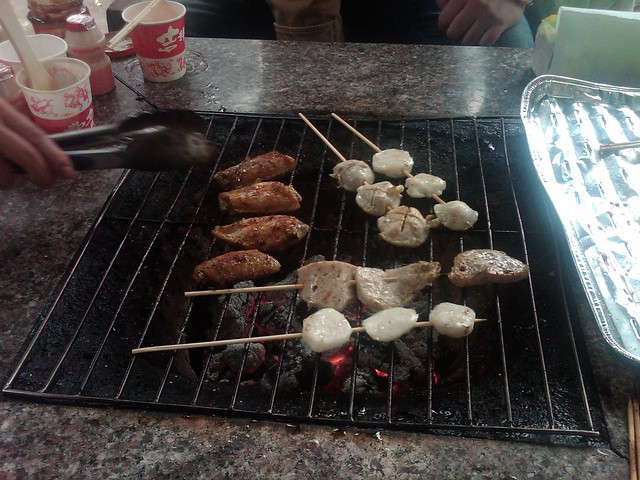
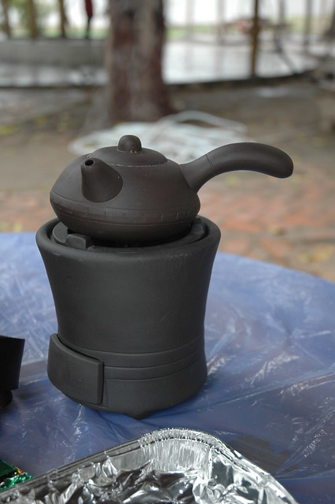
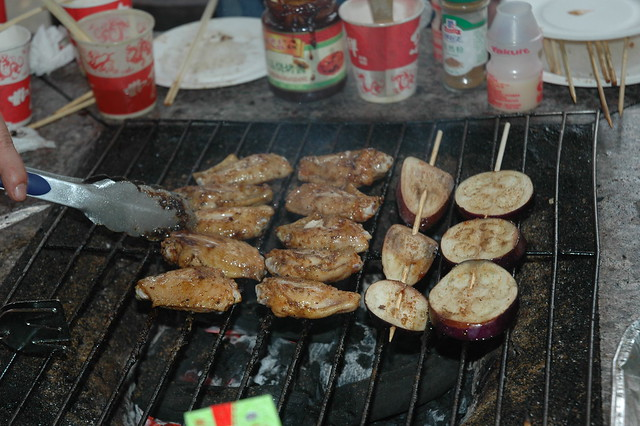
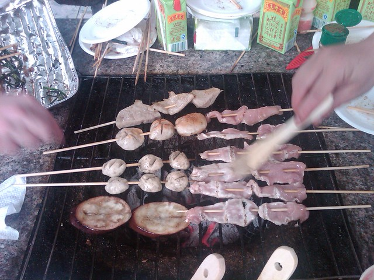
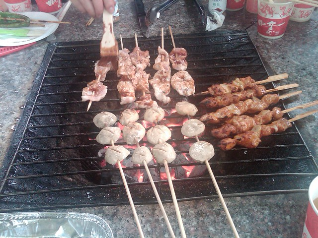
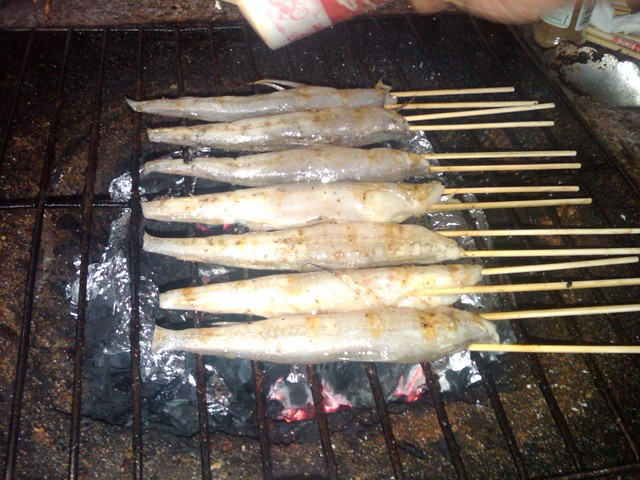

到汕头半年多，平时很少有时间和机会出去玩。这周听同事说他跟领导申请去汕头市农业科技园烧烤，领导同意了，于是我便随大家一同前往。

我们偷着跟那个同事开玩笑：“干嘛不争取在上班的时间去烧烤呢？一周就这么一天假，浪费了。”他很为难的说：“领导已经答应出钱了，再说利用上班时间就不好意思了，要说你们说，我可不说了。”

周日的早上，下着细雨，我坐着漏着小雨的4路公交车前往，下车的时候看见三位男同事已经到了，提了好几兜吃的东西，听说烧烤的食材都是他们提前买回去洗好，切好，自己用竹签一根根串出来的。这么多东西，肯定是不小的工作量。

等到约定的十点，还是还是我们几个人，便先进去了，被看门的拦住，说进去烧烤每人还要买十块钱的门票才行。我们在里面东拐西拐，总算找到地方，环境看上去还算幽雅，虽然今天下着雨，赶上周末，生意还是不错的。

整个烧烤过程我们几乎都没有怎么动手，全由准备食材的男同事承担下来。外套也不穿，露着胳膊不停的忙活。他们开玩笑说，其实他以前就是楼下卖烤肉串的，领导看着还不错，就把他招进来了。

潮汕人很喜欢喝功夫茶，即使出来烧烤也要带着茶具，里面烧着酒精。

烧烤的东西有很多，我们从上午十点多开始烧烤，一直烤到中午领导过来，看着桌上的东西还没有消灭到一半，于是继续烤，他们开玩笑说是要一直烤到吃晚饭的时候，这叫早饭、午饭、晚饭一起吃。

在外面吃烧烤图的是消遣与放松的感觉。听说这里烧烤是计时的，一小时25元，碳是十元一包，大概可以用上一个多小时。要是再算上炉子的钱，那这一天烤下来，费用也不少呢。

到最后，桌上的东西越来越狼藉。

hillway最近一直没有外套可以换，心里满是哀怨，一直盼着周末能买件换着穿。

到下午两点多，我看大家还没有收工的打算，就先走了。坐公交到步行街，等着hillway一起逛逛。

记得研一的时候，组织专业同学和hillway也一起去尖峰山上烧烤过。初春时节，我和hillway认识时间还不长，我坐在他的自行车后面，在城郊的大马路上吹着风，感觉很微妙。

路上遇到一个大下坡，一男生还摔破了膝盖，烧烤的时候他坐着一旁养伤，有其他几个女生烤给他吃。当时烧烤是一个炉子25块，其他都不算钱了。由于我们都没有经验，人又多，不仅烤的很慢，而且比较失败，感觉也没有吃到什么。当时hillway凭着他们班组织烧烤时烤玉米的经验，就在一旁专心致志给我们烤了好多玉米棒子，是那天最好吃的东西了。

后来一算，我们俩人平均下来花了50块钱，连呼不值，从上午买东西到中午又洗又腌，又跑到山上去，折腾的不得了。还不如花50块钱去北门烧烤摊，不用怎么费劲，还可以吃到更多的东西呢。

不过，组织活动，图的主要还是一个形式，一种感觉。
