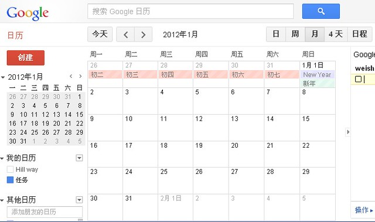
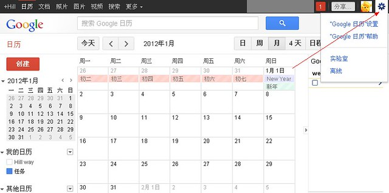
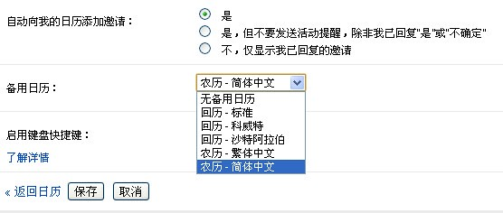

众所周知谷歌日历可以添加其他有趣的日历，比如我的谷歌日历就添加的有“中国节假日”、“农历”和“天气”这几个日历。可是我的谷歌日历中的农历进入2012年之后就没有了，可见下图。（2012年1月2日之后就不显示了）

<!--more-->网上求来的解决办法：

1、点击右上角“设置”小齿轮。

2、进入“谷歌日历设置”。

3、在“基本”设置中的“备用日历”中选择“农历-简体中文”。

这样的话2012年以后的日日夜夜都能显示农历了。
