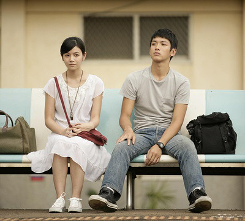

[《那些年，我们一起追的女孩》是Jasmine叫好的电影](http://www.jfsay.com/archives/479.html "那些年，我们一起追的女孩")，就如同她看过《钢的琴》之后的癫狂评价。

> 《钢的琴》是一部难得的好作品，让我看到了一个男人的能耐，过往的时光，永恒的旋律和坚固的友情，勾起了我儿时的记忆，泛黄的景象，苏俄的小调，废旧的工厂……

这几年台湾的电影确实有几部很不错，像[《海角七号》](https://www.jfsay.com/archives/88.html "美丽的海滨，静谧的台南小镇")和[《听说》](https://www.jfsay.com/archives/44.html "甜的忧伤")的青春题材，总能让人看到一股清新的、纯纯的味道，是那种暖日阳光里海风拂面的感觉。

青涩的爱情，中学的顽皮，学习与考试，这其中的每一个都能让人在以后的回忆中心情澎湃，年老时忆起年少时的岁月——青春似火。

那时的爱情，淡淡的纯纯的，像昙花般一闪而过，得与失去都不重要。

我喜欢看台湾的小说和电影，可能也有一种猎奇的成分在里面。想看看那边的生活、学习、爱情以及成长的样子。当然也可以看到精美的繁体字和竖排版的书。

我所看到的这部电影是删节的版本，好生生的东西被肢解的破碎不堪，看过之后马上到网上找些删节片段用以补充，这样才看得出作品的全貌。

这些年会想起那些年，那么这些年又会在何时被忆起呢？
