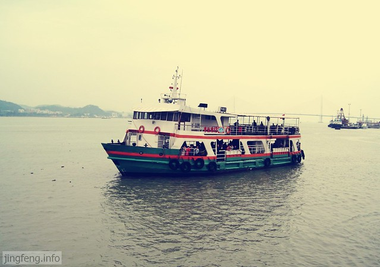
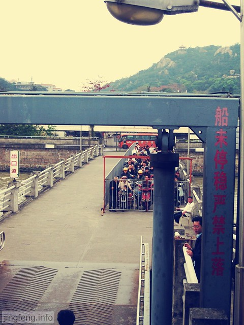
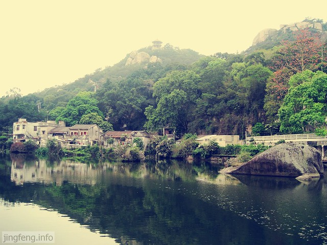
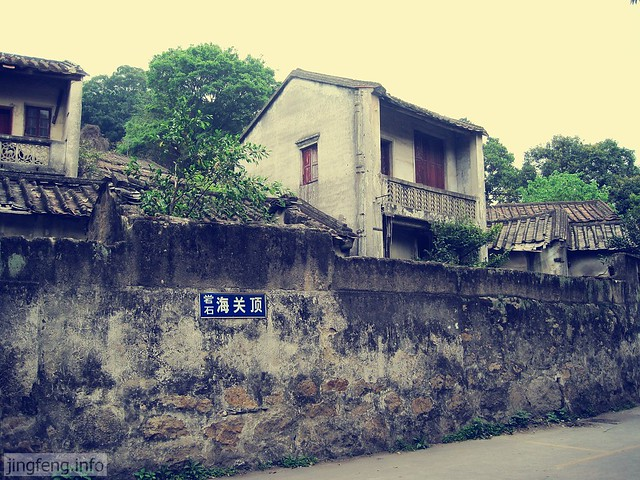
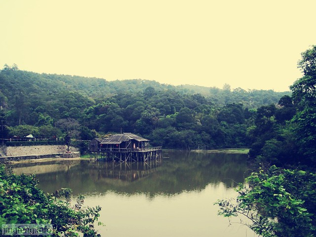

阳春三月，对于出行的渴望也与之俱来。想来想去，汕头除了几个公园，和正在架桥的南澳岛，也没有什么能吸引人的去处。如此想来，更想念在浙江读书的日子了，周边的旅游资源多丰富呀。

hillway提议去礐石风景区看看，称作考试之前的放松。 我对礐石的风景并没有抱很大的期望，平时我总是故意将礐石读成dang石，hillway说好像把人家念的很淫荡。

今天天气阴阴的，上船前还滴了几雨。我倒是觉得第一次坐轮渡挺新鲜，拿着相机拍呀拍。今天是清明节，迷信的潮汕人免不了抱着贡品和鲜花准备祭拜祖先保佑他们发大财。

<!--more-->一楼大多是骑着摩托车的人们，二楼有好多排椅子可以坐人，还有一个老头拿着碗在挨个乞讨。

礐石轮渡站到了，栅栏外等待上船的人们。

当走在林荫道上呼吸着大自然的气息，还是很惬意的。

沿路有一些老房子。不知道这个海关顶和海关有什么关系。

一座建在水上的房子，像是苗家的吊脚楼。

