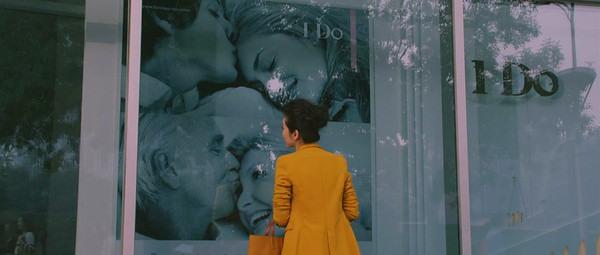

《我愿意》和[《失恋33天》](http://www.jfsay.com/archives/439.html "失恋33天")都像是迎合当下成年人的感情现状，拍给剩女们幻想一番的童话，情节和去年的《单身男女》类似，两个优质的男人都争着赶着去追一个多年单身的优质剩女。被男人追的感觉多好呀，何况是两个，何况是两个优秀的中年男人？套用《夫妻那些事儿》里的一句话：“中年男人就像是一块温润的玉”让人难以抗拒。

《我愿意》上映有好长一段时间了，一直没有看，看了两眼宣传片就估了4—5分。知道hillway是不会和我一起看这种类型和档次的电影的，于是在一个人的下午，翻出来打发时间，不知是因为期待太低还是李冰冰的演技有所长进，加上孙红雷恰到好处的表演与台词，让我觉得看电影的时光也是一种享受。整个电影看下来没有什么让人反感的东西，虽然有大量明显的广告植入。比《失恋33天》好看，也比《窈窕绅士》好看。
