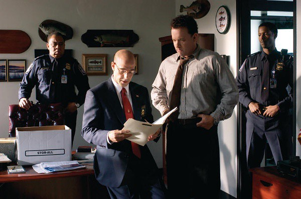
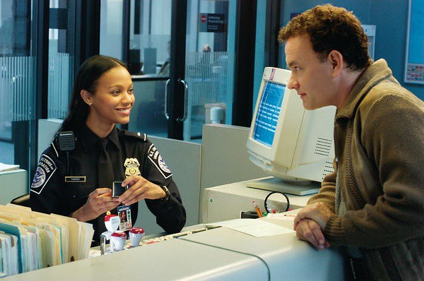

如果《幸福终点站》这个电影放在我读高中的时候看，必定会振奋感动一番。看完豆瓣的评分和介绍，期待的不得了后来又失望的不得了。

这部电影拍的像童话一样，虽然男主角在展现种种设计建筑才华之后没有赢得甘做人小三的空姐的芳心，显示出生活不能尽如人意的现实残酷性出来。好在经过艰苦而漫长的等待之后，男主角在一个不费吹灰之力的晚上，伴着爵士音乐，完成了父亲多年的遗愿。

我将它称作童话，不是因为令人温暖的完满结局。而是电影为了人物塑造与情节发展将偌大的美国肯尼迪机场变成管理与运行体制不健全、唯有最高领导人唱反调的一场戏，过度放大个人力量和人心的现实。

男主角因为祖国发生政变，身份证、护照等失效，签证也无法再使用，根据美国肯尼迪机场负责人弗兰克的安排，只好待在机场等待两国重新建立关系，在此期间不得迈入美国半步。我不了解美国的相关法律，假设这种安排是唯一的解决方法，男主角在机场9个月的时间里，有些故事总觉得不合理。

例如：刚到美国的男主角操着保加利亚语，与人交流十分困难。经过一番学习，英语也能运用自如。一个偌大的国际机场没有保加利亚语的翻译，这也就算了。

后来一名俄国乘客乘客情绪很激动，拿着刀具要做出过激行为。由于语言不通，机场连俄语翻译也没有，负责人只好叫男主角帮忙。原来是这名乘客从加拿大购买几瓶给父亲治病的药品，因为飞机降落在美国，而他没有开具美国方面要求的购药许可证，机场负责人按规定要求扣留药品。后来出于同情，男主角编造药品并不是给他父亲而是给山羊治病用的，砖法律的空子帮助那名乘客带走了药品。

我不禁想问，美国的法律操作如此随便吗？那么多机场的工作人员就凭借男主角一句“在俄语中山羊和父亲的发音类似”这种空口无凭的说辞就放走一批药品。工作人员难道都不用去核实两种名词的发音和药品的真正效用吗？即使听不懂，总归看的出吧，倘若给山羊治病，怎么会情绪那么激动，又是跪地乞求又是寻死觅活呢？如果这样的话，所有的人都可以随意携带药品并声称是给动物用的。设置这样的空当，真不相信一个国家运行很多年的法律法规会这样不健全，爬到领导岗位的人智力水平也太低了。

接下来的事情就更夸张了，机场里所有商店里都贴着男主角手掌的复印件并向他表示崇高的敬意。当男主角即将迈向美国国土的时候，各个商店里的打工仔们都跑出来欢送他，还赠送了很多贴心的小商品。虽然我对人心没有产生绝望，但是也不会热心到如此疯狂的程度吧，大家有什么理由都去这样做呢。

不能理解的情节还有很多，机场清洁老头为了男主角得到一张明星签名而不惜放弃现有工作，回家接受六年牢狱之灾；下属会违背上司的命令与相关规定放走一个无他无关的人；一位负责办理签证手续的美女工作人员竟然会嫁给机场的后勤人员，拿到中国就相当于一名国家机关公务员嫁给同单位的没有编制的勤杂工，而他们之间几乎没有直接接触，全靠男主角每天跑去柜台传话……

这些情节真是够让我想不明白的。

