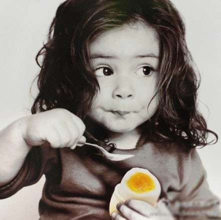

上小学那会儿，到了放暑假，小蜜瓜有时候带着我去亲戚家打牌，我在旁边无事可做，就跟着比我大好多岁的表姐们去舞厅玩。上个世纪九十年代，我几乎去遍了小县城的所有舞厅，在昏暗嘈杂的角落里，负责给几个表姐占座和看包，一边吃着东西一边看那些大人扭屁股。

后来升了初中就再也没有去过了。

再后来上了大学，记得大一的元旦，班里组织联欢舞会，听说租了一家舞厅，就是学校对面。去到一看，真是简陋呀，白墙水泥地空荡荡的一间屋，四周摆放了一排排凳子，角落里一台笨重的电视机和旁边的两个话筒不知道沉睡了多久，屋顶上的几个电灯泡很明亮，显得房间更空旷。

那时班委想着大家从紧张的高中生活过来，大概不怎么会跳舞，担心冷场。因此在舞会之前的一个月，每天晚上组织班里同学去大操场，借着远处宿舍楼的灯火，近乎黑灯瞎火的学习适合在舞厅跳的舞，一个自告奋勇的女生站在最前面，地上摆着放音乐的步步高复读机。学来学去，虽然小时候在舞厅里待得时间挺多，到后来也就只学会了左右踢腿的兔子舞。

可想而知，那天的舞会上，除了最后的兔子舞我上去蹦了一会儿，其余的大把时间我都坐在一旁嗑瓜子，看班里为数不多的男生邀请比较赏心悦目的女生跳交谊舞。

大三的时候，换了一个很个性的辅导员，做了很多让我们匪夷所思的事情，只干了一年就走了。记得也是元旦的时候，他组织全班去学校后门的一家KTV，除了几个自我感觉良好的麦霸撑场，我们大多数人还是在一旁嗑瓜子。当时挺羡慕班长和团支书的歌喉，国语粤语歌都很拿手，听说他们经常和领导老师应酬，又在社会上有些兼职，一来二去所以就很熟练。

再后来去浙江读研，刚入学的十一假期里，响应专业同学的要求，组织去KTV唱歌，当时男女比例1:10，所以我就打电话给人叫他多叫几个男生过来。后来来了四个男生，hillway便是其中的一个，这也是我们第一次见面。

因为这个是我组织的第一次集体活动，所以比较紧张，担心哪点会不周到，担心气氛不热烈什么的。我和小胖胖把这几个男生接到楼上以后，专业一女生上去和hillway打招呼，握了握手。之后hillway看到旁边的我，对我笑笑，伸出了手，我也就握了上去，感觉他的手掌很宽很大，凉凉的。其实这是我第一次和男生握手。

后来hillway挺不乐意承认我们第一次见面是在KTV包厢，他宁愿是图书馆或是英语课什么的，听起来也比较纯情浪漫一些。

本来我就不怎么会唱歌也很少唱歌，所以整个活动下来，我忙来忙去也没有唱上两句。还是很羡慕那些会唱歌的同学，心里感觉有些自卑。小胖胖看出我的伤心事，一天中午，带着我去骆家塘的KTV对我进行单独训练，当时她为我选了一首歌，叫做《明月千里寄相思》，我几乎对着屏幕反复唱了两个小时，这是我第一次鼓起勇气在KTV里唱歌，旁边小胖胖一直在耐心讲解与鼓励我。最近看到一句话，说的是：“世界上没有哪一个人必须对你好，必须在乎你的心情。所以要格外珍惜那些对你好的人。”其实这些年，我一直不擅长唱歌，大学里很会唱的朋友也没有怎么去理会我自卑的心情，也许大多数时候仅仅把你当做听众，喜欢看你羡慕表情罢了。虽然那一次我还是发挥不好，心里很不满意自己的表现，但是心里一直很感激小胖胖为我做的这些事情。

再后来，出去唱KTV的次数多了，或是我和小胖胖，或是我们和hillway，或是专业同学一起，慢慢的也能唱上一两首，比如小胖胖觉得我发挥的还好的梁静茹的《暖暖》，或是被hillway超难听的《大头皮鞋》、《小李飞刀》片尾曲折磨耳膜。但是一群人在一起的时候，我还是在角落中听着几个麦霸自我欣赏地唱着。她们觉得，既然大家一起出钱，不多唱两首不就亏大了？于是也不管自己跑调不跑调，难听不难听，一个劲的把自己的歌优先、优先……一直优先到玩倦了，才想起其他人，装模作样的用手指着她们说：“你说你们，既然来了就一起唱呀，你们老是坐在这里有什么意思呀？都不见你们点歌呢？”其实人家点歌了，只是都被你们一直优先到最后一页去了。

时间过得真快，跟着hillway来汕头差不过一年的光景了。hillway前前后后跟着同事去了N次KTV，他回来以后，我就故作哀怨的说，人家来汕头这长时间都不知道这里的KTV长什么样子呢。

月初正好看到KTV团购，按照预约的时间，周末我们吃过午饭，揣着两瓶可乐和两个鸭梨就屁颠屁颠地去了。两个人在一起唱歌，完全是一种放松，这一次唱歌的感觉和效果比以往都要好，不仅有幸听hillway一展歌喉，再现刘德华和周华健的风采，同时自己也慢慢摸索出比较一些容易唱的歌。

我觉得自己超没有音乐天赋，唱歌要么上不去要么不在调上。经过一段时间的经验积累，通常我会尝试一些听别人唱起来比较好听的歌，比如说小胖胖平时在KTV经常唱的梅艳芳《女人花》、张信哲《莫莫莫》、 陈淑桦《滚滚红尘》、陈慧娴《飘雪》等。个人感觉，虽然新歌比较好听，但是实际唱起来，还是这些经典老歌的旋律比较好把握一些。而且小时候那些熟悉的曲调，现在细细品味其中的歌词，发现有很多的经典的语句，放到今天仍旧很有道理，能激起大家的共鸣。

除了经典老歌，还有一些比较容易唱的歌。比方是那些非专业歌手半路出家的，或是网络歌手的歌，相对难度会比较低一点。

个人总结下，这些都是比较好把握的：王菲《红豆》，梁咏琪《爱的代价》《短发》，莫文蔚《盛夏的果实》《广岛之恋》，刘若英《原来你也在这里》《为爱痴狂》《知道不知道》《当爱在靠近》，梁静茹《暖暖》《瘦瘦的》《可惜不是你》《儿歌》，梅艳芳《女人花》，陈慧娴《千千阙歌》《飘雪》，邓丽君《我只在乎你》等等，其他还有《和你一样》《浪花一朵朵》《挑花朵朵开》《不是因为寂寞才想你》《花好月圆》《樱花草》《追梦人》《大海》《水手》《哭砂》《笔记》《心雨》《荷塘月色》《套马杆》《军港之夜》也比较容易。

hillway由于普通话不标准，平舌音和卷舌音不分，唱起同样普通话不标准的刘德华的歌来倒是很有味道，比如刘德华的《练习》《冰雨》《世界第一等》《笨小孩》《中国人》《忘情水》，周华健的《忘忧草》《刀剑如梦》《让我欢喜让我忧》，周传雄的《黄昏》《男人海洋》《寂寞沙洲冷》，吴奇隆《转弯》，张国荣《倩女幽魂》，黄品源《海浪》，姜育恒《梅花三弄》等等都挺不错的。
