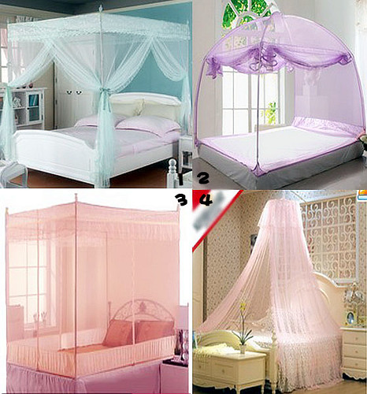

不想被蚊香熏的脑袋晕晕，就跟hillway提议还是买蚊帐吧。许久不买蚊帐，到网上一看，已经不止是蚊帐，配购的还有支架。

记得小时候，那时候家里挂蚊帐，要么是站在椅子上往墙上钉铁钉，要么就是找来竹棍绑在四周。现在改进的确实比以前方便很多，价钱也涨上去了，少则几十多则几百。看来看去，目前网上卖的无外乎这四种类型。和hillway纠结了一番，最终选定了第一种。

遥想四年前开学时，hillway仅仅花了五个大洋，就买回来两顶蚊帐的日子一去不复返了。

当时，hillway兴匆匆的拿回买来的蚊帐，用洗衣粉洗的白白香香，乘着下午的阳光，晒干净之后，又仔仔细细地将两顶蚊帐挂起来。我问他为什么买两顶呢？他说，因为小菜菜没有蚊帐，要是他一个人挂蚊帐，那些可恶的蚊子就会全叮小菜菜一个人了，多可怜呀。

后来据小菜菜在我们专业口述，他当时回寝室感动得不得了，差点没有把持住就想着嫁给hillway了。又说要以hillway为榜样，做一个体贴心细的好男人。从此hillway摇身一变，成为专业皆知的榜样人物。

到第二年暑假来临的时候，不知是本性使然还是因为之前收到鼓舞，hillway又将去年收好洗好的两床蚊帐挂了起来。就这样，读研的几次暑假，回到宿舍的小菜菜轻松享受着没有蚊叮虫咬的夜晚。当我把这个故事讲给小蜜瓜听的时候，她表示十分惊讶。

再后来，临近毕业，小菜菜的蚊帐在三年之后已是历经沧桑，千疮百孔。好在hillway的小蚊帐虽然布满岁月的痕迹，但也算完整，后来又被我五个大洋卖出去喽。
