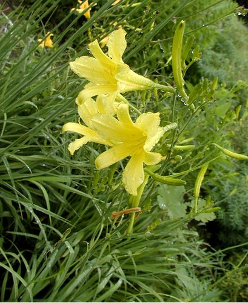

早上看微博，有人说忘忧草和黄花菜是一种生物，起初还不太相信。两个名字一雅一俗，怎么也联系不上呀。

想想周华健要是唱：“黄花菜，黄花菜，忘了就好，梦里知多少……”该有多搞笑呀，这首歌意境马上就没有了，不知道的还以为他肚子饿了，想吃我们家楼下的滑肉汤了呢。

上网查了下，原来真的是这样：

> 黄花菜学名Hemerocallis citrina Baroni，别名萱草、忘忧草、金针菜、萱草花、健脑菜、安神菜、绿葱、鹿葱花、萱萼。

虽然得到佐证，但是还是很疑惑，这两种名字品味差距很大呀，再看“忘忧草”的由来：

> 据《诗经》记载“焉得谖草，言树之背”。古代有位妇人因丈夫远征，遂在家居北堂栽种萱草，借以解愁忘忧，从此世人称之为“忘忧草”。吴中书生谓之疗愁。嵇康《养生论》云：“萱草忘忧”。历代文人也常以之为咏吟的题材，苏东坡曾赋日：“萱草虽微花，孤秀能自拔，亭亭乱叶中，一一芳心插”。白居易诗云：“杜康能散闷，萱草解忘忧”。

大俗即大雅呀，全在于文人怎么给它取名啦。新鲜的时候，虽然长得有些小家子气，但可以观赏，再然后可以食用，特别是放在滑肉汤了，味道特别好，有了这么好吃的东西，一切烦恼忧愁都忘光光啦。

好想回家吃滑肉汤呀，等呀等，等到黄花菜都凉喽。

