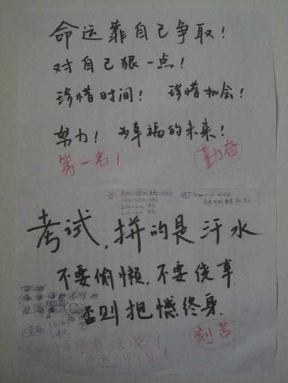

hillway说：“这次机会可谓是千载难逢，写个口号贴在墙上，你学习的时候多抬头看看，不要偷懒。”

“你这一说，我想起以前备考南师大的时候，自己也写了口号贴在桌前的。”

“哇，你写的是不是：南师大的猛男们，我来啦！”

“哪有，我才没有那么色，写的都是努力奋斗什么的。对啦，你不会写的是：苏大的靓妞们，我来啦！”

估计一般的口号对我刺激不够，就合计着要写点比较“猛”的。hillway提议搞个对照表，比如说“现在：周六无偿上班，节假日缩水；以后：周末双休，按时放假；现在：无社保无公积金；以后……”

“这样写的话太多了，一页纸都写不完。”

“那你就写：看看辛酸的现在，想想美好的未来。或者是：努力奋斗十几天，幸福美好一辈子。”

“恩，这两句对我来说不够刺激，没有多少激励的效用。”

后来，我们想了想，各自写了一篇口号，贴在墙上。

