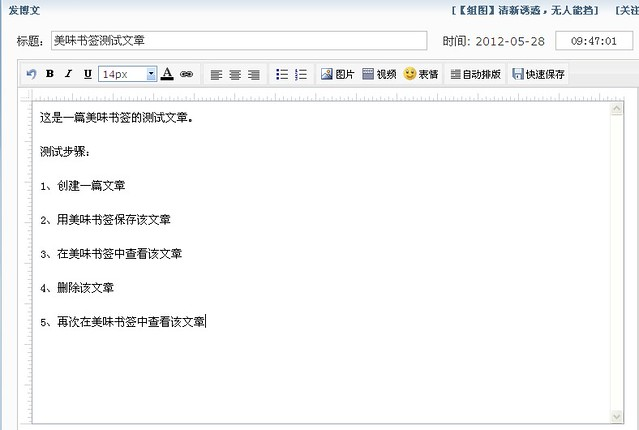
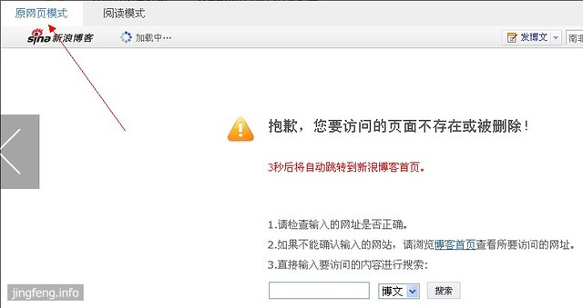
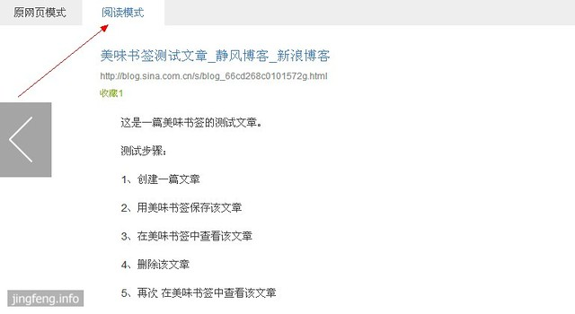

美味书签可以方便地保存网页内容，只需简单地点击书签栏中“收藏到美味书签”的书签按钮。但是保存的网页内容是否永久保存是我关心的问题，因为使用美味书签的初衷是进行信息管理，如果千辛万苦收集到的网页被删除而无法访问，那真是个让人头疼的问题。所以我做了一个简单的测试。

测试的步骤是：

1、创建一篇文章

2、用美味书签保存该文章

3、在美味书签中查看该文章

4、删除该文章

5、再次在美味书签中查看该文章

按理说，上述步骤的1、2、3步是没问题的，不然谁还会用它？

下面我先随便创建一篇简单的文章

然后做2、3、4步，都没有问题，下面来看第5步。在美味书签打开所保存的文章书签，确实出现了问题——文章被删除了。下面就是展示效果，请注意这是在“原页面模式”效果中打开的。它的旁边不是还有个“阅读模式”吗。

那么我点击“阅读模式”来看看，哦，保存的文章一下子又回来了。

从以上的小测试可以看出，美味书签是可以永久保存网页的文章信息（即使原始网页被删除），当然包括图片和视频等内容，不过前提是它们本事还存在。
