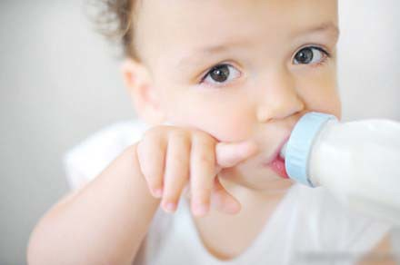
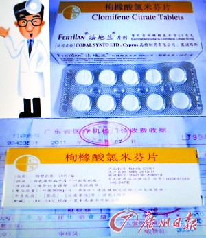
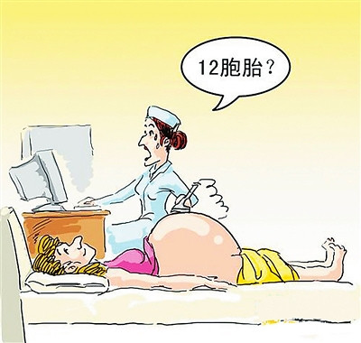

以前，总觉得生孩子这种事情距离自己很遥远，甚至觉得不要孩子也没有什么关系。不知是因为近来结婚之事摆上议程，还是年龄渐长的缘故，每天傍晚下班回家，看好多家长抱着宝宝在小区玩，总是忍不住会多看几眼。

逢年过节，亲戚聚在一起吃饭，长辈们总是以过来人经验，告诫晚辈一定要生第二胎，没钱没条件也要趁着年轻赶紧生，等到年纪大了就会很遗憾。不知出于何种原因，那些表姐表哥们好几年都无动于衷。虽然我不能体会一个孩子或两个孩子带给家庭的意义，听着多了，未婚女竟然也有些生二胎蠢蠢欲动的念头。作为独生女的我和有一个妹妹的hillway说：“国家规定双方是独生子女可以生二胎的，你尽浪费我的指标。”他说，也许等几年就可以了呢。

>  广东2011年3月向国家申请“单独子女”生二胎试点，至今尚未正式收到批复。省计生委一名工作人员昨日表示获批的几率不是很高。8月7日，广州市人口计生委表示，由于广东省的试点申请尚无结果，原计划成为广东省试点城市的广州也无法进行试点。近日，广州市长陈建华到广州计生局调研时则表示，计生政策的口子不能轻易开。

这条新闻算是打破了我和hillway的期望。转念一想，两个还没有结婚，没有生过一个孩子的人，现在瞎操心什么生二胎的事情呢？

上午，家里长辈又在群里讨论起生二胎的事情，坚持生二胎的夫妻有些并不是为了儿子。我想起前段时间《一个计生委主任的失独之痛》的报道，64岁的李建荣是石家庄一家大型国有企业的计生委主任。不但擅长做别人的思想工作，而且自己带头响应国家号召打掉了已经怀孕的二胎。如今，当李建荣成为失独者后，她感到了老无所依的恐惧，后悔当初没生二胎。如今计划生育下421的家庭结构，一旦失独，作为父母又如何度过漫漫老年生活呢？计生政策是否可以做出相应调整呢？

可能我的思想比较传统，总觉得作为女人守着稳定清闲的工作，拿着固定工资，以家庭为重就好了。人生路上长时间伴着自己的，最贴心的还是家人。一向不赞成为了工作舍弃家庭的做法。外面工作再风光，回到家中一片凄凉，也算不上幸福完满。

一些有勇夫妻偷偷或明摆着违反计划生育政策，生了二胎，甚至三胎四胎，随你们罚钱。但是有些单位，就不是罚钱那么简单，甚至会开除工作，失去饭碗。相信很多人都羡慕生双胞胎的家庭，不仅一下有了两个孩子，还不违反计划生育政策，想着要是自己能生出双胞胎该有多好呀。

但毕竟双胞胎是小概率的事情，可遇不可求。而一种俗称叫做“多仔丸”的药物似乎给广大群众带来“福音”。

前些年第一次听说“多仔丸”源于梁洛施和李泽楷，也听到关于“多仔丸”是是非非的争议，当时也没有在意。上午，群里一长辈说，他小区有卖法国进口的，没有毒副作用，准生儿子，12元一板，谁需要可以代买。这到底是什么药理呢？好奇就在网上查了一下。

> “多仔丸”实名为“枸橼酸氯米芬”或“克罗米芬”，针对有排卵障碍的女性治疗使用，但必须有专业的使用疗程，且须严格根据处方才能购买。通常育龄妇女每月只能排出一个成熟卵子，但服用促排卵药物后可一次排出多个，如果同时受精，就会形成双胎或多胎。但是，如果健康女性以多胎为目的滥服促排卵药物，因体质各异，排出的卵子甚至可能达到十几二十个，若不加控制会导致严重后果。所以，即使在治疗排卵障碍的患者时，医生也会严密监测卵泡数目。盲目服用，最直接的影响就是过度刺激卵巢，使卵巢过度膨胀、雌激素明显上升，引发代谢异常。甚至会出现胸水、腹水、肝肾功能损害等，严重者可能因为颅内血栓致死。

虽然医生这么讲，但总有胆大心切或知之不多的人愿意一试。各种报道扑面而来，有欢天喜地顺利生出双胞胎儿子的，也有意外怀上五个后来病变或无一存活的。众说纷纭，不过主流意见还是坚决抵制，禁止服用。看到服用“多仔丸”的案例，就仿佛在看一场场的赌博，赌上产妇的健康，也赌上多个孩子的健康和未来，没有事情倒也罢了，要是生出几个不健康的孩子，可是一辈子还不清的孽缘呀。

在当下，还是安安心心得一健健康康的孩子吧。在计划生育体制下，随缘吧。
