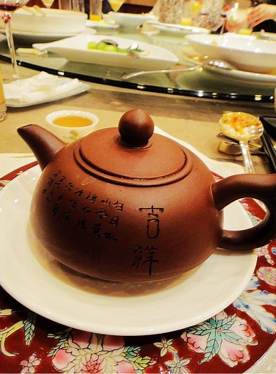

五月初，听报社同事用一种提起领导就自然迸发出来的崇拜与景仰神情告诉我：他爹这周日晚上要摆生日宴，退休前是位有文化的局长，一生清廉。不过，接下来的时间，我仍旧做着原来的手头工作，只见同事楼上楼下，似乎将工作内容转移到生日宴的筹划上来，拟写主持稿等等。间或见有贺电发来，不知他们具体忙些什么。

周六下午，全体开会，还有去年参加年会的他家侄子和女友。领导吩咐各自在生日宴的职责，很高兴地展示一些自认为生意上很有头脸而我根本没听过的人物送来的生日贺礼。说是一场生日宴，倒不如说是场小型年会。家事按照公事办，带着商业目的，总觉得味道怪怪的。不过借此机会也可一举两得，或许是自己头一回参加生意人的宴会吧。

最后一个说到我，工作内容是看场，具体点就是帮忙看同事的包不被拿走，因为大家到时候会很忙来回走动顾不上。说完大家都笑了，我也觉得很好笑。

记得刚来的时候，领导除了讲起这里广阔的发展情景，还说很锻炼能力，可以开阔眼界之类。领导说的没错，报社确实有些发展前景，不过是对于他而言的，现如今都四十多岁，不知道全靠他维系的报社能撑到什么时候，不知道当他干不动的时候，那两个比他小一二十岁的女人做何打算；其实这也是一个很锻炼人的单位，采访联络甚至大型年会的筹备，都会让人有所收获，但是真正接触外界能到锻炼的总是主编和那两个女人组成的三角。

如今已过一年时间，不知是出于对能力的怀疑还是对我知之不多的性格顾虑，每天，我除了每天坐在电脑前敲敲打打，一整天说不了一句话，看着同一张脸。再也没有接触过多余的人。就算有些长进，也是自己慢慢按照工作要求，从网上借鉴别人稿件，在整合中领悟到的。有时候想起在电视上看来的一句“谢谢领导的栽培”，想想自己，就觉得很荒诞。我几乎从未得到过提点，也从未参与过报社内部的事情，就像一个局外人。

不给我安排其他工作，竟然还在辞职的时候说，去了新单位恐怕我也胜任不了在办公室与人打交道，在他这里整日坐在电脑前是最好不过。

我回忆一遍，每天按照要求写稿，是因为年会没有参加？所以就叫我看包？其实在未提出不去北京之前，具体年会安排中，给我的职责是看管仓库。这个工作有什么要求呢？不限年纪不限文化不管聋哑都能做。听年会回来的人讲，他们除了经常晚上九点开会到凌晨三点，无规律的工作与作息，还有不被认可的委屈。

明明可以胜任其他工作的却只能守着锅台做菜或者搬货卸货购置物品，明明大半是自己的功劳却被有心计的人抢了甜头。虽然领导存在对低学历的歧视，但是也不排除貌美与心机对于学历的取代。抱怨归抱怨，但总会各自找到平衡点。我想，除了不得已，其中总归还是有甜头的，至少年会后继续做的人是这样的。

周日下午两点半，按照要求的时间来到报社，其他人已经过来了。美编说他上午十点就被叫来了，周六晚上到很晚才回家。他平时很少说话和议论报社，也不知道整天想着什么，就和那两个女人一样令人难以捉摸。但是又总是被叫去参加针对主编的议论聚会。

我无事可做，只好打开电脑上网，某人依旧忙的楼下楼下跑。等到五点半，有辆车把我们带去酒店。看座位表，我被安排在最后一桌，里面还有两个新来的，一个辞职过来帮忙的，司机和平时帮忙做杂活的。而另外几个同事被分在主席台旁边与嘉宾同坐的那一桌。

在角落坐定，同事们的包都交给我，他们各自忙去了，我无聊地翻着手机看，间或看看他们在调试音响和摄像机，沟通宴会演出的歌曲节目，或是接待嘉宾。终于等到七点，本以为可以上菜，结果特意请来的没有什么名气的主持人上台开始讲话，读一些贺电。我不太清楚这边宴会的习俗，想着不会先看晚会再上菜吧，等来等去肚子不是很饿呀？还好，过了十几分钟就上菜了，看旁边人动筷，我也开动起来，除了龙虾和小汉堡，现在记不清那天都有些什么菜了，加起来总共也就七八盘的样子吧，分布在转桌边缘，中间都空着。不像我们老家先是一圈凉菜，再是几圈鸡鸭鱼肉，炒菜炖汤火锅一应俱全，一圈圈堆成小山。虽然安排给两个新同事的座位空着，可是没有几下也就没有东西吃了。幸好后来每人上了大碗很粘稠的稀饭，吃完以后，便有了饱腹感。在我们那里，从来没有喜宴上叫人家喝稀饭的，连米饭也不会上，最多是生煎包或是小甜点。

吃到这里，估量着进行的差不多了。其中还穿插着唱歌、念贺信、展示贺礼和现场题词。不知是因为他爹确实低调还是身体缘故，一直没有上台露面。再看看其他的同事，整场下来几乎一直是站着的。本来生日宴是一场家宴，结果所有杂事全都交给员工来做，忙里忙外，自家人乐得清闲，吃的悠然。要说摄像、展示礼品、调配音响这些事情就算了，就连接待和送来宾的事情也交给员工来做，从开始到结束他们没有吃一点东西，倒是我这个负责看包的坐着半步不动，虽然当时对这个安排有些不满，但后来想想也挺有好处的。至少吃着热菜热稀饭，不用等到人走光了，狼吞虎咽吃各个桌上的剩菜。

喝完稀饭。服务员给每人上了一套茶壶和茶杯，我想，潮汕人真是爱喝茶呀，宴会上还要品品工夫茶。后来倒入茶杯中，见上面飘起一层油，打开茶壶盖一看，里面有几块肉，原来是鸭汤。这种喝法还是头一回看见。

最后，熄灯开始吹蜡烛，由酒店人员分蛋糕到各个桌上。过一会儿，服务员上了盘水果，几乎没有人动，大家开始散去。我也没有吃的欲望，稀饭加奶油蛋糕，真管饱。

