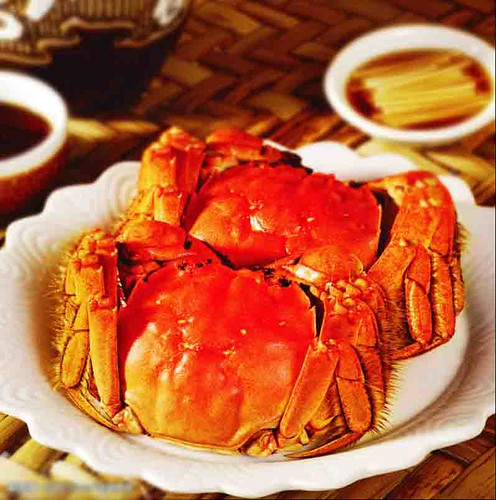

李渔很喜欢吃蟹。在《闲情偶寄》之《饮馔部》谈到了品尝食材的心得，其中有一篇专门写螃蟹的文章。开篇以蟹为命，足见喜爱程度之深�?
> 予于饮食之美，无一物不能言之，且无一物不穷其想象，竭其幽渺而言之；独于蟹螯一物，心能嗜之，口能甘之，无论终身一日皆不能忘之，至其可嗜可甘与不可忘之故，则绝口不能形容之。此一事一物也者，在我则为饮食中痴情，在彼则为天地间之怪物矣。予嗜此一生。每岁于蟹之未出时，即储钱以待，因家人笑予，即自呼其钱为“买命钱”。自初出之日始，至告竣之日止，未尝虚负一夕，缺陷一时。同人知予癖蟹，召者饷者皆于此日，予因呼九月、十月为“蟹秋”。虑其易尽而难继，又命家人涤瓮酿酒，以备糟之醉之之用。糟名“蟹糟”，酒名“蟹酿”，瓮名“蟹瓮”。向有一婢，勤于事蟹，即易其名为“蟹奴”，今亡之矣。蟹乎！蟹乎！汝于吾之一生，殆相终始者乎！所不能为汝生色者，未尝于有螃蟹无监州处作郡，出俸钱以供大嚼，仅以悭囊易汝。即使日购百筐，除供客外，与五十口家人分食，然则入予腹者有几何哉？蟹乎！蟹乎！吾终有愧于汝矣�?

> 蟹之为物至美，而其味坏于食之之人。以之为羹者，鲜则鲜矣，而蟹之美质何地？以之为脍者，腻则腻矣，而蟹之真味不存。更可厌者，断为两截，和以油、盐、豆粉而煎之，使蟹之色、蟹之香与蟹之真味全失。此皆似嫉蟹之多味，忌蟹之美观，而多方蹂躏，使之泄气而变形者也。世间好物，利在孤行。蟹之鲜而肥，甘而腻，白似玉而黄似金，已造色香味三者之至极，更无一物可以上之。和以他味者，犹之以爝火助日，掬水益河，冀其有裨也，不亦难乎？凡食蟹者，只合全其故体，蒸而熟之，贮以冰盘，列之几上，听客自取自食。剖一筐，食一筐，断一螯，食一螯，则气与味纤毫不漏。出于蟹之躯壳者，即入于人之口腹，饮食之三昧，再有深入于此者哉？凡治他具，皆可人任其劳，我享其逸，独蟹与瓜子、菱角三种，必须自任其劳。旋剥旋食则有味，人剥而我食之，不特味同嚼蜡，且似不成其为蟹与瓜子、菱角，而别是一物者。此与好香必须自焚，好茶必须自斟，僮仆虽多，不能任其力者，同出一理。讲饮食清供之道者，皆不可不知也�?
在李渔看来，好的食材是不需要添加很多的调味料的，烹饪要发挥出食材本来的香味。如果是因为加了很多种调料才可口的话，那也不算是好的食材。蟹的味道鲜美，最好就是清蒸了，端上桌来，色泽橙黄，非常诱人，难怪有人会说“蟹肉上席百味淡”�?

记得之前看电视剧《红楼梦》演到甄士隐请贾雨村吃蟹，用到了很多的工具。那时我才明白，为什么自己吃蟹时候又咬又啃，牙都痛了，还没有个所以然来。关于吃蟹的工具，有“蟹八件”只说：

> “蟹八件”是品蟹的必备之物。蟹八件包括小方桌、腰圆锤、长柄斧、长柄叉、圆头剪、镊子、钎子、小匙，分别有垫、敲、劈、叉、剪、夹、剔、盛等多种功能，一般是铜铸的，讲究的是银打的，造型美观，闪亮光泽，精巧玲珑，使用方便。螃蟹蒸煮熟了端上桌，热气腾腾的，吃蟹人把蟹放在小方桌上，用圆头剪刀逐一剪下两只大螯，将腰圆锤对着蟹壳四周轻轻敲打一圈，再以长柄斧劈开背壳和肚脐，用钎、镊、叉、锤，或剔或夹或叉或敲，取出金黄油亮的蟹黄乳白胶粘的蟹膏、雪白鲜嫩的蟹肉，一件件工具的轮番使用，一个个功能交替发挥，好像是弹奏一首抑扬顿挫的食曲。当用小汤匙舀进蘸料，端起蟹壳而吃的时候，那真是一种神仙般的快乐�?> 
> 据说，晚清时期苏州阊门有一个富商嫁女，嫁妆有一百二十抬之多。发妆的前一天，人们把所有嫁妆配置装饰好，顺次摆放在街上，作一次检验。在围看嫁妆的人们的夸赞声里，却有一个工匠说：“嫁妆九十九样，再添一样‘蟹八件’就百全百美了。”富商是个食蟹迷，二话不说就让这工匠连夜赶制“金蟹八件”。第二天喜日，这一抬书写着“飞黄腾达”的蟹八件，在男家被围观，引起了轰动。一传十，十传百，于是到了民国年间，蟹八件就成了许多苏州女儿的嫁妆之一�?

除了清蒸，在浙江读书时，餐厅经常还有蟹炒年糕的做法。在濠江还吃到生腌的螃蟹，听说还有“潮州冻蟹”一说�?
> 宴上客者势难全体，不得已而羹之，亦不当和以他物，惟以煮鸡鹅之汁为汤，去其油腻可也�?> 
> 瓮中取醉蟹，最忌用灯，灯光一照，则满瓮俱沙，此人人知忌者也。有法处之，则可任照不忌。初醉之时，不论昼夜，俱点油灯一盏，照之入瓮，则与灯光相习，不相忌而相能，任凭照取，永无变沙之患矣�?

