这篇文章是个流水帐，只是记录下在厦门三天两夜的活动内容吧。

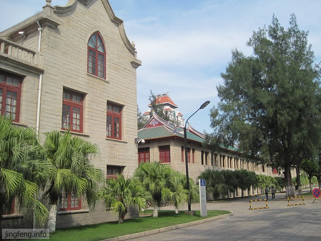

**第一天：厦门大学  普陀寺  中山路步行街**

早上七点半的汽车，大概十一点到达厦门。出了湖滨汽车站，坐上了去厦门大学学生公寓附近的公交车，顶着烈日，想找一家比较经济实惠的旅店，四处转悠，询问好多家，均在百元之上，连声感慨厦门物价之高，就合计先解决午饭然后再继续寻觅。午饭后，在曾厝垵一条极似鼓浪屿民居的小巷中，找到一家普普通通的旅馆，好在未到开学的时候，我们最终以蛮实惠的价钱搞定了周五和周六两个晚上的住宿问题。

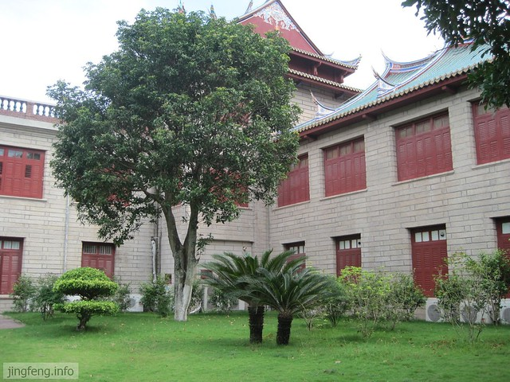

hillway说：“时间宝贵。”虽然旅店很凉快很舒服，还是收拾收拾出门了。先是游览厦门大学，在公交上看到了大家提到的环岛路，还有店门口摆放的多人自行车。大海沙滩椰子树的确很漂亮。厦门大学不仅毗邻环岛路、胡里山炮台和普陀寺，而且建筑风格很独特很有味道。最让我神往的是他们的宿舍楼，想象在阳台上看风景的时候，风景和看风景的人肯定都很美。

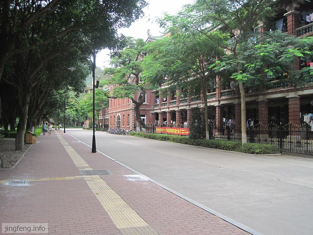

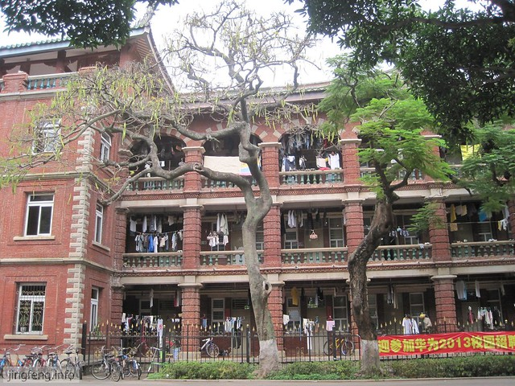

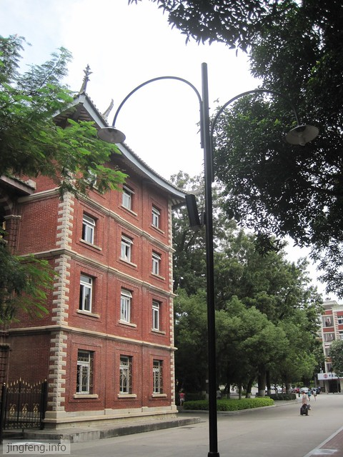

逛完厦门大学，拿着导航手机的hillway把我带到了普陀寺的门口。每次当晕头转向的我被hillway七拐八拐带到目地的的时候，迷茫的心就开始崇拜起他来，觉得那会儿就是他最帅的时候。

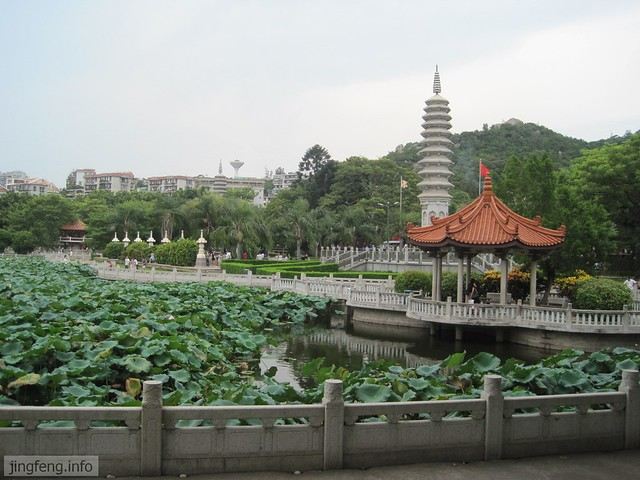

普陀寺好像是一个分界。从开始对寺庙完全不感冒的状态一下子过渡到想烧柱香拜上一拜。也许因为我经历了太多次的偶然，开始相信了仿佛冥冥之中的注定。

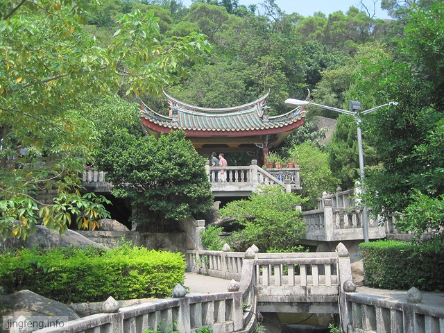

在普陀寺，我们喝光了所有的水，不知是因为太累还是因为中午的菜太咸。肚子也饿了，hillway提议去厦大餐厅解决晚饭问题，可是餐厅只能刷卡，又没好意思借学生的饭卡来刷。于是走着走着，就从厦大西村站出来了，去对面的妙香扁食填报了肚子，端着被喝光汤的扁食又加了一碗汤，真是太渴了。

网上有人推荐晚上适合去厦门中山路步行街，看公交路线没有几站，就提议直接走路过去，就当是饭后消化。结果我们仿佛走了一站又一站，走了好久还没有走到。hillway说：“我们是在用脚丈量厦门吗？”

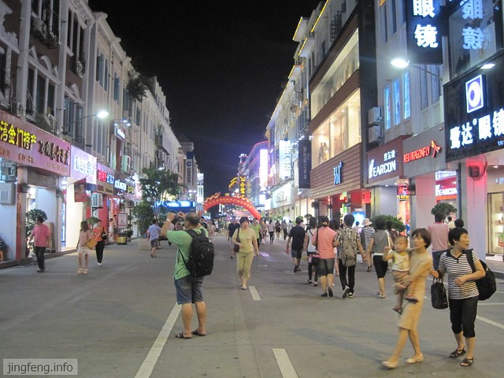

思明南路的大生里有很多店铺，让我想起了汕头外马路那边的骑楼，风格很相似，只是汕头的太古老太破旧，仿佛是一位风烛残年无人问津的老人，随处可见“危房勿近”的字样，公交车唯恐颠簸到危楼也绕行了。

终于找到了所谓的中山路步行街，感觉和思明南路的店铺也没有太大区别，都是各个城市普遍能见到的各种品牌专卖店，只是没有车辆经过罢了。有购物需求的游客可以有所收获，对于我们两个观光客来说只是走马观花，没有特别的感觉，只是渴的厉害，脚板有些酸疼，心里有些内疚不该叫“穿小鞋”的hillway和我一起走这么远的路，为了省那一点点公交费。

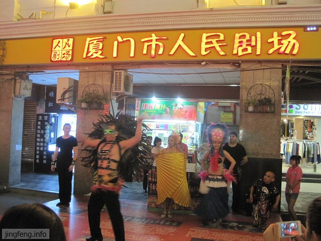

为了保存体力，迎接第二天去鼓浪屿的重大任务。八点多，我们坐上了回旅店的公交。在厦大白城站，有很多人下车去海边玩，只感慨厦门的治安真好，都将近九点还有人刚出来玩。在汕头，天一黑，我和hillway就呆在屋里不出门了。

**第二天：鼓浪屿  环岛路**

这次去厦门，其实主要是奔着鼓浪屿去的，因此特地安排了一整天的时间。虽然昨晚全身酸疼，很累很头晕，但是洗了热水澡，一觉醒来似乎体力全都恢复了过来。

坐轮渡是很兴奋的，虽然在汕头坐过一次。这次大概五分钟左右就到对岸，如果上轮船二楼需要多加一元钱。

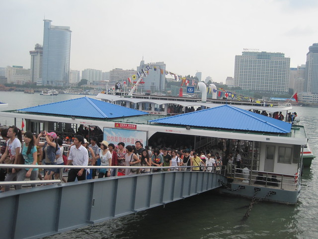

鼓浪屿空气很清新，花花草草树树木木，一定要备好驱蚊水、风油精之类。一天时间，我们的两条腿被叮了好多好多的包，特别是坐下休息的时候，用掉了半盒万金油。

之前在网上看到关于鼓浪屿的图片，拍摄对象往往只是一些小物件，小花小草，虚化了背景，弥漫着小资复古的调调，给人以浪漫精致的感觉。但是，在岛上，两个俗人用着最普通的相机，却拍不出那种美感，只有普普通通。

虽说和想象中不同，但也算很有特色，值得一去。

之前看有人建议，鼓浪屿适合悠悠闲闲逛上两天，待上三天也不为过。然而，实际上，就像我充分准备却只用半天时间就逛完了深圳世界之窗的角角落落一样，我和hillway拿着在轮渡入口五块钱讨价还价买来的鼓浪屿手绘地图，在午饭后基本就结束了行程。

想想又有些不甘心，中午吃的鱼丸粗面和海蛎煎分量很少，很快就饿了。

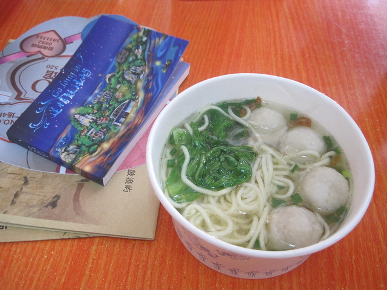

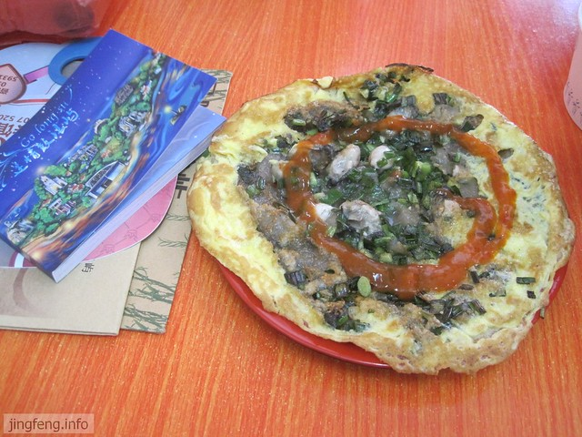

于是，hillway带着我去了岛上的麦当劳餐厅，点了汉堡薯条可乐一堆大吃起来，消磨了两三个小时的时间。

我说：“感觉好浪费在鼓浪屿的时光呀，麦当劳哪里都有，坐在里面感觉都一样，应该找个有鼓浪屿特色的地方坐着，才不算浪费这时间呢。”hillway说：“那去哪里坐着呢？逛的也差不多了，也没什么动力了。外面这会儿又很热，还是在里面吃点东西补充体力。这些是用优惠卷买的，便宜了好多钱呢。去外面随便找家店也没有这里划算呢。”

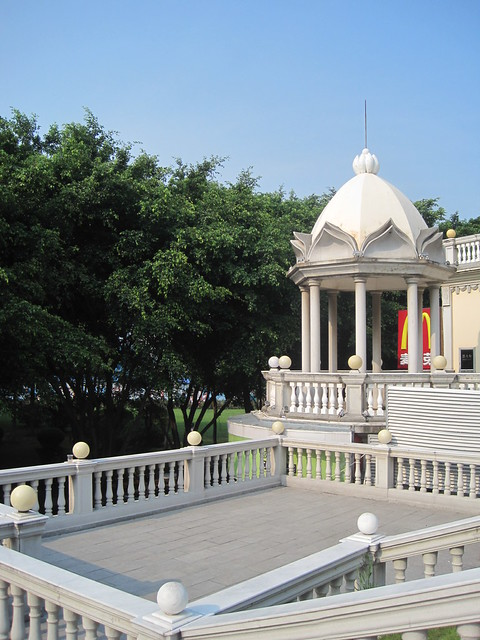

说的也是。歇息到四点多，我们出了麦当劳，看见还有一些旅游团刚上岛，就跟着走了，想着之前自己逛的说不定会漏掉一些景点。我们选择了一位声音洪亮的胖导游，其实也没有太多的导游词，她的团里是清一色四五十岁大腹便便的男人，像是官员的样子。他们的行走速度很快，几乎都没有在商业街一带停留，我们稍一不留神就被落下一大截。跟着跟着，走进一条比较偏僻的路，我对hillway说：“他们好像很有钱的样子，不会晚上直接住在岛上吧，我们跟到旅店门口，岂不是还要自己找路回去呀？”

结果只是在酒店门前小驻片刻就往前走了，走着走着就进了一个收费的小院子。我们没有办法再跟进去，就接着往前走，又看到一片海。

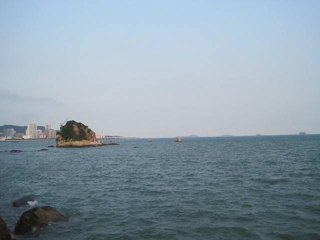

还以为是上午经过的沙滩，风景又有些不一样。下午的时候，有好几对新人在这里拍婚纱照，还有一些人在海里游泳，再往前走，看到一处标志，写的是“大德记泳场”。兜了一圈，又回到轮渡口，歇息一会儿，在商业街快速游荡一圈就回去了。

我本来不想买盖章本的，hillway很不好意思的望着老板不停的降价，只好出七元钱拿了一本。有些看到的店铺却在盖章本里找不到，盖章本里的有些店铺又找不到。hillway笑着说：“难不成我们买到盗版的啦。”

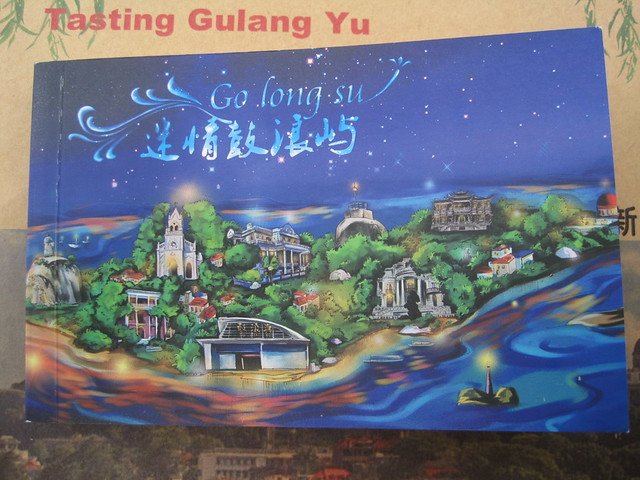

有些店铺把印章放在外面，印泥快风干了，蛮期待盖上去，拿开不过是一层看不清的红晕。让人觉得失望又愤愤；有些放在店铺最里面，大概是吸引人家来购物吧；还有一些写着标语“本店无章”、“本店印章损坏”、“印章在门口处，不要再一遍遍问了”等等。盖章本虽然用处不大，对购物兴趣不大的我来说，也是一种逛店的动力。

可能一天吃的东西比较杂，又喝了好多海风，肚子隐隐作痛，有些恶心，就想回去了。

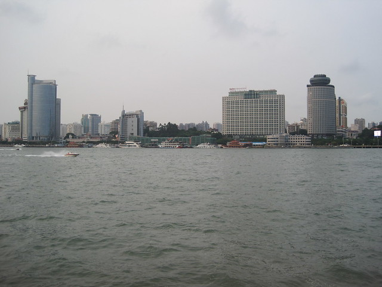

公交走到厦大白城站，感觉好了很多，肚子也不饿，就下车一起去沙滩坐坐，有卖麦芽糖和冰糖葫芦的从身边经过。之前有人建议去环岛路骑车之类，皮肤黑黑的我虽然有着情不自禁对大海的喜爱，却也算是怕上了海边的阳光，在夜晚吹着凉凉的海风，聊聊天也很不错。

望着对面朦朦的灯光，hillway问我那边是哪里？我说：“是台湾吧，因为网上介绍说在胡里山炮台可以看到台湾岛的。”他白了我一眼，掏出手机搜索地图，原来对面还是厦门，台湾还远的很呢。

本想在沙滩上写点字拍下来，可惜光线太昏暗。肚子有些饿，就回去了，在周边小饭馆吃了宵夜，开始为第三天的行程苦思冥想起来。

**第三天：厦门大学  普陀寺**

连续两天的游玩有些疲惫，一时又想不出再去哪里里转悠，干脆一觉睡到了十点半，吃了饭，收拾收拾就退了房。

联系好下午四点的汽车回汕头，还有几个小时的时间。不想去海边晒太阳，也不愿意再去鼓浪屿，对公园和大街也没有多少兴趣。商量一下，就从厦门大学里面悠悠哒哒到再次去了普陀寺。穿着短裤跪在硬邦邦的木台上，努力不让自己在相机里像第一次看上去那么“猥琐”，被hillway嘲笑好像期待被佛祖艳遇一样。上香之后，我们就一起沿着山路一直爬了上去。

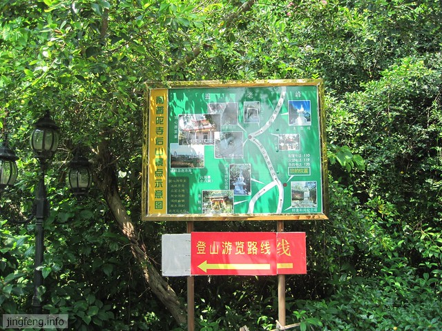

之前和hillway一起爬了几次山，学校后面的尖峰山，大佛寺，还有汕头的龙泉岩。沿途没有什么风景好看，不仅无趣又很累，总想半途而废。大概是因为南普陀的山不高，或许是因为开发成熟，环境卫生，竟然没有放弃的念头，反而比hillway爬得快。

大汗淋漓的时候，从山间林从吹来阵阵清风，很凉很舒服。

爬到一处平台上，鸟瞰厦门大学的风景，豁然开朗，赶紧拍了几张照片，摆起姿势留影来。

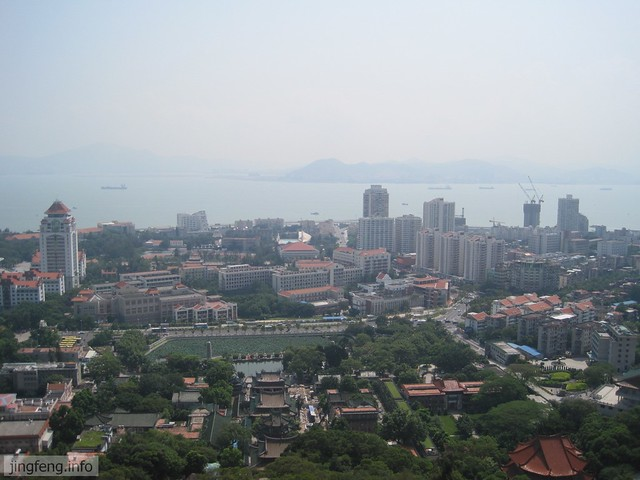

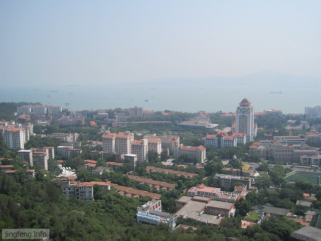

时间不早了，我们坐上公交去海天宾馆门口等汽车。乘着间隙，hillway提议去对面的妙香扁食匆忙吃了晚饭，心里担心误了汽车耽误了第一天上班，吃起来也没有第一次那么香了。

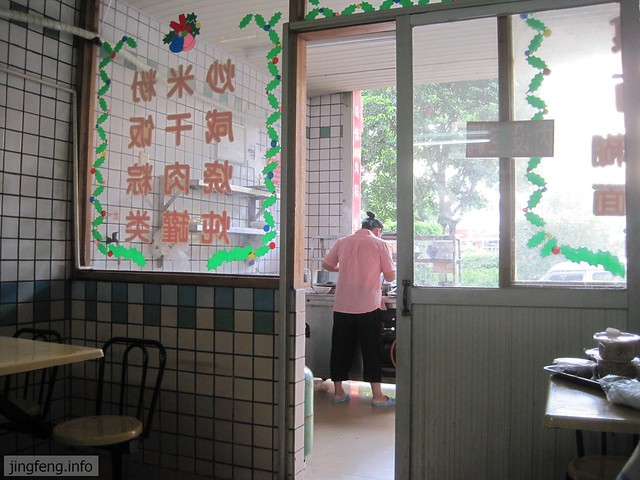
