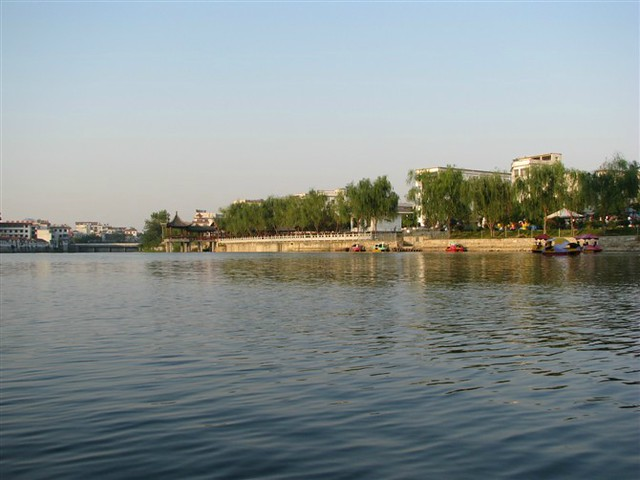
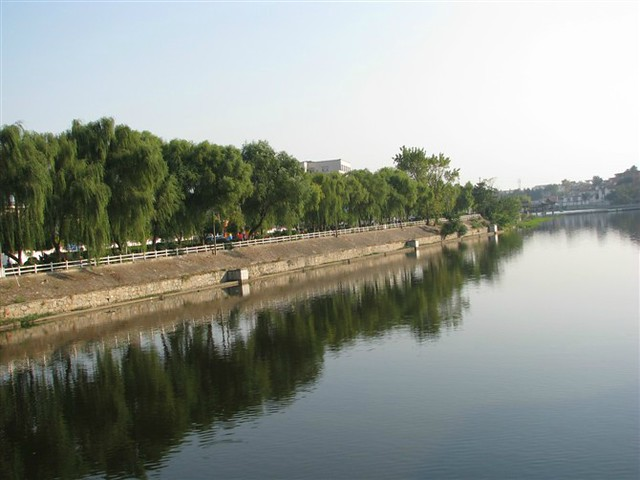
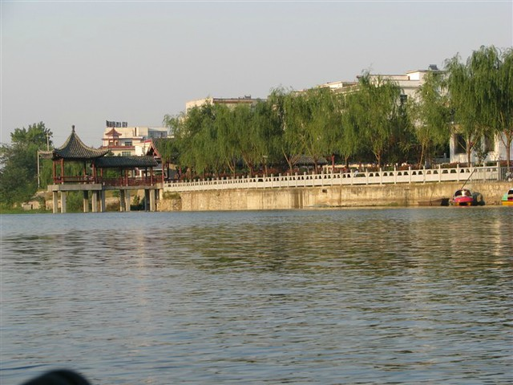

前段时间，小蜜瓜为了我政审的事情满县城跑，据说晒得很黑，叮嘱我到家前先做好思想准备。hillway偷偷大不敬地给她起了个名字：黑小黝。

晚上八点多，汽车在商城汽车站门口停下，没有通知小蜜瓜，我们径自上楼了。小蜜瓜在我们回家之前刚做了发型：酒红色的蘑菇头，倒也没有觉得黑，反而感觉比以前时尚了很多，心里也宽慰很多。每次回家，总是害怕看到长辈日渐苍老的模样。

**9月20日——9月23日 hillway在商城**

hillway去年过年在我家住了几天，因为赶上走亲访友四处拜年，匆匆忙忙也没有怎么带他在县城里转悠，吃点商城小吃。这次时间倒是比较充裕，第一天一大早就去了对面的菜市场，叫上两碗我早已魂牵梦绕的馄饨，已经涨价到五元一碗了。汤是加酱油的，撒着葱花。虽然没有hillway吃的那样快，上颚却烫出了三个泡，不过还可以忍耐。hillway担心吃不饱，买了一张烧饼和我一人一半，好香好脆真好吃。

听说结婚当天和回门的时候，穿的用的都要是全新的，用的倒还好说，一提起买衣服就很头疼了，身材不好又不太舍得花钱，总是觉得很难搞定。本来网购了两条短袖连衣裙，可惜家里天气已经转凉，等到十一估计是穿不了了。

小蜜瓜吩咐我要重买。于是下午三人一起逛街，衣服没有买到，倒是买了五个皮鸭蛋和五个茶皮蛋。茶皮蛋是我最喜欢吃的了，好像其他地方也没有卖的，就是把没有做成功的皮蛋用茶叶卤水煮熟了吃，很香很香，比皮蛋和茶叶蛋都好吃，虽然现在看来不怎么健康营养。

在商城的第二天，我带着hillway去菜市场吃滑肉汤，里面除了滑肉，还有少许的黄花菜、萝卜。前一天烫出来的三个泡隐隐作痛，不过还是吃的很香。下午，小蜜瓜留在家中随时接待前来送礼的亲友，我和hillway在街上继续逛衣服，看中了一件长袖连衣裙，晚上小蜜瓜看了以后觉得不太适合我，倒是在另一家店里买了一件。hillway又很细心地翻着店里所有的款式，为小蜜瓜挑选了一件绿色皮夹克。看他用心的样子，被店员误认为是母子关系。

自从17日因顺利请假确定下来十一的婚事，小蜜瓜就开始着急起来，逢人便问“应该准备些什么？有哪些礼节？哎呀，我的脑袋都是越来越不够用的，没有经验，也没有帮手。想起来什么就要赶紧记下来，半夜想起来，就打着手电拿着小本本写下来。晚上就只睡几个小时……”

除了在家纺店里买来的几套床上用品，小蜜瓜还要特意准备两床缎子被面的棉被。棉花在刚播种的时候就和人家预订好了，第三天，小蜜瓜坐着三轮车，提着从菜场割的猪肉和糕点下乡买棉花了。等我们剥完早上去菜市场买来的两斤青豆，小蜜瓜发短信叫我们去菜市场弹棉花的店里搂被子回家，这速度可真够快的。除了两床棉被，还有一床迷你小被子，我们猜着大概是小蜜瓜准备以后给小熊仔用的吧。

下午，小蜜瓜拿出两个大号喜糖袋，装满香烟、喜糖和糕点，准备送给帮忙套被子的女人。按老家风俗是有讲究的，要夫妻和睦，头胎生儿子，有福气的女人才行。被子缝到最后要留下一道口子，用来放六种喜果（红枣、莲子等），还有一幅红筷子。

听说新弹的被子是不能盖的，否则棉花会断掉。新被子要先平铺压在床下一段时间，等到棉花的纤维都压实在了，连在一起了，才不会断掉。

小蜜瓜说，结婚是件大事，应该带上我们去告诉大地瓜知道才行。第四天，我们买好纸炮坐着小三轮去了紫云乡。那里的野草长的很高，已经淹没了原来那条窄窄的田间小路，少有人走。山上的草长得也很茂盛，清理一番之后，小蜜瓜就开始念念起来，说hillway的情况，说结婚的事情。我说，你咋不告诉大地瓜我考上公务员的事情呢？小蜜瓜说，你也可以说的呀，于是又接着说了考试的事情。

亲友和邻居那段时间来家里送礼总会说起大地瓜，要是还在的话，看到现在我们工作结婚该有多好呀，没有那个命呀。听着鼻子好酸，生离死别，人生中为何会遇到无力抗拒的事情？

就在hillway在山上磕头的时候，他的爸妈已经坐火车从天津回家，忙活起买新床的事情了。等到我们回到家里，hillway的妹妹打来电话“质问”起来，看来他爸已经哀怨地把hillway没有给他们打电话询问是否安全到家的事情传到北京去了。

**9月24日 送日子 送聘礼**

hillway的爸妈开着他四姨家卖太阳能的货车，带着聘礼、结婚时辰和烟酒来到我家，还有我们在汕头买的“三金”。小蜜瓜特意叫来大伯一家“主持”，中午在酒店又叫上能说会道的邻居作陪活跃气氛。大家把hillway的妈咪夸赞得笑靥如花，年轻、漂亮、时尚、能干等词纷纷用上一遍，听到有人夸赞自己的老婆，估计他爸听着也很高兴。

中午吃完饭，他们开着小货车把hillway带回了家。小蜜瓜特意买来商城的茶叶、山茶油和葛粉作为回赠。

**9月25日——9月31日 各自在家**

我和hillway各自在家的这一周，应该是他家那边比较忙，张罗的事情更多。这段时间，小蜜瓜松闲下来一些，该准备的也都准备了，主要是接待前来送礼的亲友，还有从宁夏、深圳和郑州特意赶来的亲戚。

这一周，不知道hillway在家都忙些什么，只知道从他走的第二天开始，就不自觉想念他起来，与日俱增，这两年里我们几乎都没有分开过。

本想着乘着在家几天，多吃点家乡小吃的，结果却上火了，嘴疼的厉害，也没有胃口了，都是那一碗馄饨和滑肉汤的错。这次从汕头回家，总觉得北方的空气有些干燥，尘土也多。买了一盒牛黄上清片吃了几天，总算不疼了。

过了几天，发现一亲戚穿着和我刚买准备回门的连衣裙一样布料和颜色的外套。小蜜瓜吩咐我，还要去街上重买，回门那天不能和她撞衫。真头疼，又要花钱。

十一前两天，我独自一人骑着自行车在街上逛悠，寻觅着不再和别人重复又实惠的衣服。当我把在两家店里买来的衣服搭配着一起的时候，小蜜瓜说，你不要生气不要不开心哦，说句实话，你回门那天还是穿那件连衣裙吧，撞衫也比这套效果好。

郁闷……早这样还不如不去买了。
