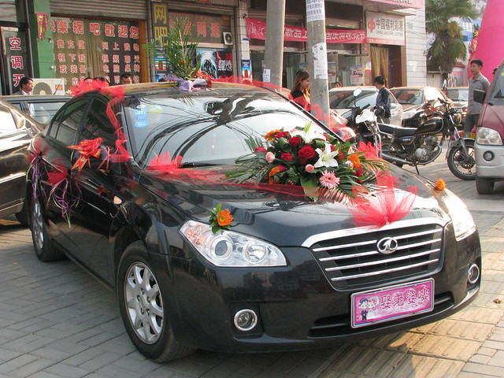

中秋节晚上，小蜜瓜邀请家中的十多位亲戚在酒店过节团圆，顺带商量下第二天婚礼的事情，大家酒足饭饱之后就各自散去了。

国庆早上五点钟，我和小蜜瓜起床开始拾掇。五点半的时候，化妆盘头的阿姨过来了。小蜜瓜给她盛了一碗蛋炒饭和一碗排骨汤。吃到差不多六点钟就开始化妆盘头了。不一会儿，小舅过来探望一番，他起床真早真积极，昨晚吃饭的时候还不停嘱咐那些亲戚早上七点钟早些过来。化妆的过程中，陆陆续续有些亲戚过来了。

之前定好的九辆婚车八点钟之前要从商城县发车，大概七点钟的时候，hillway给我打电话说车队还在潢川县城。因为街上有成群结对的人拿着长棍，专门阻拦婚车，索要红包和香烟，不满足要求就不让走。这些人好多是上了年纪的，碰不得也磕不得，万一扼上了就更麻烦。几乎每走十米就会被蜂拥包围。本来四点半就去鲜花店扎婚车，六点出发的，结果用了一个多小时都没有走出县城。他叫我们这边也准备些红包，以备回程被拦截。因为提前准备的一百多个红包已经消耗的差不多。

竟然还有这样的事情！！！之前只是考虑结亲和回门的时候，亲戚邻居图个热闹要备些红包，没想到路上却杀出来一帮“土匪”。好在这只是潢川县特有的民情，车队进入商城境内，竟然畅通无阻。

<!--more-->化妆以后，我摘掉眼镜朦朦胧胧的乖乖坐在自己的小床上等待，也不太清楚到底有哪些亲戚朋友过来，大家在门外做些什么。hillway赶到我家的时候已经八点多了。听到门口沸腾的声音，还有hillway应众人要求大声喊“妈”的声音。我所在的房间门是堵上的，要拿出红包才会hillway进来。前些天有经验的长辈已经传授给他诀窍：千万不要从门缝往里面递红包，这样堵在前面的人拿了好多个，后面的人一个没有拿到，给的再多还是进不去。最简单的办法就是拿着一叠从门缝往上抛，大家都会蜂拥着拣红包，这样就可以顺利进门了。

不知道hillway在进门之前经历了怎样一番“磨难”，当我正朦胧的看着门缝外高举的鲜花时，hillway似乎没有任何预兆的就挤进了门，扑通一声单膝跪地了。时隔一周没见，看着他西装革履衣着光鲜的样子，竟产生出一种心动的感觉。摄影师是他家远方的堂哥，他说hillway刚才的动作太快，没有来的及拍摄下来。于是他们一帮人又退出门外，重新进来拍了一遍。

老家规矩是新娘出门脚不能粘地，要背到婚车上的。但是路程太远，我又比较重，估计hillway不堪重负是难以完成的。虽然hillway嘴上喊苦不乐意，但他还是把我背下了三层楼，背出了院子，我看他实在辛苦就自己跳下来了。

去潢川的路上，又遇到了hillway讲述的那些专门拦婚车拿着长棍的人，看穿着打扮也不像是要饭的人，而是城郊一代故意转空子要钱的。上午电话里听说的时候，我问他：“你们不是来了九辆婚车，跟车的亲戚也不止十几个男人，下来帮帮忙也是可以赶走的。”可实际上，大家都坐在车上不动，只是跟车来回看热闹，真正下来应对的只有他妹夫和堂弟两个人。

就这样在县城缓慢前行一小段路，听说走火车站附近绕路可以避开一些。结果在一条狭窄的小土路上，还是被拦了好几回。他们把自家的电动车之类都推到路中间拦着，看那些拦路的男人都是三四十岁，穿衣打扮也还体面，小红包和喜糖他们根本看不上眼，提出要求要一人一包烟，不好的不要，真够贪的。还有一家人也够极品，一个二十几岁的小姑娘凶巴巴地砸着车玻璃，一边喊着“给红包”，在婚车中来回穿梭。她家老奶奶也出来“干活”，当场打开给她的红包，一脸厌弃地说“你家的钱真大呀”，接着继续想多要些钱，动手竟然把主婚车上的扎花都扯掉了。

本来遇到结婚的车辆，说些吉利话，讨些喜糖喜烟也可以理解，沾沾喜气。但是像这种以“赚钱”为目的，喜糖喜烟也给了就是不罢休，恨不得一天发横财，也不管人家赶着结婚时辰拜堂，让人觉得嘴脸真够贪婪恶心的。

赶到hillway家门口是10：35分，拜堂时间定的是十一点之前，紧赶慢赶终于顺顺利利举行完结婚仪式，主婚人还是他的摄影堂哥。

接着就把婚纱换了下来，穿上了在网上买来的小凤仙敬酒服。急急忙忙也没顾得上看脸上的妆，在几个小时激动发热之后的样子。我们在饭店门口迎宾的时候，hillway说，你是挖煤出来的吗？脸怎么这么黑呢？我自己也觉得脸上油腻腻的，假睫毛都快掉下来了。找人借了镜子一照，心情差得不得了，真是糟糕。恨不得全部洗掉，心里只埋怨早上那个阿姨化妆竟然如此草草了事，还收了188块钱。

没有办法，只要继续在酒店门口站着，好好的心情也没有了，只求快点结束，早早回去。因为十一也是我阴历的生日，所以昨天托小舅帮忙在我们县城买了蛋糕早上带了过来。摄影堂哥在大堂致辞以后，一帮小孩子就跟去小包厢围着生日蛋糕唱“生日快乐歌”了。

因为hillway酒量很差，敬酒环节我端着白酒瓶子，他端着一杯貌似白酒的矿泉水，可谓速战速决，大家也没有当面识破点明。酒足饭饱大家都散去了。

回家后，我洗干净脸，和hillway的妹妹、妹夫聊天。他们是专门从北京赶来的，还带着两个小孩，小的只有三个月，一起说说话，抱抱小孩，就这样度过了下午的时间。

晚上还是在那家酒店，不过从中午的15桌客减成5桌了，都是关系很近的亲朋。吃饭之前还有一个给磕头前的环节，按理是新媳妇给家中长辈们磕头给钱，现在简化到只是给钱记名，没有磕头环节了。我都觉得虽然不磕头，介绍认识认识也不错的。

晚饭后，大家吃完饭也是各自回家了，一直到临睡也没有来。之前小蜜瓜一直担心有人会闹洞房，怕我被欺负了。hillway说之前几天大家天天熬夜帮忙都累坏了，所以都没有精力来闹了，都回家早早睡觉了。

因为hillway的妹妹在北京的生意没有人照看，晚上匆匆忙忙带着两个孩子去火车站赶十一点的火车又回去了，这两天一直在忙几乎没有停歇。送走了他们，我们也该休息了。

很累很累，洗完澡，躺在大红色的新床上，一动也不行动了，只想睡觉。
