在一个地方待久了，总想去看看别处的风景，换一种生活方式。在地图上琢磨着汕头周边的城市，厦门鼓浪屿吸引了我。

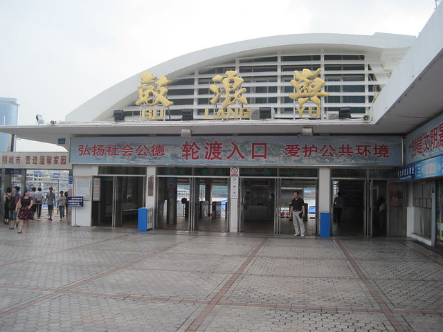

俗话说，打铁要乘热，写文章其实也是。从鼓浪屿回来，已经有一个月的时间了，只好凭借着星星点点的回忆。当时本想写点什么，又紧接着上班，不久又急急忙忙赶回老家筹办婚礼。等再回到汕头，还没有缓过劲，又接着上班了。

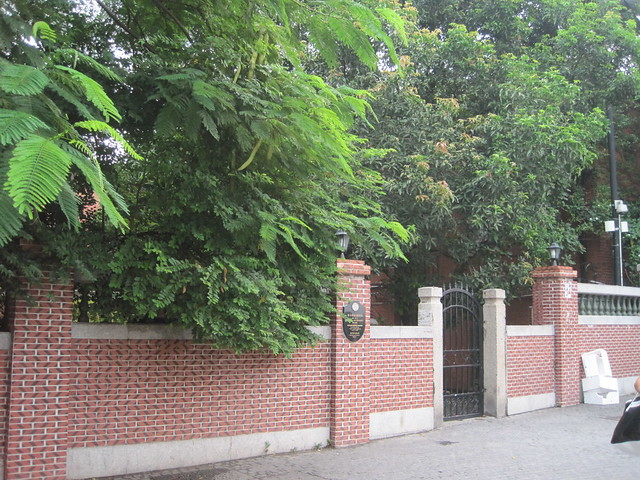

踏足鼓浪屿之前，脑海中浮现的是一系列弥漫着小资情调的照片，朦胧中闪现的小花小草，独具特色的沿街小店……让我没有办法不喜欢。因此特意安排了一整天的时间在鼓浪屿上慢慢游荡。<!--more-->

在渡口处，有很多人叫卖手绘地图和盖章本，老板称凭借盖章本买东西可以打折，hillway心想着在厦门也没有给我买什么，经过一番讨价还价，用12块钱搞定了两份。手绘地图里面还有四张没有邮票的明信片，参与盖章本购物打折的大都是一些不太有名的商店。

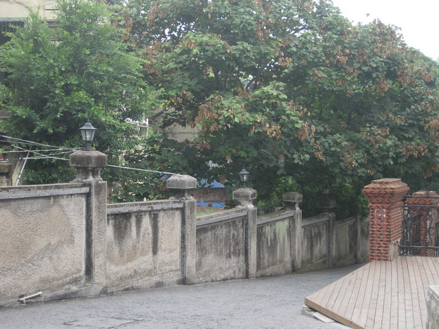

厦门大学的学生还未开学，离十一还有半个多月，虽然是周末，岛上的游客也并不是很多。在鼓浪屿上，转角遇到爱可能不太现实，但转角遇到旅游团倒是常有的事情。在一些景点，虽然会出现人多拥挤的时候，稍微等上一会，大班人马随着导游的指引匆匆向下一个景点进发，只留下零零散散的几个人，自在拍照游玩。

在我错误的指引下，一直转到中午也没有看到传说中的那些店铺，从海边折回，在岛上普通的民居小巷中来回穿梭，点了一份海蛎煎和鱼丸粗面，都是十元一份，分量不多。海蛎煎和汕头蚝烙看起来很像，两地距离不远，小吃比较接近，没能够勾起我的食欲。

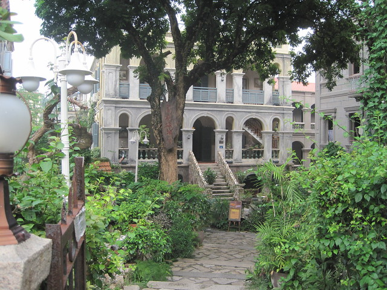

这一块是传说中的“鱼翅”吗？

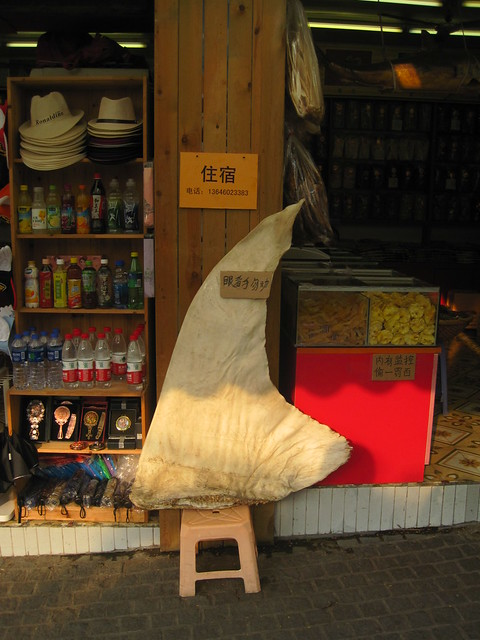

一家茶店里展示的制茶物件。

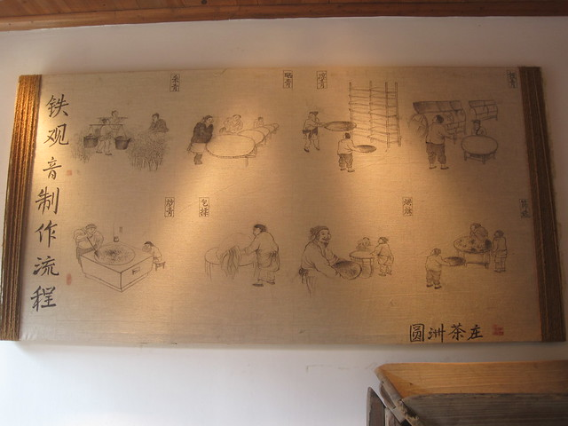

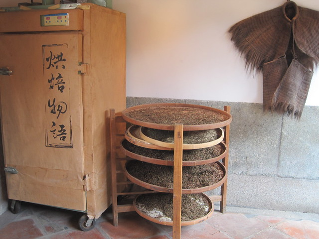

在我的错误指引下，我们穿过了鼓浪屿上有两个山洞，看到墙壁上有许多游客的留言。

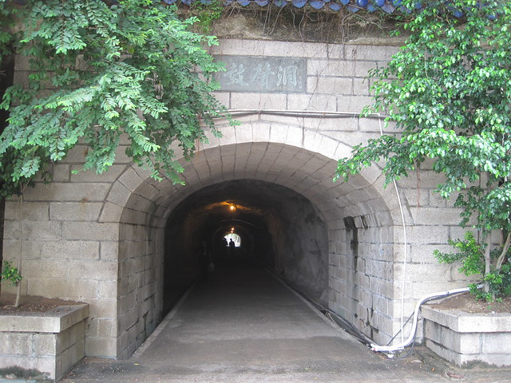

鼓浪屿的海边，虽然惧怕烈日，还是在沙滩玩了一会儿。

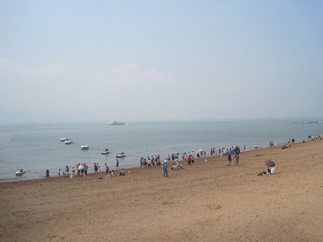

不敢再乱领路了，乖乖的跟在hillway身后，顶着大太阳，终于来到了所谓的岛上商业街，坐在张三疯奶茶店门口的长椅上喝着自带的饮料歇脚。据说张三疯是店里一只猫的名字。

正午时分，光线充足，晒得有些睁不开眼睛。遥望日光岩上不断的闪光灯，真佩服那些有毅力爬上山顶的游客。

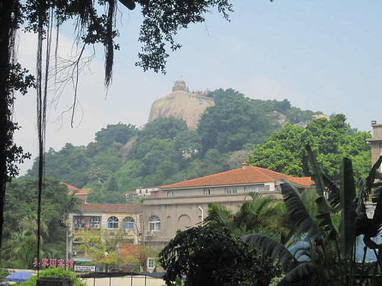

如果用普通相机，不用任何技巧去拍摄鼓浪屿，实在和想象中差别很大。被聚焦的唯美的小物件，也许正在被杂乱破旧的大背景环绕着。尽管如此，还是学着过来人的样子，只去拍一些好看的部分。

奶茶和爆米花，30元一杯。

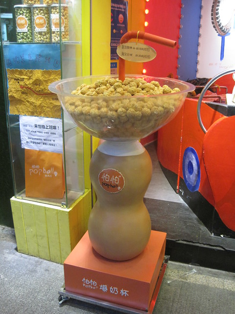

慢递，寄给未来的自己。貌似很浪漫，当然浪漫也是要付出金钱来支撑的。

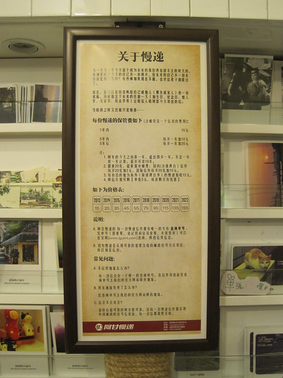

岛上也有很多卖盖章本的地方。

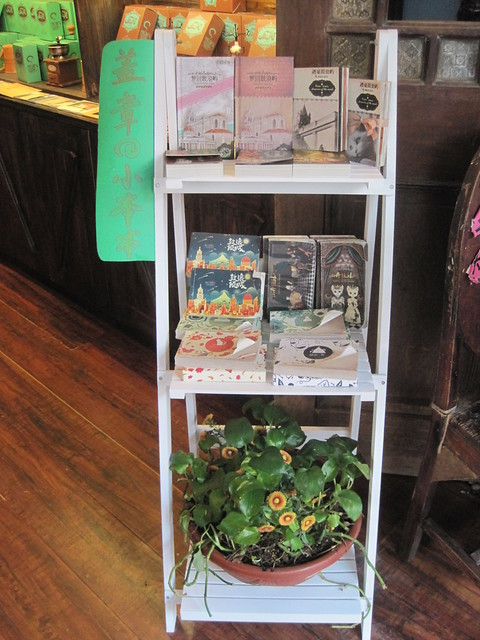

最喜欢的店铺风格就是赵小姐了，怀旧内敛中透着小资气息。

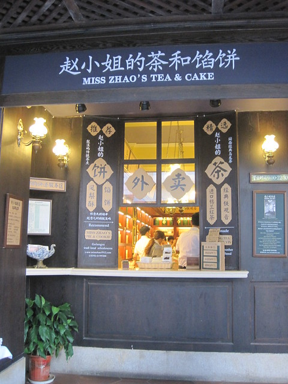

店铺里卖着各式诱人的商品，尤其是小女生喜欢的东西。一家一家的店逛下来，有些麻木，随意拍了几张。

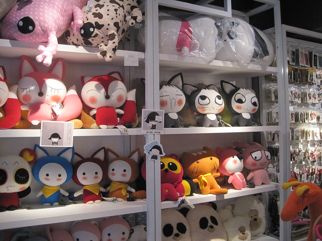

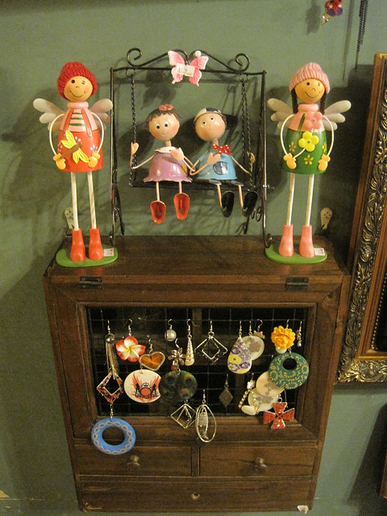

“我要和你生个小宝宝”，我想，这也是一种爱到深处的表达方式吧。

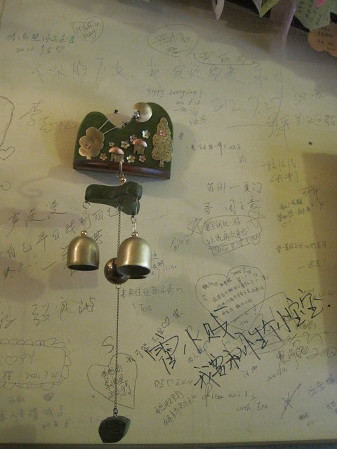

康师傅方便面吃过袋装和桶装版本，这种现场版的倒是很少见。往店里望去，只见盛面的碗出奇的大，不知道味道怎样。

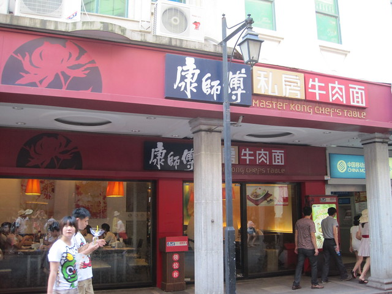

能够在岛上疗养或小驻几日，悠哉悠哉呀。

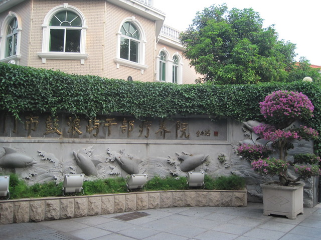

很多饭店门口都摆放着这样的红盆，展示着各种海鲜。招揽生意之外，也让游客了解了这些海鲜的模样和叫法。

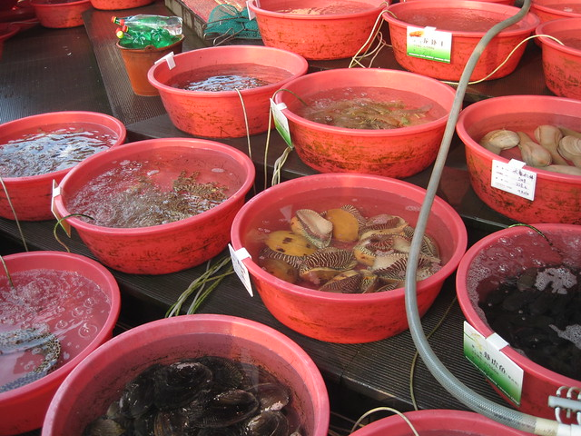

美好生活劳动创造，辛劳的母亲形象。

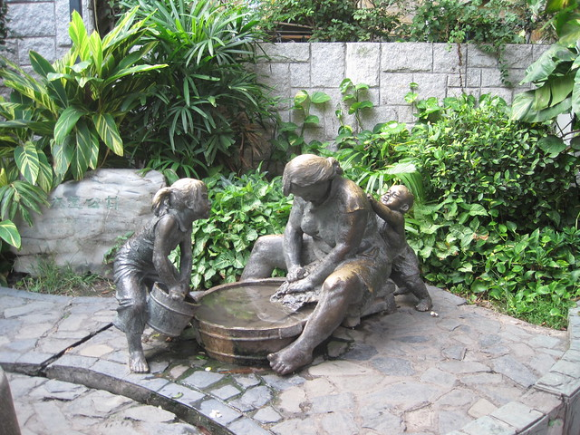
