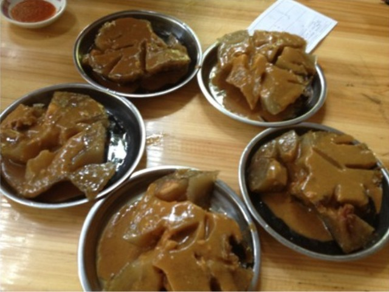
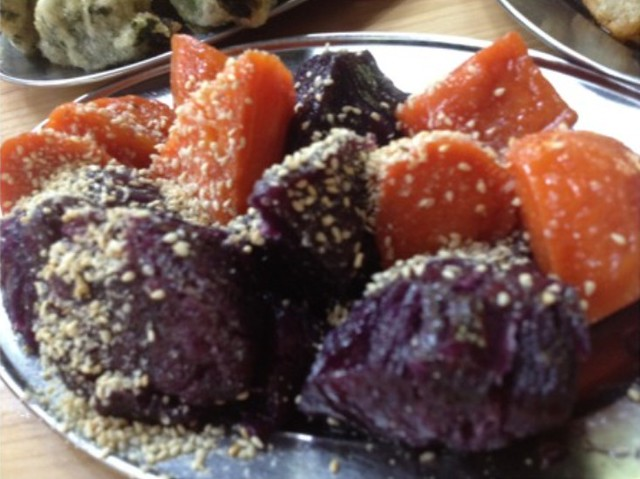
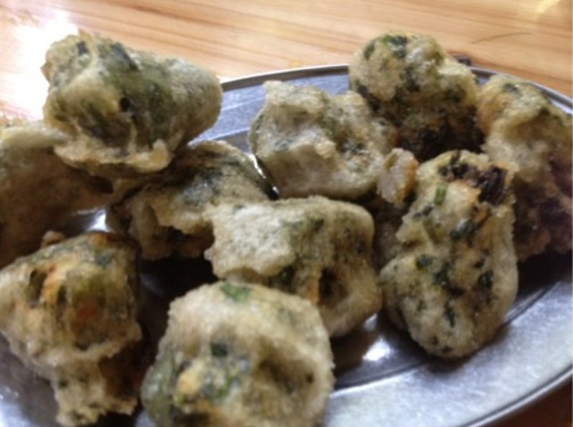
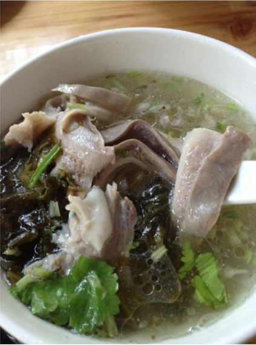
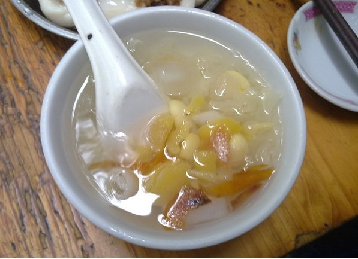

中午，单位一帮小姐妹说带我去老城区吃潮汕小吃（不过貌似单位也就在老城区）。坐在车里也不知道东南西北，只看见绕过金凤坛的转盘一直往前走，走到一家摊位前停了下来。桌子都是摆在店铺外面的那种。

以前在红磨坊里点过蚝烙、萝卜糕、芋头糕、黄金糕、虾饺、叉烧包、豆豉鸡爪、肠粉这类貌似特色的小吃尝了尝。因为对潮汕小吃了解甚少，又听不懂潮汕话，在外吃饭通常选择的都是有明码标价菜单的饭店，这种街头摊点，还有那些摆着一排海鲜的大排档是从来没有动力去的。

我看着橱窗里的小吃，一脸的迷茫。小姐妹说，你不用管，我们给你点些吃着还不错的尝一尝。

首先端上来的是豪粿，听声音念hao，不知道是不是传说中的鲎粿。听说是用米浆来做的，除了一个蛋黄，两只虾，一块五花肉和两个鱿鱼片之外，吃起来几乎全是米浆，可能第一次吃不太习惯而且分量有多，吃到一半的时候就觉得肚子很胀吃不下了。

<!--more-->小姐妹说，吃不下就算了，再尝尝其他的小吃吧。

这个是紫薯和红薯的拼盘。从小到大，我最喜欢吃红薯了，特别是烤出来的那种，分外香。

刚开始看到它们是泡在水里捞出来的，外面又撒了一层芝麻类的东西。吃起来很甜很甜，估计是用糖水煮过吧，觉得红薯本身就挺甜了。我问她们，“你们本地人吃这个有没有觉得很甜呢？还是刚刚好？”她们说，“确实有些甜，不过以前有个同事觉得这种程度就刚刚好。大概我们这里人普遍能接受这种吧。”

这个是用韭菜做的粿，油炸出来的。这边好像叫做无米粿。在网上搜索了一下，之所以叫无米粿，是因为粿皮通常用番薯淀粉制成的。

不知道这个叫什么，因为油炸的很脆，吃起来有种薯条的口感。

吃了上面的那些小吃，只觉口渴，想喝些汤来解腻。等了好久，猪肚汤终于上来啦。猪肚吃起来和小蜜瓜做的口感差不多，不过我们老家煮猪肚只放山药（萝卜）和葱姜盐就好。没有加酸菜和胡椒粉的习惯。我们都觉得胡椒粉放的有些多，喝起来有些辣。

后来结帐的时候才知道，这个卖15快一碗，她们大呼不值，说华邬路上有一家猪肚汤比这划算很多。

吃了上面的这些小吃，觉得肚子好撑好胀。刚开始点汤的时候，她们问我是喝凉的甜的那种，还是热的咸的那种呢？我当时担心太凉太甜，就要了后一种。有个小姐妹觉得猪肚汤胡椒太辣，而且她一心很想让我尝尝那种凉凉甜甜的汤，就又叫了一碗五果汤来。

吃起来确实挺爽口的感觉，淡淡的甜味，也不是特别凉。特别是在吃了许多口味比较重的的小吃之后，喝几口五果汤觉得清爽很多，甚至让我觉得这是这顿饭中最好吃的一种了。

最后一张图是从网上找来的，因为最后点的就没有拍照了。五个人总共花了143块钱。吃饱喝足之后，我们就回单位睡午觉啦。
