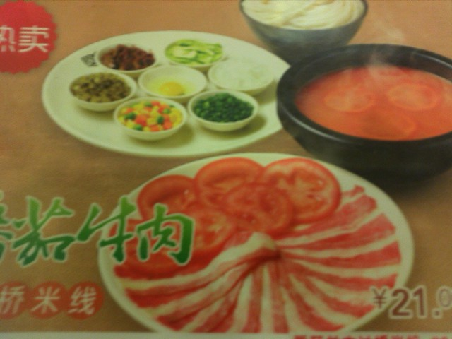
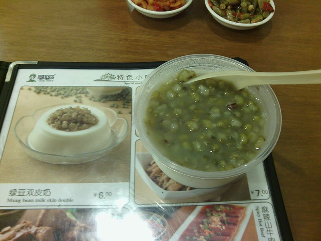
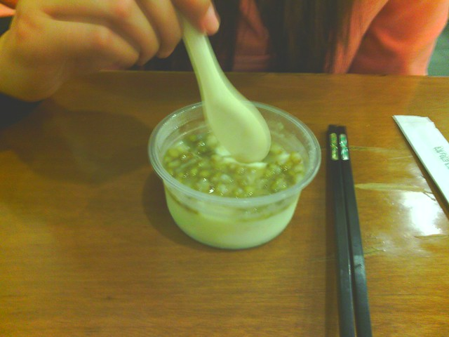
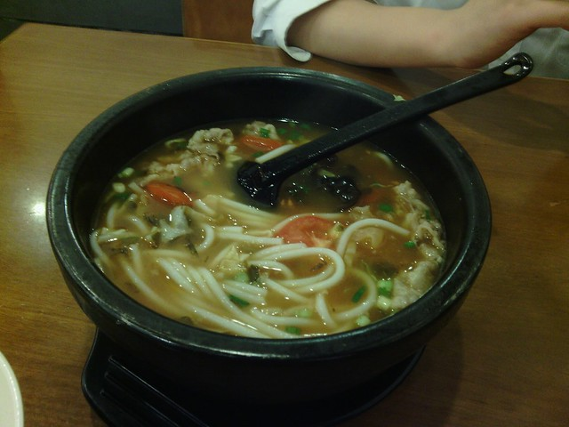
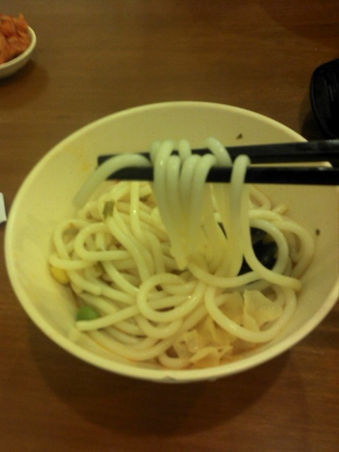
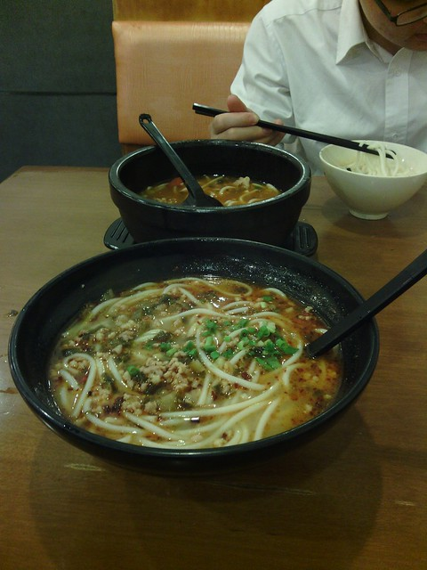
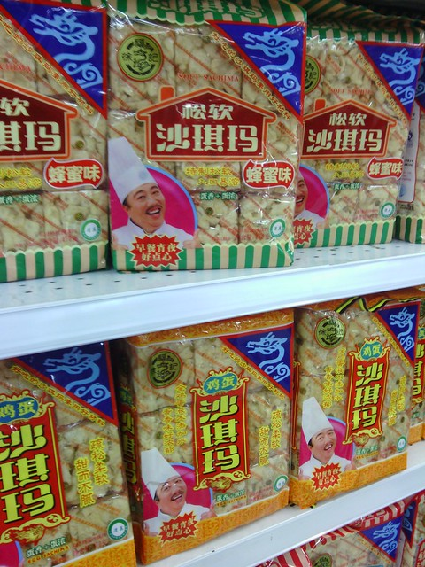
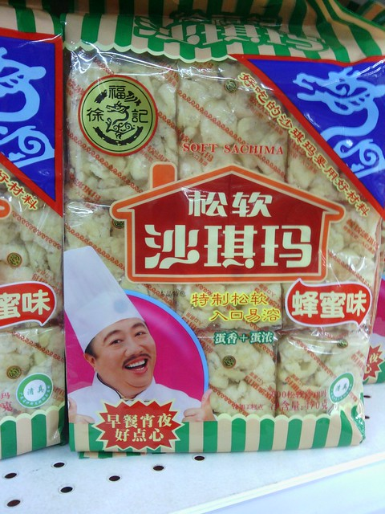

据说昨天是世界末日，几年前看了《2012》这部电影，和大家一起开开玩笑，心里却觉得有些荒诞。也许因为不上网，一整天也没有什么与世界末日相关的言语行动，只是瞅见同事因为潮汕冬至要拜老爷就没来上班。

这个周末事情挺多，我们把逛超市的活动直接安排在周五下班后。想着好歹也算过节，我们两个人也好久没有一起在外面吃过饭了，就带着hillway到上次同事领我去的米线店里解决晚饭。

番茄牛肉米线是上次我吃过的，感觉味道还可以，大概是因为汤里放了番茄的缘故吧，酸甜可口。在我看来，一般加了番茄的汤面都不会难吃到哪里去。

最先端上来的是绿豆双皮奶。<!--more-->

也不能说食物与图片不符，因为看上去材料都是一样。只是放在这种塑料容器里，以这种组合方式出现，总觉得两种档次上差了一些，多少感觉有些失望。

吃起来冰冰甜甜的，口感还可以，吃多了会腻。

还有免费的小菜可以盛，最喜欢的就是左边这盘泡豇豆了，酸酸脆脆，很开胃。

hillway点的番茄牛肉米线上来了，米线和配料是现场加进去的。听云南的同事讲，这种还算是比较地道的云南过桥米线的吃法。

看上去碗还是挺大的，不知道够不够hillway吃。

还有一个小碗可以将米线盛出来，这样吃起来不会太烫吧。米饭比之前上大学吃过的那种要粗了很多很多，也比较容易嚼。

我的那一份端上来了，胡乱点的也没注意叫什么名字，当时服务员说多一颗卤蛋要加3块钱，想想不划算就罢了。吃了两口，发现碗沿上粘着一根头发，hillway说找他们反映一下，我说算了吧，在外吃饭哪有那么干净，多是没有看见罢了，不想找那些服务员的麻烦了。

这碗米线加的肉末按说应该是新鲜猪肉，但是吃上去口感有些怪怪的，总觉得不是很新鲜，有些变味了。后来，慢慢把米线吃得差不多，觉得肚子好饱，就一起去楼上逛超市了。走着走着，觉得肚子越发的胀痛，还有一些反胃。我和hillway说：“有些想吐。”他竟然重口味的回了一句：“你又没有吃屎，为什么会想吐呢？”无言以对，不知他怎么想出的这一句。

既然吃得这么饱，周末回家也没有什么事情，就在超市多转悠几圈吧。

走着走着，看见hillway扭头嘿嘿冲我笑，购物篮里多了一袋沙琪玛。我显然不想同意，家里还有一堆上次在普宁带来的条状沙琪玛和糕点。我说先吃完那些再买，不然就浪费了。

hillway显然不死心，他用手指指包装袋上的大叔：“你看他笑得多开心呀，你看他多可爱呀，他正在招呼我们赶紧把他买回家呢。”

想起来以前在学校，吃完晚饭去北门溜达的时候，他很想吃马路两边卖的各种饼，就和我说：“你看呀，这边的饼饼和那边的一排饼饼都在冲我摆手手呢，它们在招呼我去买它们吃呢。”
