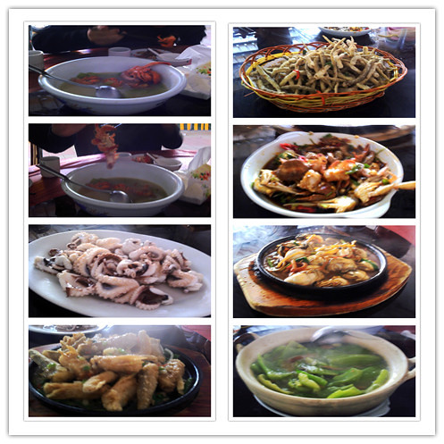

潮阳本地的同事带我们去吃潮汕的小吃，去的是一家海鲜大排档的小店，店门口的摊铺上摆满了各式各样的鱼，应该大部分是海鱼，身体细长，我都不认识。同事和老板用潮汕话点菜交谈，我也听不懂。

我们进屋里找了张桌子正要坐下来，突然有人喊了句：“先别坐，要擦过才能坐的，这里的桌椅比较脏。”于是我们每个人揪了把卫生纸使劲擦桌椅，这一擦才发现确实比较脏。有人解释说，这种路边的小店灰尘很多的。

等碗筷上来，也不是一次性的消毒碗筷，我们找服务员要了开水然后开始忙活洗碗筷。

准备工作做完，不一会儿就上菜了。第一份菜是生蚝我以前都没有见过，赶紧掏出手机照了一张。他们见我拍照，都停下筷子等我。

之后菜一上来他们就让我拍照再吃，搞得我很不好意思。

不管怎么说，拍了不少的照片。走出小店，每个人都吃的很饱，结帐时也不贵。

上一张Jasmine为我做的图片（虽然我不喜欢，但也是她千辛万苦难得做的，凑合着用吧），内容有：寄居蟹汤、炸鱼、醉蟹、鱿鱼、生蚝、豆腐鱼、大头菜。

