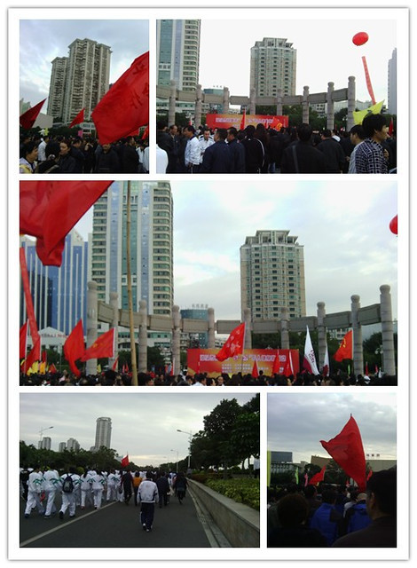

作为单位的年轻人，参加集体活动是“义不容辞”的事情。昨天通知早上先去单位楼下集合，吃完早饭出门看见外面黑乎乎的，天还没有亮。急忙往公交站牌赶。真羡慕可以在热乎乎的被窝里呼呼大睡的hillway。

七点多，当我们举着单位的旗帜到达人民广场时，已经聚集了很多单位的人马了。看到主席台上的标题才知道昨天发给我的一包汕头某牌的麦片是怎么回事，原来是赞助商提供的产品。

正在聊着天，忽然听到枪响，吓了一跳，人家陆陆续续开始行动了，路线是沿着海滨路从人民广场到华侨公园。长期不锻炼身体，一会儿就感觉腿酸。开始还能跟上，跑着跑着就掉队了，看不到单位的旗帜，慢慢混到后面其他单位的队伍中了。听说以往跑着跑着就有人半路撤回家了，觉得跑了好远，听周围的人说才四分之一，心里就想放弃了。到路口见零零散散有人撤退，我也跟着穿过封路用的警戒线去找公交了。

后来一查地图觉得放弃可惜了，其实撤退的地方离华侨公园已经很近了，后来找公交走的路都比到终点要长。是谁告诉我才跑了四分之一的？！也是新来的吗？看来对汕头地形还是不熟，有待提高呀。

