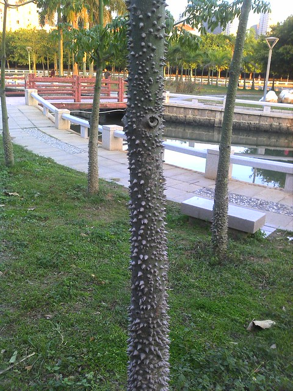
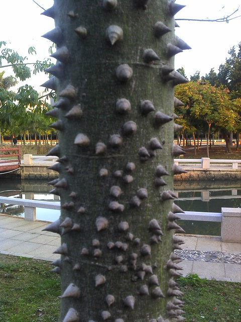

那天，我们从[国瑞建材城](http://www.jfsay.com/archives/702.html "去房展会")出来，一路悠悠哒哒到了星湖公园。去年年底看几处楼盘介绍的时候，都将毗邻星湖公园作为卖点。虽说比不了[汕头中山公园](http://www.jfsay.com/archives/511.html "中山公园之“天下为公”")，但是闲暇时能有地方可以散散步也是不错的，总比我们附近连个晨跑的地方也找不到的好。

看到这里种植了好多树干长满尖刺的树，摸上去十分坚硬锋利，还有一些刺被刀削掉了。走在附近还真要小心，不小心扎到了还真疼呢。hillway把这种树起名叫“刺猬树”。在网上看到有报纸说名为“美丽木棉”，是一种行道树。

之前在北方，从未见过木棉树，仅仅在课文《致橡树》中学到，舒婷将木棉树塑造成一位在爱情里人格独立的女性形象。想起前年暑假第一次在[汕头大学](http://www.jfsay.com/archives/320.html "绿芒果和木棉")看到的那种飘着棉絮的木棉树，长的十分高大粗壮，虽然树干上布满了圆锥型的硬刺，但并没有这般锋利，给人以凶狠狠、一幅倔强不可侵犯的感觉。不知是因为没有长大还是品种的关系。

当时从汕头大学回家，想起来这种感觉更像男性的木棉树，还专门翻出那篇《致橡树》看了一遍，没错，确实比喻成木棉。文中提到它有红硕的花朵，想着这个是比较女性化的意象，什么时候看一看也好。

去年每天步行去上班，经过林百欣中学的木棉树，那时已开出了火红的花朵，远远望去很是好看。常看见有路人提着塑料袋捡着那些散落了一地的花朵回家，听说是可以煮汤喝的。木棉树是很多城市的市花，花朵和棉絮都有很多用处，翻阅一些介绍木棉的文章，也可以看出当地居民对于木棉的喜爱。

我本人也不排斥木棉，只是总是在想，爱情中人格独立的女人，纵然爱的热切爱的痴狂，开出红硕炫目的花朵，但也并不一定要长成这种高大凌人、锋芒毕露形象，总该有着一番女性的纤巧与温柔吧。

