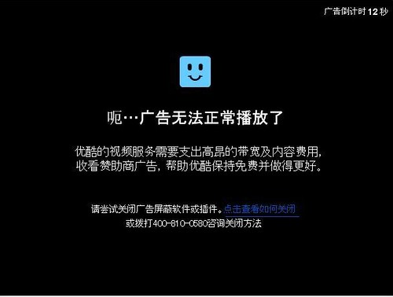

国内的视频网站与国外的同行相比显得无耻的多了，你兴致冲冲地打开一个视频准备看，它非让你先看上十秒到一分钟的广告不可。等你等到快睡着的时候视频开始了，你的兴致也减了一半。

看看人家视频网站的鼻祖YOUTUBE，人家的广告尽量以不干扰用户为前提，而你们这些贱坯子非让俺们看完广告才给播放内容。于是江湖上就出现了技术上屏蔽掉你广告的方法。

几年前出现的“IP方法”流行一时，操作上呢也可谓简单，通过在HOSTS中添加一段网上流行的IP地址就可以了。但是用的人多了就露馅了，人家发现了你的技俩，然后把你关进了“小黑屋”。

但是道高一尺魔高一丈，伟大的牛人又发明了新的方法。如果你使用的是Chrome内核的浏览器，你可以去Googel应用商店下载[Adkill and Media download](https://chrome.google.com/webstore/detail/adkill-and-media-download/lcibdonokophlabplhpmmmjjbgohgcok?hl=zh-CN "去除视频广告插件")安装就行了，该程序的代码在code里面也能[找到](http://code.google.com/p/adkill-and-media-download/ "adkill-and-media-download")。

目前去除视频网站广告的战斗仍在持续中，我军与敌军将会进行旷日持久的拉锯战。
