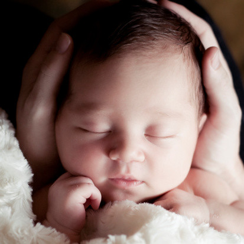

距离上次去医院检查已有两月，掰着手指头数着日子进入了十三周，这段时间因为恶心呕吐，总是担心小熊仔在肚子里到底好不好，上次的黑白B超仅仅排除宫外孕，于是4月8号在小蜜瓜和hillway陪同下去了医院。

进入十二周的尾巴，我丝毫没有感觉到呕吐的症状有丝毫减轻的迹象，甚至肚子饿到半夜要爬起来一两次填补食物。去医院前天半夜，肚子咕咕声叫醒了我，想着早上要空腹验血不能吃早餐，到时候肯定又会饿到大吐酸水，倒不如半夜吃点东西。结果到医院被告知抽血前一天晚上十点之后都不能进食，否则影响检验结果，想想近千元的检查费，就只好再请了一天假，先做了彩超。

从医生手中接过彩超单，看到图片上小熊仔的模样，心中莫名地柔软了起来，总是忍不住要拿出来研究一番。我们三个人对这几张图片有着不同的解释，可谓众说纷纭。我看到的小熊仔，是一副很乖很害羞的模样，安静的趴在角落里，背对着大家，躯干显得很修长，让人发自内心地想去保护他。

真奇怪， 那天没有吃早饭，竟然一上午都没有感觉到恶心。第二天早上空腹去医院抽了八试管血，既没有头晕也没有肚饿恶心，小熊仔很乖很乖。从医院回来的这一个月里，虽然有时还是会恶心会呕吐，但次数明显减少，已经亮起了光明与胜利的曙光，心情也自然跟着轻松起来。

现在回头来想想两个多月的恶心呕吐，仿佛有些遥远了。我和hillway琢磨为什么我的反应会这么厉害，被单位一些同事说成“反应过度，担心多余““娇滴滴，柔柔弱弱就很像那个刚做过化疗的”……尽管身体有时不适，但我也能记住不会跟这些人去聊自己的状况。可能有时难受到气色不好，还是被说成“不正常”，听得我心里不是滋味，仿佛是自己做错了什么。

hillway上网查找孕期呕吐的原因，然后念给我听：“孕期呕吐是因为宝宝在成长过程中会产生激素，在怀孕早期宝宝并不需要太多的营养，它为了保护自己会把自己认为‘有害’的物质排出体外，这时孕妈妈就会呕吐”，还有一种观点认为“呕吐说明宝宝在生长，一般没有呕吐的孕妇出现死胎流产的几率比孕期呕吐的孕妇几率大很多”。

听他这么一说，我的心里也好受了很多，只要小熊仔能健健康康的，也是值得的。

小蜜瓜在这段时间里利用每天买菜做饭干家务的空余时间，给小熊仔钩了一件毛衫，又织了一套毛衣毛裤。听说她在老家的时候，已经织了几件了，不过没有带来。小蜜瓜说：“我织毛衣的时候就知道小熊仔很调皮很厉害了。”我们问她为什么？她说:“因为给他织毛衣总是织不好，总是弄错，拆了好几次才成功。乖小孩就不会这样。”我们听完，大呼这套不知她从哪里得来的理论的“神奇”。

随着日子一天天的过去，渐渐隆起的肚子上莫名长起了许多黑色的毛毛，有时候痒痒的都想去挠两下。父爱泛滥起来的hillway有时会趴到肚子上听声音，但是每次说的都是同一句话:“下水道的声音，哗哗啦啦的。”

随着腹部一起渐渐隆起的还有胸部，是我不得不胸闷去更换大一些的文胸。更让人难以接受的是不断扩张势力范围并不断加深的乳晕，使它们看上去呈现出一副有些“恐怖”的怪模样，更不敢去想当哺乳期过后，它们又会变成怎样？

记录下孕四月身体指标：身高172cm，体重68kg，胸围102cm，腹围99cm。
