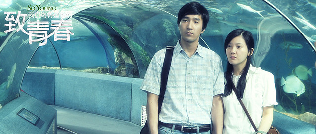

今天看了赵薇导演的电影《致我们终将逝去的青春》，在看电影之前本完全没有期望，也没有看过任何的影评和评论，不知道电影讲得是什么，可以说是在没有受到外部干扰的情况下看完了电影。

从电影开场到结束，我的情绪一直跟着电影的情节、人物、场景在变化在叹息在思考在回味，电影一结束马上往卫生间跑，差点就憋不住了。同事问我为什么中间不上趟厕所，我说怕漏掉了一丁点儿的剧情。

电影看完，觉得意犹未尽，思维仍在电影中穿梭，从电影的结尾处发散。

电影的名字叫做《致我们终将逝去的青春》，可想而知这是和“青春”有关的电影，当然还有围绕着青春的爱情。这让我想起不久前看过的《那些年，我们一起追的女孩》。但是这部电影和《那些年》风格很不一样，这里的大学校园只是背景是铺垫，在这里衬托出以后青涩变质的人生。

从电影中郑微口中说出的那句“青春是用来怀念的”，标明了青春的价值。这又何尝不是呢，儿时是来怀念的，过往是用来怀念的，因为我们无法回到过去。

陈孝正和郑微分手离开前说的那句“我们都爱自己胜过爱爱情”，道出了爱情在生活面前的无奈。出于本能和情感我们多希望有情人终成眷属，我们都多么希望看到完美的爱情，感受阳光普照大地的温暖，可是生活却是一成不变的冰冷。

人们常说大学是象牙塔，大学中的爱情是最最纯真，不世俗的爱情。是的，在学校你可以不用考虑未来，不用考虑世俗，也不用考虑生活，可以大无畏张开双手拥抱爱情。但是在毕业时难免要面对世俗的现实，当爱情碰撞生活的时候才显现出它的渺小。这时再回过头看看过去的爱情，是那么地可笑与轻狂。这时才知道青春只能用来怀念，因为你再也回不去了。

对于普通的我们，青春远没有电影中剧情的辗转与悱恻，但多少也让人沉凝片刻，少许怀念。

**一**

第一个出现的女主角郑微，热情泼辣，敢爱敢恨，爱的时候死去活来，不达目的不罢休，这一种敢爱的劲头着实可爱。性格外向而又待人友善，她的周围总有一群哥们儿姐妹儿。当拥有爱情以后收敛张扬的个性，依偎在爱人身旁，死心塌地。这样的女生有一种“活”劲儿，能带动活跃的气氛。

郑微和陈孝正两种看似迥异的性格走到了一起，一直坚持到大学毕业，这也是一种难得。心里生怕他们闹矛盾，闹分手，虽然这部分电影中没有体现，但我觉得这些矛盾会在郑微妥协的爱中得以化解。这个时候的郑微是为爱痴狂的时候，后来的施洁也就是她的一面镜子。

当爱情离去的时候，她也痛苦也伤心，心都是肉长的！当若干年后，经过生活和失恋洗礼后的郑微说出那句“其实（没有）爱情是死不了人的”，听着让人更是心痛。原来之前的陈孝正对她来说就是整个生命。

在电影结束的时候，真心希望她能得到爱情，但她该爱谁，谁又该爱她呢？

**二**

陈孝正是一个幸运的人，家境贫寒却遇到了主动喜欢自己的女孩，一再拒绝对方，对方却百折不挠，他是被感动了还是妥协了？

在学校里学习和努力，把自己的人生比喻成“不允许1厘米误差的建筑”，生活中的他争强好胜，使自己做到极致。

在毕业的时候，面对爱情和仕途的选择，他义无反顾背着爱人选择了更好发展的出国机会。

他又何尝不可怜？卑微的家境造就了好胜的性格，这注定让他终究失去爱他的人——青春的爱情。

**三**

阮莞的性格和郑微正好相反，温柔漂亮，聪明坚强，是学校里人见人爱的一朵花。可是对于爱情她显然显得有些无措，当郑微被陈孝正拒绝时趴在床上痛苦乞求她安慰时，她说了句“换作是我，我也不知道该怎么办”。

在青梅竹马的男朋友哭着跑过来向她哭诉意外让别的女孩子怀孕的时候，她又显得痛心地镇定，拉着怀孕的女孩去做了人流。那个女孩说了句肺腑的话来劝她：“赵世永配不上你”。我以为从此以后她会离开赵世永，这个让她伤透了心的男人。而她偏不，原谅了他，继续和他在一起。正是她的妥协让自己跟着也做了人流，以致最后失去了生命。

**四**

这不是青春的赞歌，也不是葬歌。它只是展现出生活中的人情事物。剧中的人物生活在我们身边，也正是我们自己，那些剧中的情节或许能勾起你心中的往事。
