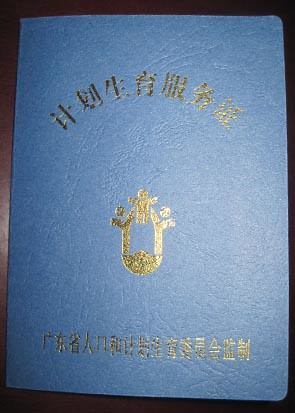

怀孕以后，生产之前，需要办理“准生证”，也就是“计划生育服务证”。有了这个证，你才可以光明正大跑到医院去顺利生产。不然的话，到时医院没准不接收。

我们是良民，自然按人家规定的程序走，去办理“准生证”。

首先去户口所在的居委会领一式两份的登记表。这张表需要盖好几个单位和部门的印章，有医院的，单位的，居委的，街道的，计生服务站的。除了这张登记表，还需要两个人员居委会的“初婚未育”的证明，这张证明同时需要居委和街道的印章。

我们俩就分别拿着这两张表到处跑。医院的章很好搞定，医生签了字，直接到医务处去盖个章就可以了。所在单位的印章稍微有点麻烦，不过因为是自家公司，他们也不为难。计生服务站要盖两个章，一个是听课章，一个是体检章。这两个章是要你完成了听课和在他那里的规定体检之后才能盖的。还好听课和体检都是免费，也很简单。听课只是在大教室里看新生儿的视频，半个小时左右结束。体检的内容主要是抽血、尿检和血压。这几个章盖好之后，我们就去跑那两份证明了。

我的证明的章盖的不太顺利，[被讹去了100块钱](http://www.jfsay.com/archives/752.html "盖章")。Jasmine的章还算顺利，只是居委和街道办事处的距离相隔太远，一个来回把肚子给走痛了。

总的来说，一步一步走下来虽然繁琐，但也算顺利。就这样，我们的准生证领了回来。也就是一个蓝色的小本本，有了它，我们才能正常生育。

