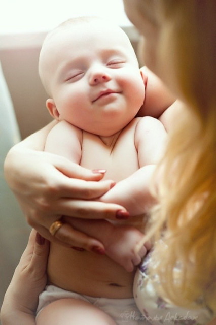

进入21周，终于感受到了期盼已久的胎动。它不似网上所说的鱼儿游动或吐泡泡，而是很真切地感到肚皮被踢了一脚。

胎动几天之后，开始慢慢总结小熊仔的活动比较集中的时间段，分别是上午十一点，下午四点，晚上十点。

小熊仔不动的时候在干嘛呢？是不是在睡觉哦？那可真是遗传了他粑粑hillway的睡觉超能力，可以从晚上睡到第二天中午再起床呢。

进入22周，小熊仔的胎动更加频繁了，不再集中于每天的几个时段，而是从早上七点持续到晚上十一点，差不多和我的作息时间一致。除了那种像是肚皮被蹬的感觉，似乎还有些翻滚动作。有时候冷不丁被有力的小腿踢上一脚，自己还要几秒钟调节才能接着做事情。

小熊仔的胎动是随时随地的，不仅我坐下来安静的时候会动，走路和干活的时候也会动。我们有时试着给正在胎动的小熊仔“配音”，却搞不懂他的小脑袋在想些什么。

进入23周，hillway公司请产假的同事回来上班了，跟他讲了许多有关顺产与剖腹产利害，还有大医院没熟人会很黑，医生尽吓人不让顺产硬要剖腹产，手术要缝六层之类的话，结果把他听的紧张兮兮，一连几天都不停向周围生产过的同事打听医院送礼与生产方式的问题。

这次去医院做的是三维彩超。前一天晚上，我还在祈祷到时候小熊仔乖乖把脸蛋儿转过来让我们好好瞧瞧，竟有些紧张到几乎彻夜失眠，感觉小熊仔也跟着在肚子里动来动去，好像也没有怎么休息好。

照三维彩超差不多用去一个小时的时间，不仅有看外观是否正常，还有看胎儿的内部器官发育。因为有些地方看的不清楚，医生让我出去活动一段时间之后又回去重新看。后来拿到的彩超单上显示的是一张侧脸。给我第一感觉是瘦瘦长长的脸和大背儿头，再加一个朝上的小鼻头。

本来以为宝宝是圆圆胖胖的可爱模样，可是结果和想象真的不太一样。看彩超单显示宝宝目前体重是一斤，又开始万分自责起来，都怪自己没有给宝宝很好的营养，所以才长成一张瘦瘦的脸的。后来hillway告诉我，他在网上查询了23周胎儿的体重标准，说小熊仔属于正常范围，长肉肉的时候还在后面呢，这样我放心下来。

我们拿着照片研究小熊仔到底长的像谁呢？乍一看好像和我很像，因为是长脸。不过小蜜瓜说我小时候一直是圆头圆脸，是后来长大才变长脸的。hillway指着照片说:“你看他的眼睛多大吧，睫毛也很长的样子，长的像我呢。不过这朝上拱的鼻子是怎么回事呢？该不会你上辈子非洲野猪的原型在小熊仔这里显露了吧！”

医生说，现在小熊仔一切正常，不过有个脐带绕颈两周的问题。难怪小熊仔前段时间每天胎动好厉害，最近几天频率降低呢。唉！怎么办呢？万一他呼吸不畅可怎么得了呀？……又开始担心起来……

医生说随宝宝自己动，也没什么办法。只好再次求助于网络，发现绕颈现象的宝宝也挺多，有些自己慢慢就绕出来啦，不会影响顺产的。可是要是绕不出来呢？不仅是剖腹产的问题，还有小熊仔的呼吸问题呀，万一缠的太紧怎么办？

有人说要留心数胎动，可是小熊仔的胎动也没有什么规律可寻，只能确定他还会动来动去。傍晚散步的时候，hillway说，羊水环境下的绕颈不同于空气环境，脐带估计是处于漂浮状态的，应该不会很紧。

恩，相信小熊仔也不傻的，他如果感觉不舒服的话，他自己应该也会左动动右动动，或者用他的小手拉一拉扯一扯的。祈祷小熊仔平安降生，健健康康。

进入24周，自从不再孕吐以后，就觉得时间过的挺快，转眼到周末，转眼就到七月份啦。

虽然感觉自己吃的并不多，但是体重却不断增加，近乎飙至150斤，发胖以后最明显的感觉是走路的时候，两条大腿肉会相互蹭来蹭去，非要分开来走路不行。小蜜瓜说，那样走路的姿势多难看呀。

遥想还有几个月的日子，岂不是要直奔180斤的大关啦？还是要多注意锻炼，适当运动运动，坚持散步。

已经怀孕六个月啦，摸摸自己的肚子，似乎还是赶不上胸部的生长，小熊仔也太不给力了，以至于大家总会转移注意力，真是喧宾夺主，只希望哺乳过后能变小下去，不然也是一种负担呀。

