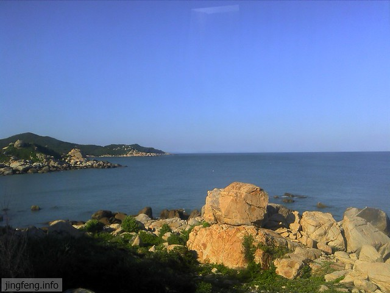
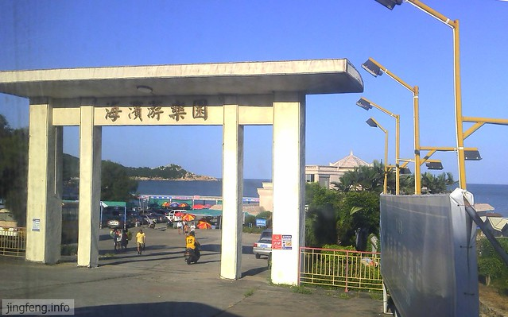
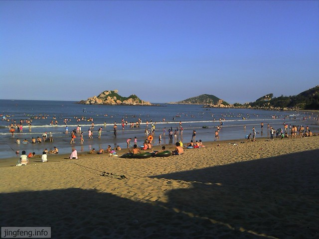
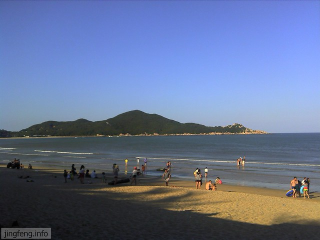
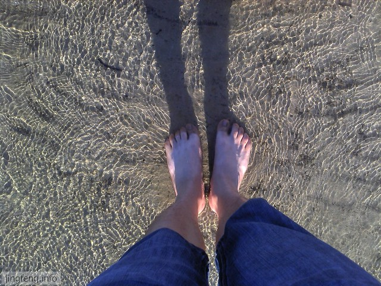
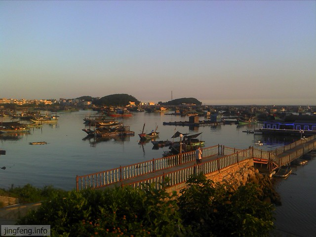
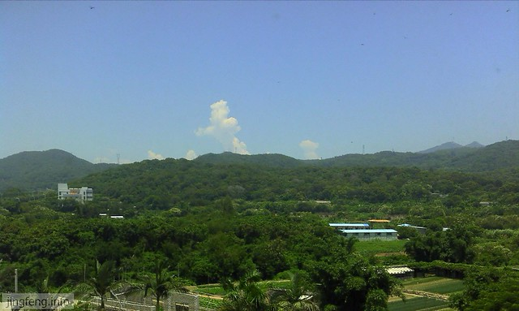

汕头东面的南海上有一个不大不小的海岛，它就是南澳岛了，虽然距汕头市区不远，但是去往岛上的交通不太方便，所以我一直都没有去过。

现在去岛上还需要轮渡，虽然南澳大桥建有几年了，目前还没有修好。先要坐车去渡口，乘轮渡上岛，之后转乘汽车。岛上虽有公交车，但不发达，如果去各个分散的景点旅游的话，还是要包辆车为好。

这是我第一次去南澳，去之前兴奋了一把，想着美丽的海岛，蓝色的海水，金色的海滩，口水忍不住地流了下来。

汽车绕环岛路行驶，一路上很是荒凉，几无建筑，不过靠海边的风景还是不错的。让我不得不惊佩大自然的美丽。

这次去南澳由于时间紧迫，还有事情要做，所以只是去了著名的青澳湾，别的地方都没有去。

青澳湾和以前去过的北山湾很是相像，三面被山环绕，一面与大海相接。就是这样的地势造就了它得天独厚的天然浴场。

青澳湾和北山湾的最明显的区别是青澳湾太干净了，看着清澈的海水，真的想躺下亲亲它。

不过我们去的时候海水有点凉，不知道是为何，这与35的高温天气很是不配。

回去的路上我们被一处港湾吸引，司机大哥成全我们，让我们驻足拍照。

大大小小的渔船横七竖八地停靠在湾内，船上亮起的灯光提示夜晚的来临。

回去的路上，心里就坦然了。来了一回南澳，见识了这个粤东知名的海岛。给我的映象是，岛上并不发达，除了几处簇新的房产开发商的广告，不怎么能嗅出现代化的气息，这与厦门鼓浪屿成熟商业形成鲜明的对比，而我倒觉得正是由于交通的落后，岛内开发的滞后成全了一片没有被过分开发与破坏的纯净美丽的海岛。

如果你想去南澳旅游，奔着那几个景点而去，我想最后你肯定会败兴而归。趁着南澳岛人烟稀少，你可以在岛上小住几日，感受下迎面而来的海风，呼吸下纯净自然的空气，蓝天白云和海水本身就是那样的美丽。

