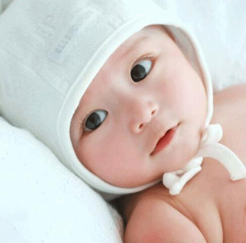

**一、摔了一跤**

我以一个有些狼狈的沾满污水的屁股墩儿拉开了孕八月的序幕。那是在验收完新房的中午，我和小蜜瓜还有hillway准备过马路，结果一脚滑了出去，一屁股坐在污水中，他们俩看见后，便急忙赶来扶我起来。

摔下去的一瞬间心里有些害怕，心想“这下完了完了”。但是当我的屁股着陆后，又有些释然了，感觉力度似乎并不严重，不过有些难堪，急忙走回家洗澡换衣服。

周末在家待了两天，哪里也没去，还是有些心里阴影，好在小熊仔安然无恙继续在他的小天地里活动着。

站在我附近目睹全部过程的小蜜瓜说，当时把她吓了一跳，不过看到我是用“缓降”模式一屁股坐在马路上以后，又稍稍放了些心。

hillway说，不错，小熊仔长的挺结实，胖阿莉还是比较耐摔的嘛。要吸取经验教训，走路要小心，不能再摔了。

和当地同事提起此事，她们说孕妇是不能去新房子，会动胎气。又举例说五月份相继流产的两个同事都在流产前几天去了刚装修的新房。不知是真是假。

**二、男宝还是女宝**

29周的时候，在网上又看到一种说法叫做“十臀九女”，之前有两次彩超显示小熊仔都是臀位。再加上以前看到的生女孩的特征之孕吐厉害、饭量不多、喜欢睡觉、肚子圆圆、喜欢水果等等，发现自己的所有迹象全部吻合了大家的推测。

为了让hillway的妈咪做好充分思想准备，便打电话告诉她说小熊仔九成是个女宝。她说，其实男宝女宝都一样，都挺好的。后来又说，她之前在老家给hillway算过，算命的说hillway肯定生男孩，这辈子想要女孩都很难。听他妈咪的语气，还是对即将诞生的男熊仔信心满满。而我们自己找的算命先生都说第一胎是女孩。

hillway和我说:“男孩女孩都挺好的，你若是生个女宝，我也很喜欢。你看，现在国家过几年说不定放开单独二胎的政策，到时候我们再生一个。先生女孩的话，二胎不管男宝女宝压力都不会太大。若是连续生两个女宝，就相当于一个儿子啦。”

我问他为什么？他说:“大家常说一个女婿半个儿，两个女婿不就是一个儿子啦。”嘴上虽然这样说，但是我一提出来给小熊仔买粉色的衣服，他都会表示强烈反对，看来还是没有彻底死心要女宝的。

其实，我自己都搞不清到底是喜欢男宝还是女宝，似乎各有各的好处，各有各的烦恼。不管怎样，健康快乐才是最重要的。可是，可是，为嘛我的潜意识里还是想要男熊仔嘛？！没办法…没办法…

**三、大采购**

一直说小熊仔都到了八月了，可怜只有两双买孕妇裙赠送的婴儿袜，除此之外，还什么都没有给他买。一天晚上，我们本打算网购一本育儿书，发现有满288减100的活动，很是划算。在我的提议下，我们在电脑前等到十二点，一股脑买下小熊仔的婴儿床、婴儿车、背袋、奶瓶、浴巾、洗发精、沐浴露、爽身粉、隔尿垫、碗勺等一堆东西。到凌晨一点睡下时，大脑还十分兴奋，心想小熊仔这下就不止两双小袜子啦。

前后一个星期陆陆续续收到货，每一次都顾不上吃饭，都要很兴奋地研究一番。

至于小衣服之类，除了小蜜瓜亲手钩织的那些，剩下的由小熊仔的奶奶和姑姑包下了。

万一小熊仔提前出生，而他的奶奶还没有来汕头怎么办呢？岂不是要光屁屁啦？于是乎，晚上出去散步的时候，在童装店给他买了两套打折的小衣服，解决了我的担忧。

我们在想，小熊仔出生以后会不会很哀怨地问:为什么我的东西都是打折淘来的嘛？！

**四、胎位问题**

29周的时候，我们揣着红包去产科找到hillway同事推荐的医生，看上去和我年纪差不多，毕业没几年的样子，给我做了血压、体重、宫高、胎心等常规检查。医生指给我看小熊仔心跳的位置，是在我肚脐的右上方。经验不足的我们，一直没能避开周围的医生护士，红包又原封不动揣回家了。

感觉小熊仔的胎动位置主要还是集中在下腹部，加之心跳位置偏上，估计臀位的胎位还是没有转变过来，这样就增加了顺产的难度。 书上说，30周是纠正胎位的关键时期，于是觉得还是去医院检查一次。

进入30周后，感觉小熊仔的胎动比较集中在右侧胸部下方的位置，不再只局限于下腹部，自己猜测是不是胎位已经改变了。

8月12号早上去医院照黑白b超，报告单显示小熊仔胎位是头位，脐带绕颈一周，相当于32周大小，一切正常。我们都很高兴，相比之前的臀位和绕颈两周，已经有了顺产的可能，一路上都在夸赞小熊仔很乖很听话。 希望到时候小熊仔能够足月顺利生产。

**五、其他**

还延续着以前的饮食习惯，但食量已经有所下降，吃一点就觉得撑，而且出现了传说中的便秘症状。

“躺在床上”这种最让人舒服的姿势现在却让人觉得有些难受，怎么躺似乎都不太舒服，好在迄今为止不会影响到晚上的睡眠。小熊仔也没有出现像网上所说会在妈妈睡觉时使劲胎动，以致影响睡眠的情况，而且很乖的随着我的作息而运动。
