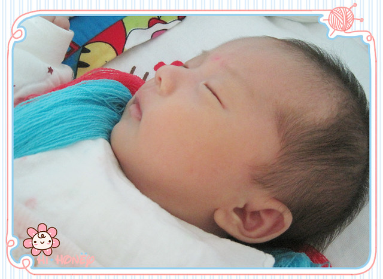

11月21日，小熊仔满月啦！ 我们是如此期待小熊仔的成长，从初生一天天盼到满月。每天都盼望着她能够快快长大，长的结结实实、健健康康、漂漂亮亮。

10月23日（农历9月19日霜降）下午四点，小熊仔以剖腹产的方式诞生。

10月24日中午，小熊仔因为鼻塞干呕疑似新生儿肺炎转入新生儿科治疗，先后几次向医生询问，总是说要继续住院观察，直到10月28日中午，在我们的强烈要求下，才得以同我一起出院。

在医院住院那几天，虽然在第一天还未能看清她的模样，躺在床上却不停想念小熊仔。想到她刚出生，还那么小，就要被医生两次抽血化验，挂点滴，孤零零躺在保温箱里面……想着想着，就忍不住哭起来，一个人的时候偷偷哭，和hillway说起小熊仔的事情也哭，整个人的神经似乎变得很脆弱，住院几天下来哭了好几回。

回到家，看到小熊仔的两只小手和脚丫都有针眼，右边小手背被针扎的发青，脚腕处还残留一片干的血迹，想来每天近两千元的费用也未必护理的有多仔细，敷衍了事，也不知道这些天小熊仔在保温箱里面是怎么过的，哭闹的时候护士会不会管……越看越心疼，越想越难过。

10月28日中午，我们大包小包出院回家， 剖腹产的伤口在走动过程中仍旧感到疼痛。从保温箱出来的小熊仔刚喝完牛奶，还在熟睡中，这是我第一次仔仔细细看到小熊仔的熟睡的模样，同时又盼望着她醒过来睁开眼睛，再看个仔细。

那天下午小熊仔一口气从中午睡到了下午四点多，确切地说是被大家期盼的说话声吵醒的。接下来，我开始笨手笨脚尝试第一次母乳喂养，小熊仔小小的嘴巴根本含不住，大家齐上阵帮忙，好在小熊仔很聪明，很快学会了如何张大嘴吸到母乳。

小蜜瓜说:“你怀孕期间怎么也不经常向外提拉乳头呢？那种又细又长的乳头才适合宝宝吮吸。”虽然孕检时医生给我提到过提拉乳头，但我当时还以为只要不是乳头内陷就不用理会，况且整个孕期乳房肿胀一碰就痛，导致如今乳头太短不易吮吸。

10月31日上午，小熊仔爷爷坐火车回了天津。临走前一晚他特意来和小熊仔告别，并抱了抱她，他说:“出生到现在从来没有抱过，这还是第一次抱她呢。”本以为小熊仔爷爷奶奶这次来汕头会久住，和我们一同照料小熊仔，结果小熊仔的奶奶那晚也要同她爷爷一同回去，后来一直“坚持”到11月17号，高兴地踏上去天津的火车，那时距离小熊仔满月还有4天。

身为外地人的我们，早料想小熊仔在汕头满月时不比在老家那般热热闹闹，有满月酒可以办。满月这天，hillway上班去了。小蜜瓜按照老家的习俗，给小熊仔戴上了百岁锁和银手镯，蓝红两种长命线。然后将碗中装满大米，放上红包，用红纸把碗和勺子包起来送给小熊仔，寓意以后不愁吃，不愁没钱花。下午接到了单位大姐的电话，她还记得小熊仔满月的日子，让我感到既意外又感动。

看着在婴儿床上睡着的小熊仔，不知道是否因为剖腹产没有经历顺产感受的缘故，竟然时常会有一种莫名的疑惑感和陌生感:这小家伙是谁呀？哪里蹦出来的？咋到我家来了呢？……似乎自己压根就没有生过宝宝。我和小蜜瓜说，现在连怀孕那阵子的事情回忆起来都有些模糊不清了，仿佛一场梦一样。虽然还记得那会儿孕吐厉害的事情，但啥感觉都忘记了。小蜜瓜说，女人就是这样，好了伤疤忘了疼。以前人生孩子痛的要命，生完以后人家说给孩子取个名字吧，她说就叫“招弟”吧。

在这一个月里，正如hillway写到的那样：[时间过得好快。可是具体到每一天又是如此地艰难。](http://www.jfsay.com/archives/1077.html "写在满月时")在这一个月里，小熊仔经历了新生儿肺炎、新生儿贫血、脐带迟迟未脱落、打嗝、胀气、不正常大便等问题，让我们有些手足无措着急难过。

剖腹产二十天左右结疤脱落，看上去伤口已经长好了，但下腹还是偶尔作痛，尤其是长时间抱着哭闹中的小熊仔，就更加剧了伤口附近的疼痛，那里的肉摸起来硬邦邦的。除了下腹痛，后背和腰背也会感到疼痛，有时候弯腰时间并不长，却要费点劲直起来。整个月子里，我闷在楼上没有网络的小房间里，过着与世隔绝的日子。每次吃饭时都吃得汗流浃背，不能淋浴洗头，只能擦洗，全身难受不适。在我看来，这些倒不算什么，只是需要用时间来慢慢恢复罢了，当务之急是奶水不够。

大家说，应对奶水不够的首要方法是多喝汤。一个月下来，老母鸡黄花菜汤、鲫鱼豆腐汤、猪蹄黄豆汤……也都没少喝，但似乎都无济于事。大家都说母乳喂养好处多多，而且能解决小熊仔奶粉过敏大便不正常的问题，也免去了每次冲奶粉试水温的麻烦，我个人也何尝不希望能实现完全母乳喂养呢？可事实总让人失望。小蜜瓜总结说是饭量太小，要大碗大腕吃饭吃菜才行。可能是月子里活动量小，虽然小熊仔出生解决了孕期恶心厌食的问题，还是吃不多肚子胀。

hillway在网上阅读了大量应对母乳不足的文章，跟我说：“最重要的就是要树立自信心。要道路自信，理论自信。平时要让小熊仔多吸，多吸吸可以促进母乳分泌。”可每当小熊仔吃不到奶哇哇大哭的时候，我的自信心就一下子消失殆尽，剩下的只有自卑和失落，不知如何是好，只能期待满月以后奶水能够多起来。

渐渐地，大家似乎也接受了母乳不足的现实，习惯了混合喂养，于此同时，发现了我的另外一个作用，就是“糊弄”，以此来赢取冲奶粉的时间，减少小熊仔在等待喝奶粉过程中的哭闹。

多了小熊仔，我们的生活和观念也出现了很多改变。记得怀孕时，hillway分享一篇关于新生儿大便的文章给我，里面有许多新生儿大便的照片，将正常的不正常的进行对比说明，记得当时我们俩都被这些照片恶心的够呛。现如今每次给小熊仔换尿布，奇怪的是，不仅对大便臭臭的气味没有反感，而且还会拿着她的大便研究一番，要知道，为了小熊仔便便的问题，整个月子里，hillway没少担心，没少奔波去医院，所以每当看到小熊仔拉出金黄色的便便，hillway的心情就会高兴起来。

除了小熊仔，她还获得了其他的“称号”：小酸奶、小地主、偷地雷的、情报员、交通局局长……
