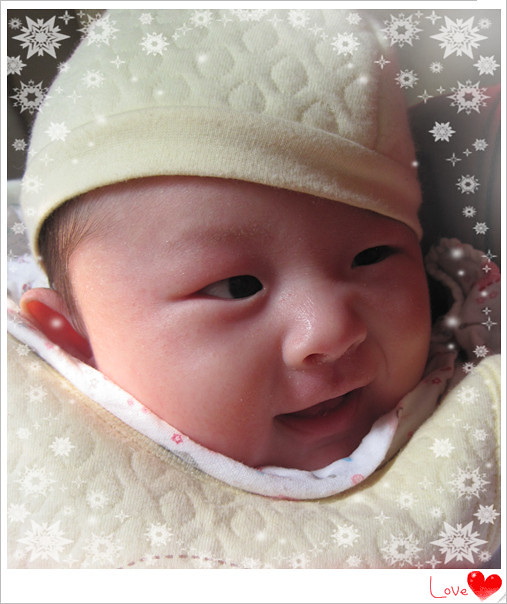

三月是以搬新家（2013年12月21日）为开篇的。

从狭小的单身公寓搬进宽敞的新房，些许有些不太习惯，几乎很少感冒的我也被冻到喉咙疼不停流鼻涕，连hillway和小蜜瓜也加入到了轮番感冒的队伍中。

大家都感冒了，但是还要抱小熊仔，只好买来口罩戴上。小熊仔在搬新房头几天也出现鼻塞流涕的情况，而且下巴和脖子因为湿疹加上喝奶浸湿又红了一片，看的我心里十分着急，本想第二天带她看医生，结果一起床发现症状减轻许多，hillway建议还是自己恢复，用药还是不太好。

大概过了一周左右，小熊仔的大面积湿疹几乎没有了，我们仍旧每天坚持给她洗完脸后抹上一层郁美净。据我观察，湿疹似乎总是会反反复复，郁美净对于治疗湿疹其实作用不大，不过有一定的预防和控制作用。

搬入新房后，小熊仔一般在晚上十点多睡觉，我们起夜次数减少基本上减少到一次，半夜三四点钟小熊仔醒来，我再用一小时左右的时间喂奶哄睡就可以了。

新房装修后晾了将近半年，灰尘很重。不仅要清洁打扫，还要将搬来打包的东西依次归位，再加上要照顾小熊仔，因此过了一两个星期才算收拾妥当。

客厅的沙发茶几一直空着没买，搬来以后又急忙购置，安装以后家里味道挺重，一个月的时间还没有完全挥发散去。接着把三幅十字绣裱框，裁餐桌和茶几玻璃，又把装修师傅叫来钉钉子，挂上十字绣和我们的结婚照，新房算是增加了一些色彩和点缀。

搬入新家以来，逛白菜成为hillway每天必不可少的娱乐项目，网购了一大批诸如洗发水沐浴露洗手液卷纸抽纸地垫等生活日用品，几乎每天都有几个快递可以收。除了日用品，这个月陆陆续给hillway添置了两件外套和毛衣。我的衣服还是难买，乘着腊八节活动淘了件连衣裙。

小熊仔开始不习惯在大澡盆里洗澡，虽然每次都慢慢让她适应水温，但入水的时候她还是有些害怕，小拳头攥的紧紧的，也不敢大声哭，嘴里发出颤抖的声音，眼睛瞪的大大的，我们看着都不忍心把她放入澡盆里，随着洗澡的次数和频率多起来，她才不怎么害怕，才会在不情愿的时候哭出声来。

小熊仔有段时间连续两三天没有拉粑粑，我们很担心她会便秘，放的屁屁也很臭，我们用豆浆机给她做些苹果汁，小熊仔平时不喜欢喝白开水，苹果汁倒是可以喝上几十毫升，喝过以后还挺见效，便便又恢复正常了。

搬来半个月以后，小蜜瓜有时早上出门会买一条鲫鱼，放入我在药店买的通草一起煮汤，结果连续喝了半个月的鲫鱼通草汤，想多些奶实现全母乳，可事实还是没能尽如人意，产奶量似乎一点变化也没有。

hillway说:“你的胸部真小家子气，每次就产那么一点点奶，都喂不饱小熊仔。前几天夜里时间长了没有喂又直喊涨奶胸部疼，我还以为有多少奶呢？挤出来原来还是那么一丁点儿。

小熊仔一百天临近了，我和hillway利用周末去找照相馆，本想着几百块的预算，结果一家影楼给我们推荐的都是上千元的套餐，更是极力推荐4888元成长套餐，比当初拍婚纱还贵，把我搞出一身汗。后来又换了另一家，定下了一个几百元的团购套餐，想着等周岁再隆重一些多拍一些。

hillway打算请公司同事来新家玩，望着小蜜瓜自小熊仔出生都没有打理过的“乱发”，决定带她去拾掇一番，周末留下hillway独自在家抱小熊仔，结果理发店的生意太好人太多，我们直到七点半才回到家。hillway汇报他利用小熊仔仅有的五分钟时间炖了排骨汤焖米饭，“你们若是再晚来十分钟我就崩溃啦，小熊仔一直要抱着，一放下就哭，我一下午抱着她左手换右手，右手换右手，累到不行，抱的够够的，我一个星期都不想再抱她啦。”虽说这样，等到晚饭吃过，他缓过劲来，还是想着要抱小熊仔的。

接着，hillway给我看了他下午拍的视频，属于“偷拍”性质，名义上是拍小熊仔，实际上几段视频的画面都被他的脸占据，主要是因为小熊仔有时候本来又玩又笑，咿咿呀呀说着话的，一发现相机对着她，立马什么表情声音动作也没有了，只是盯着相机看。

hillway说:“下午小熊仔会大声叫着说话啦！”我一看视频，果然如此，就像是一位女侠在和hillway江湖论战一般。之前小熊仔和我们说话的声音都不大，比较柔的那种，看到hillway立马不一样了。
