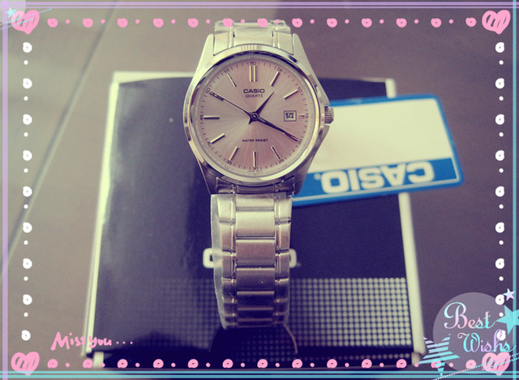

今年的元宵节和情人节赶在一起，上午我抱着小熊仔喂完奶，打开手机一看，有一条hillway发来的短信:

“胖阿莉同志，在过去的一年你勤勤恳恳、任劳任怨，为家庭工作作出了应有的贡献，至此元宵、情人双节到来之际，我谨代表家庭对你表达崇高的敬意，希望你再接再厉，来年取得更大的成绩。为表彰士气、鼓舞先进，经家庭组织研究决定，授予你为“家庭十佳青年”，奖品为晚上看电影（19:00甜心巧克力 CCTV6）”

虽然只是一条短信，看着心里还是蛮舒服的，说明hillway还惦记着过节的事情，总比什么都没有的好。不过看到最后一句“奖品为晚上看电影”括号里注明的是打开中央六台来看，不免心里又飘过一丝“哀怨”，不由想起昨天同事在微信里晒今天晚上3D电影票的那张照片。

短信中间是几行空白，再往下拉，又看到这样两句话:

“真正的奖品在结婚照后面，请径去寻取。”

还蛮神秘的嘛！我把小熊仔放在床上躺着，开始寻觅。

结婚照都放在主卧，我看看米亚奇摆台后面空空如也，墙上挂的三幅结婚照后面也只是一堵白墙，并没有发现什么，就抱起躺在床上的小熊仔开始失望起来。原来hillway不过是和我开个玩笑罢了，我心里想着。

也是，和他在一起算起来也有五六年了，遇上过节过生日，几乎每次问他会送我什么礼物的时候，他都会说同样的一句话:“我把自己洗的干干净净白白香香的送给你，我就是最好的礼物啦。”

午饭后，小熊仔睡午觉了。hillway在gtalk上和我聊天。他说:“你把家里所有的结婚照都找一遍，告诉你肯定会有。”

于是，我怀着半信半疑的心态又进了主卧，站在飘窗上翻过书架最上面一层摆放的结婚相册，意外的发现后面竟然有一个黑色的小盒子，像是高中时用的黑色墨水瓶，我赶紧取出来看，纸盒上有一个很大的商标:Casio。

印象中是一种手表的牌子，赶紧打开来看。

当时惊喜的不行，心里喜滋滋的，没想到hillway真的给我准备了礼物，一改多年他在我心目中的形象。

我赶紧回复他:“哈哈哈，我好高兴呀，今年的情人节过的很有意义，我准备特此撰文一篇，作为纪念。”

他说:“嘿嘿，以后会越来越有意义的哦！表带可能有些长，明天带你去裁下表带。”

ps:后来，hillway带着我在小区附近也没有找到修表的摊位，晚上自己拿着手表研究一番，自己动手拆卸组装表带，顺利完成裁表带的任务，戴在手上刚刚好，不错不错。

后来听同事说她去外面调表带花了几十块呢。不得不佩服他的动手动脑能力呀！！！嘿嘿嘿……
