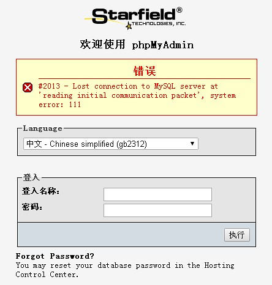
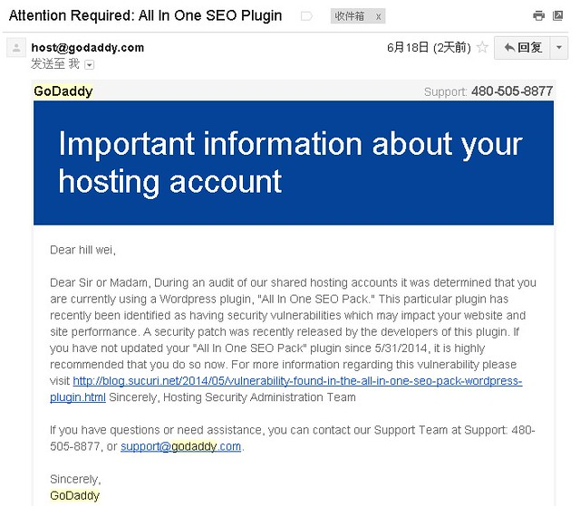

昨天下午博客不能访问了，进入网站时提示“建立数据库连接时出错”。我博客的主机空间用的是Godaddy的免费HOST，一直以来用的都挺好的。

我赶紧登录phpmyadmin，没想到根本登录不进去，提示“#2013 - Lost connection to MySQL server at 'reading initial communication packet', system error: 111”。这下我就纳闷了，不知道是什么原因，难道phpmyadmin的密码与MySql的密码不一致（其实是一致的）？我特意去改了MySql的密码还是不行。我尝试去新建一个数据库，给它一个新的用户名和密码，没想到很容易就进入phpmyadmin了。看来我的原先的数据库真的出了问题。

打开Gmail邮箱发现Godaddy昨天给我发了一封邮件，通常Godaddy发过来的都是广告邮件，我都没有打开看过。昨天邮件的内容说All in One SEO Pack有重大的安全问题，让赶紧升级到最新的版本。我想这次博客数据库出现的问题应该就是All in One SEO Pack插件的影响的了。

下面的工作就是恢复数据库了，原本很简单的事情折腾了好几个小时。数据库恢复的方法是通过phpmyadmin导入WordPress Database Backup插件备份的数据。导入的时候报错了，提示“1062 Duplicate entry '804' for key 'PRIMARY'”。打开数据库文件发现有两行804的记录一模一样，让我更震惊的是还有很多重复行的记录存在。也就是说WordPress Database Backup备份的数据库有问题，备份了好多重复的记录。

一条条删除肯定不现实，我试图寻找“删除重复行”的方法。网上流传广泛的就是Excel删除重复行的方案，我把数据复制到Excel时，提示复制的内容不全，好像是导入的数据超出了Excel行和列的限制。

后来发现大名鼎鼎的UtralEdit具有“排序删除重复行”的功能，可是，排序的话SQL的语句就全乱了。

最终的解决办法是，找到了另一款文本编辑器EmEditor，它能删除重复行，而且不排序。可是，它在删除重复行的同时，把数据库创建表的某些重复的语句也给删除了。幸好这些CREATE TABLE语句不是太多，我全都手工做了一遍就好了。

看着博客又活了过来，我喜悲交加，喜的是又见到了博客，悲的是再也不相信插件了。接着我整理了一下插件，把一些可有可无的插件都删除之，同时提醒自己以后要做好数据库的备份工作，我打算每个月手工导出一次数据库文件。
