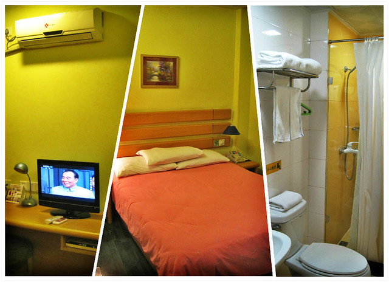

**第一天（11月7日）：汕头中旅客运站、广州天河客运站、如家酒店长寿路地铁店、第十甫路、上下九步行街**

半个月前，hillway问我要不要和他一起利用周末去广州旅游，我很快答应了下来，并开始在网上搜索有关广州的游记和旅游攻略，大致定下了十个感兴趣的景点。还是2011年12月底，我为了找工作参加师范类招聘会匆匆去了广州，又带着疲惫和失望回来，除了华南师大，哪里都没有去成。

比不上hillway公司还有一些出差的机会，我自从婚前和hillway去过一次厦门之后，再也没有迈出过汕头半步。因此，半个月的时间里，一想起可以去广州和hillway一起过周末，心情不由自主地开始兴奋起来，十分憧憬着周末的到来。临行前晚，hillway看到周末广州降温降雨的预报，有些抱怨选择出游的时间不当。而这些对于我来说绝对不是问题，即使有雨也不会一直下不停呀，纵然大姨妈也跟着造访，牙龈肿痛口腔溃疡，但也丝毫不改我对于这次出游期待和愉悦的心情。

广州上下九步行街首先吸引了我的注意，向来就很喜欢这种店铺云集种类多样的地方，强烈建议hillway将酒店定在附近。考虑周末客多加之抵达酒店时间较晚，就在网上预定了如家酒店长寿路地铁店两晚的大床房，每晚221元，预先支付了第一晚的房费。这次是和hillway在一起六年来，我住过的最贵的酒店了，和三年前招聘会那时自己住过的30元每晚的华南师大招待所形成天壤之别。

在中旅客运站买了十二点十分去广州的车票，每张130元。离发车一个小时，hillway突然想起有东西落在公司，于是乎，急忙匆匆先从家门口坐公交去公司，然后又重新等公交车去车站，满头大汗，总算赶在十二点零五分赶到车站。

坐在车上，hillway忽然想起网上支付的房费出了些问题，忙着给如家400客服打电话，被告知无法取消，房费也无法返回支付宝，我帮着他想对策，建议抵达酒店以后再和前台商量解决办法。一路上，hillway的心情都不好了。

原定十二点十分从中旅客运站发出的汽车，等客后慢慢悠悠又开去中心站，中途在服务区休息十五分钟，直到七点半左右才抵达广州天河客运站内，等我们赶到逢源路上的如家酒店已经是八点多，预先想出的几种解决方案全部被前台大姐否定掉，hillway的心情变得更加糟糕。放好行李，hillway脾气很坏，催着下楼吃饭，根本不给人家拿雨伞的时间，一路骂骂咧咧疾步走在去吃饭的路上。hillway的一张黑脸如同一团巨大的阴霾笼罩在我的四周，感觉十分压抑，本来自己很轻松愉快的旅游心情全被破坏了。我跟他讲，既然是出来旅游，就是图个高兴。遇到问题就想办法解决，如果解决不了就算了，不要因为221块钱的房费坏了旅游的兴致，即如此，倒不如回家算了。而hillway仍旧沉浸在自己的情绪中，疾步如飞往前走，我只好快步跟在后面，路上的积水溅在裤子上，那些对我来说十分新奇的沿街店铺是没工夫看的，也算是明白平时走路如踩蚂蚁一般速度的人其实也是可以走快的。走在路上，我不由回想起上半年和hillway一起去星湖影院看《同桌的你》时的情景，仅因为电影没有达到他的预期，气愤到电影散场自顾自奔下楼去。hillway认为一场烂电影浪费了他一个半小时的时间，而因为他的怒气冲天的决定，眼看着末班车从身后错过，我们只好步行去另外的公交站等车再中转，原本二十分钟的回家路程中转延长到一个半小时。那个时候，我好久未出家门，很想逛逛从未到过的星湖城，压抑着被破坏的心情快步跟在他后面，暗下决心再也不和hillway一起看电影了。而此时此时刻，我也在警告自己，再也不要和hillway一起出来旅游了。因为我并不具备很好的自己调节能力，心情极易受周边人事影响，带着一份坏心情旅游倒不如自己在家里轻松自在。

晚饭是提前在网上团购的28.5元的真功夫第十甫路分店的双人套餐，有酸菜卤肉饭、冬/香菇鸡腿肉饭、香滑蒸蛋、金杏蜜桃汁（卖光了，换成热豆浆）、西兰花。听上去种类挺丰富，实际上分量也挺足，酸菜五花肉是我的最爱，十分入味，而西兰花又硬又凉，hillway选择了他最喜欢的鸡肉饭来吃。虽说是家常味道经济套餐，性价比很高，吃到肚子饱饱出门，任凭路边烤鱿鱼蒸扇贝的香气阵阵飘来，也勾起不了任何食欲了。吃过饭已经是九点多钟了，就在上下九步行街逛了一遍，hillway的心情也慢慢平复了下来，他决定明天上午按照我的方法去解决问题，并把私下逐一和退房客人协商的任务交给我。回去的路上下起了雨，幸好中途有段骑楼和屋檐可以躲雨，在绝味买了15块钱的香辣鸭脖。洗过澡收拾下已经到半夜一点钟，而我就是那种心里揣不下事情的人，又畏惧与人协商，带着这种不能确定的任务，一夜都没有睡好觉，一直做梦，醒过来好几次，头昏昏。
