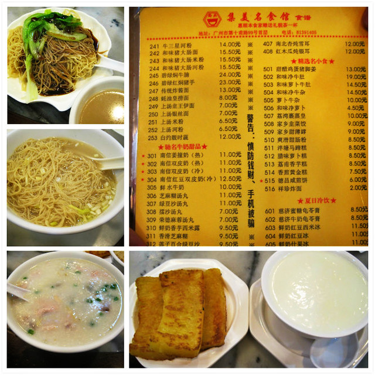
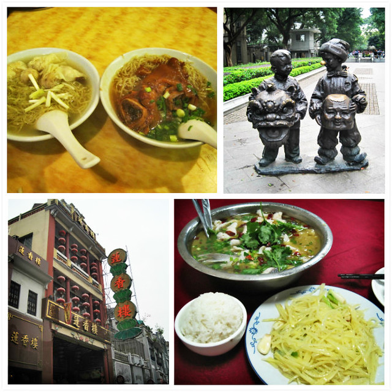

**第二天（11月8日）：石室耶稣圣心堂、德宝交易广场、上下九步行街、西关、沙面、中山大学、恒宝广场**

早上将近八点钟起床，询问酒店前台小妹说通常十一点后退房的客人比较多，就决定先吃早饭，出去完成一两个景点的游览任务，赶在十一点左右再回酒店坐等。在酒店附近多宝路上吃的早饭，我把宝多面店混淆成更有名的宝华面店，点了一份鲜虾云吞面和一份招牌猪手面，都是十元一小份。hillway不喜欢猪蹄等肥腻的肉类，吃的那份鲜虾云吞面，云吞里有整只的虾仁，口味还不错。十元的小份量对于早饭来说是足够了，只是大清早就啃卤猪蹄这么油腻的东西，加上自己口腔溃疡，几乎没有怎么嚼，硬生生把大块大块的猪脚筋都吞进肚里，有些不习惯。

广州从7号晚上开始下雨，8号早上依旧淅淅沥沥，本打算乘公交车去石室耶稣圣心堂，结果站在反方向的公交站牌前，却找不到对面的公交站牌究竟在何处，后来决定放弃公交出行，全部坐乘地铁了。赶到石室耶稣圣心堂已经将近十点钟，之前看网上介绍说每逢周末早上八点有祈祷唱诗等活动，看着教堂大门紧闭，心想全都错过了，连室内都看不到了，只好在教堂前方自拍了几张合影。带着扫兴绕着教堂转一圈，发现有个侧门是开着的，惊喜地跑进去，总算是可以见到里面的景致了。

这里比我之前在世界之窗看到的教堂要大很多，每排座位的抽屉里都放有一叠圣经类的书籍，翻开看看，有好多本都是全英文的，看来要信教还得有些文化基础才能看懂呢。最让我感兴趣的是教堂的彩色玻璃，尽管室内光线昏暗，但是那些玻璃画却十分绚丽夺目，我本以为是玻璃中间放置了灯管的缘故，走进一扇打开的玻璃窗户细看，并没有灯管，应该是玻璃画涂料的神奇效果吧。教堂内四周放置多个供信教者忏悔用的小屋子，教父坐在中间。令我不解的是，这种设计考虑的是忏悔者不被教父知晓面相，而教父隔间的挡板很低，忏悔者离开时从隔间走过岂不是还会被看到。

十点半游览完教堂，考虑到继续去沙面肯定赶不上酒店其他客人退房的时间，于是决定在附近转悠转悠，教堂周围的沿街店铺多是卖节日庆典用品。又到德宝交易广场逛逛，发现客人很少，每家店铺的老板坐在门口，我们两个走在里面感觉有些不自在，也没有什么需要采购的物品，就打道回府了。

十一点半赶回酒店。等了一会儿有位衣着时尚的中年妇女结账，我赶忙走过去和她商量，结果她一脸抵触和不耐烦，以“太麻烦，会算错”为理由拒绝了。我只好灰溜溜退到旁边继续等待。不一会儿，从电梯里出来一家三代人，有个中年男人在办理退房，hillway让我去和他们商量。我还没从刚刚被拒绝的郁闷中走出，想着又要面对这么一大家子人（后来才知道并不是一家人），有些不情愿。hillway皱着眉头，坐在沙发里一个劲地催着我赶紧去。好在这位中年男人很快答应下来，我终于拿到了那221块钱现金，压在心中的包袱总算放了下来。hillway一看问题解决了，十分高兴，一扫脸上的阴霾和不快，兴高采烈地拥着我走出酒店的大门，说中午要请我吃大餐犒劳我一番。而吃什么对于我来说真是一件很无所谓的事情，我只是觉得出来旅游就要开开心心，不要搞到如此压抑、心情不畅快就好。

午饭是在第十甫路的集美名食解决的。点了一份上汤银丝面、蚝油皇捞面、皮蛋瘦肉粥、南信双皮奶、黄金糕，合计46块钱。hillway本想继续再点，我觉得已经够吃便制止了。我把上汤银丝面和蚝油皇捞面想象的太好，实际上真可谓素的纯碎，上汤银丝面只有面和葱花，好在银丝面的口感不错，感觉比汕头的竹槌面更细更易入口。而蚝油皇捞面除了面，就只有蚝油和生菜了，配一碗小汤，面吃起来十分咸。黄金糕是油煎的，又油又硬，吃起来很费劲，也没有丝丝层层的感觉，倒是汕头红磨坊的黄金糕比较好吃。皮蛋瘦肉粥的口感和家里的稀饭不同，米煮的很烂很烂，里面放有皮蛋、瘦肉片、葱花和姜丝。最好吃的当属南信双皮奶了，当然价钱也不便宜，一小碗11块钱，吃起来奶味十足、甜而不腻，味道相当不错，也算是调节一下我被破坏的持续一天一夜的阴郁心情吧。

午饭后在附近走走逛逛，在人群里挤来挤去买了件特价玫红色毛衣，回酒店已是两点钟，午休片刻，三点钟出发步行去沙面，hillway拿着手机负责导航。从逢源路走到多宝路，经过西关，从蓬莱路又走到黄沙大道，到了沙面。虽说岛上有很多座西式风格建筑，而多数大门紧闭，没有对拍照的热衷，又无店铺好逛。hillway之前说，沙面肯定不是我喜欢的地方。话虽如此，对于如此出名的小岛，若是不来亲眼看看，也是不会死心了。走着走着时间已经到了五点钟，就决定赶往下一个目的地：中山大学海珠校区。

当我们走出中大地铁站，天色渐黑。几乎一直在走路或站着，加上大姨妈造访，不仅是脚累，腰部也十分酸疼，便走进地铁站附近的肯德基歇脚，考虑到肯德基随处都有，还是吃些有广州特色的东西。hillway拿出手机看到大众点评上有有很多人推荐川渝饭店，就往右直走再拐进怡乐路里的一个小巷子里总算找到了。

坐在学校附近的小饭馆里，不由勾起了我和hillway在浙师大读书的感觉，这家店像极了当时我们打牙祭时去过的三峡人家和重庆酸菜鱼，一起回忆起那段时期的经历和故事。点了一份酸菜鱼和一份醋溜土豆丝后，制止了hillway继续点菜的冲动。酸菜鱼35块钱，偏酸不太辣，和以前吃过的不同之处在于，里面放了好多的酸萝卜片，实在太酸，都没有吃，剩了小半锅。酸菜鱼看起来有一大盆，不算那些酸萝卜片，还有半个鱼头、一段鱼尾和两段长鱼骨，剩下的鱼片也寥寥不多了。那份醋溜土豆14块钱，相比店里的其他素菜而言，这个算是最便宜的了，其他都要二十几块一份了，而分量并不多，很久没有去外面饭店吃炒菜了，素菜竟涨到这么贵了 。加上茶位费，一共55块钱，就像当年在学校下馆子一样，hillway觉得钱花的少没面子，便让我去结帐，感觉自己没有吃饱。

吃过晚饭已经是七点半了，天全黑了。我们从附近的中大西门进入校园，游览活动名称也可以改成“夜游中大”了。校园里几乎找不到指示牌，路灯昏暗，随性乱走，不知东南西北，找来找去也没有找到中山大学的正门在哪里，拍照更是不可能了，我们既失望又疲惫，在路边学生的指引下，原路返回地铁站了。觉得折腾了好长一段路才到中山大学，黑灯瞎火，走路走得很累很累，花了14块钱地铁费，而几乎什么景色也没有看到好不值当呀。转念一想，这里还是帮我们找到一些读书时的感觉和回忆，了却了hillway总想回浙师大住几天的念想，也算是不枉此行了吧。

九点钟到达长寿路地铁站，实在累到不行，从早上起床到晚上几乎一直在走路，乘地铁来回换乘也没有座位，就到恒宝广场里的肯德基歇脚。坐了一会儿，看见商场里有些店铺标着清仓特价之类的牌子，起身再逛，对着一件39块钱的长款宽松T恤纠结了半天，还是放弃了，决定养精蓄锐等待抢购双十一的特价。十点钟，商场也关门了，我们只好出来了，在商场门口的路边摊给hillway妈咪买了一个黑色pu斜挎包，望望不远处的上下九步行街，心有余而力不足，拐弯回酒店了。

hillway躺在床上，问我：“可不可以我待会儿躺在卫生间地上，你给我冲澡呀？我实在是爬不起来了。”

"地板多脏呀。再说，地方那么小，你也躺不下呀。"

“你什么把这次广州游的行程安排的这么紧呀？好累呀，像上次去厦门那样，只去厦大、南普陀和鼓浪屿，任务完成起来也轻松一点呀。”

“这也叫行程紧呀，本来打算第一天傍晚去荔湖湾公园和上下九步行街，结果汽车到广州太远，那个公园都没有去成。第二天本来打算上午去石室耶稣圣心堂和沙面，下午去中山大学，晚上夜游珠江和北京路，结果只完成一半的任务。明天上午是越秀公园和白云山，之后回酒店退房再去坐汽车。对了。还有红专厂没有去怎么办？”

“我的天呀！！！”
