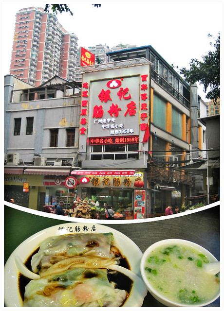
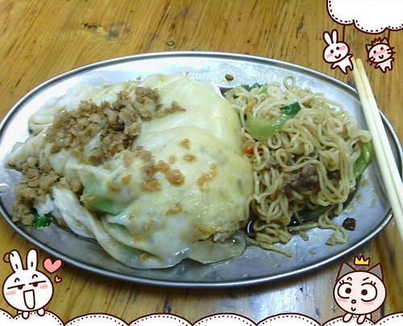
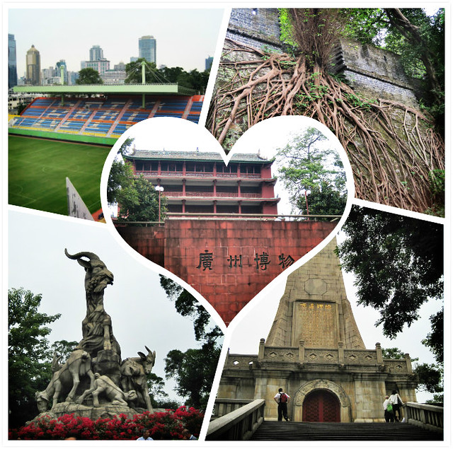
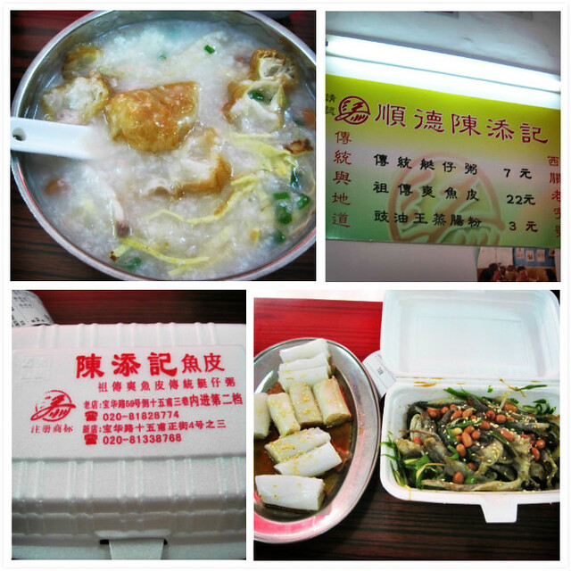

**第三天（11月9日）：越秀公园、广州天河客运站、汕头汽车总站**

广州游的最后一天，决定品尝下广州的银记肠粉。我们点了一份20元的套餐，有牛肉肠粉、鲜虾肠粉和滑鸡粥。以为套餐比单独点肠粉（12元一份）划算，端上来发现如同团购一样，种类虽是够了，但是分量大大减少。

这里的肠粉和汕头的做法不同，除了几片牛肉或两个虾仁，就是葱条和姜丝，而且葱条很多。而之前在汕头华坞路口吃过的猪肉肠粉（5元一份）里面不仅有猪肉，还有生菜、鸡蛋、香菇等材料，外面撒有菜脯。那份滑鸡粥的做法同样纯碎，里面除了鸡肉，也只放葱末和姜丝。虽说做法不同，味道清清淡淡也很好吃，只是对于不吃葱姜的人来说，挑拣出来要费点功夫啦。（下图为汕头华坞路肠粉和蒸面）

早上的时间过得好快呀，八点出门吃早饭，赶到越秀公园已经是九点钟了。进入正门右走，我们从南苑开始爬山，沿路有很多晨练的老人家，沿着镇海楼的指示牌到达了广州博物馆，旁边是一个大型的体育场。再沿着孙中山纪念碑的方向，恰好赶上了十点钟开放的时间，进门参观发现里面只有楼梯而无其他。顺着土城墙走，又遇上了一群跳舞的老人家，节奏欢快舞步轻盈，勾起了我想去学习跳舞的冲动。再往前走，便找到了著名的五羊雕像，围着拍照的人很多，也没细看，就匆忙加入了拍照的行列中。时间不知不觉到了十一点钟，就原路离开了公园，出门看到指示图才发现我们游览过的面积只是整个公园的三分之一，里面还大得很呢。整体感觉越秀公园比汕头的公园好玩，空气清新，沿路十分干净，有的山爬，有的景点逛，有的锻炼。仍旧感到累，时间也不够了，就放弃了接着去挑战白云山的计划。

将近十二点钟赶到酒店办理退房，前台当班的还是第一天办理入住时的大姐，仅开着昏暗的灯光，仿佛是一个魔咒，又使我们遇到新的麻烦。她说酒店今天歇业，系统锁死，无法办理常规的退房手续，当然也拒绝了那些来入住的客人。hillway一听，情绪立马上来了，先打电话向公司同事询问，然后又气急败坏而无可奈何地接受了这种他无法改变的事实。退房后，我们把行李寄存在酒店。去吃午饭的路上，又上演了那天办理入住后相似的情景，hillway仍旧黑着脸，骂骂咧咧，沉浸在愤怒中，不管三七二十一，疾步往前走。

按照网友游记的推荐，在一个小巷子里发现了陈添记。店里人很多，我们把招牌上的传统艇仔粥、祖传双鱼皮、豉油王蒸肠粉各点一份，总计32块钱。传统艇仔粥的内容比较多，吃起来感觉有油条、鸡蛋丝、鱿鱼丝、鱼片、猪肉、葱末、姜丝等材料。蒸肠粉卷口味偏甜，上面撒有芝麻。我和hillway都不喜欢吃鱼皮，而这里的祖传双鱼皮一改常规的口感，吃起来十分脆爽，已经尝不出来鱼皮本身的味道，凉拌有花生米、葱条和青椒，分量不多，尝尝味道就好，留下一半带回汕头给小蜜瓜们品尝。

陈添记仅能满足品尝的需求，填饱肚子是不行的。上下九步行街附近的各类小吃很多，价钱看似不贵，都在十几二十块左右，但是总体分量都不多，吃过没多久肚子就饿了。考虑到下午坐汽车回汕头还有六七个小时车程，决定还是找家经济实惠的饭店。

最后决定还是去真功夫。hillway坐在店里，连上wifi，又团购了一份28.5元的双人套餐，和第一天晚饭的内容相同，吃到肚子撑撑。不仅肯德基、真功夫等店里提供wifi，就连银记肠粉店等老字号小吃店也可以手机免费上网。

吃过第二顿午饭，在上下九步行街给小熊仔买了一个猫头鹰图案的斜挎包，在莲香楼买了一包花生果仁酥糖。赶上周末，路上和地铁里的行人很多，熙来攘往，多是衣着光鲜靓丽的年轻人。不比平日在乘坐汕头公交车，十有八九都是老头老太太。

汽车从四点十五分从天河客运站到达汕头汽车总站已经是十一点钟，等我们饥肠辘辘回到家中，将近十二点，小蜜瓜刚刚把小熊仔哄睡。

这三天里，小蜜瓜在家里白天黑夜照料着小熊仔，给我和hillway提供了此次旅游的机会。

**携带物品清单：**

旅游攻略、身份证、结婚证、钥匙、现金（包括坐公交/地铁零钱）、银行卡、手拿包/斜挎包、手机、手机充电器、相机、相机备用电池、相机充电器、饮水杯、充饥零食、雨伞、衣服鞋袜、睡衣、护肤霜（防晒霜）、卫生巾、卷纸、手帕纸、湿纸巾等。

**三天两夜花费清单：**

汽车费：130+130+130+130=520元 住宿费：221+221=442元 餐费：28.5+15+20+46+55+20+32+28.5=245元 地铁费：10+4+4+6+8+6+6+10=54元 其他：10+25+10+19=64元 合计：1325元
