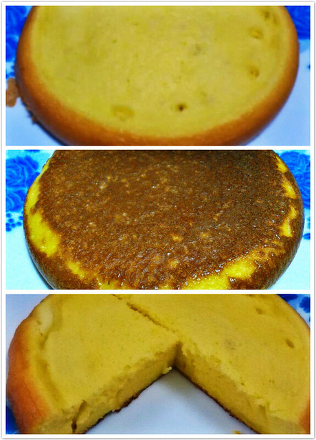

hillway出差去了黄山。晚饭后，我和小蜜瓜抱着小熊仔出门溜达，时不时吹来一阵风，有些清冷的感觉。

小蜜瓜说：“有空买斤鸡蛋糕吧，肚子饿的时候吃，松松软软我喜欢。”

第二天和同事去华坞路吃肠粉，并没有找到卖鸡蛋糕的商店，想起来前些天在网上看到的用电饭煲做鸡蛋糕的图示，材料家里都有，自己便动手尝试一番。

第一步：时间：19：00 拿出四个鸡蛋，将蛋清和蛋黄分别放入两个容器，容器要求无油无水。

第二步：时间：19：20—21：20 拿出三根筷子手打蛋清，也要求无油无水。这个过程图示仅用了15分钟便大功告成，而实际上，我完成起来却相当漫长和费力。

三个小时的《黄金时代》还剩一个小时未看，小蜜瓜抱着小熊仔出去转悠，我一边看电影一边不停地搅拌蛋清。蛋清起沫是比较容易的，一两分钟就可以了，放入一汤匙的白糖和一点盐，一直搅拌到电影结束也没有任何变化。不甘心放弃，又放了一汤匙的白糖，小蜜瓜这时抱着小熊仔回来了，也加入了手打蛋清的行动。两个小时过去了，正准备说放弃的时候，发现蛋清上面漂浮着厚厚一层奶油状的物体。

第三步：时间：21：20—21：40 往蛋黄中放入一汤匙白糖、四汤匙面粉和六汤匙牛奶进行混合，均匀后加入一半搅拌成功的奶油状蛋清，混合后再放入另一半搅拌均匀。剩下一部分没有成功的水样蛋清就搁置一旁了。

第四步：时间：21：40—22：20 将电饭煲预热一分钟后锅底抹油，倒入搅拌好的材料，先按米饭键两分钟左右跳到保温，用纱布盖住出气口焖二十分钟，然后再按米饭键，跳到保温后再焖二十分钟便可以出锅了。

做好的鸡蛋糕没有期待中的蓬松，鸡蛋味比较浓，吃起来不会很甜，虽然没有达到店里卖的鸡蛋糕的效果，也不至于糟糕难吃，第一次自制鸡蛋糕也算是成功大半吧，手打蛋清环节还需要继续研究。

