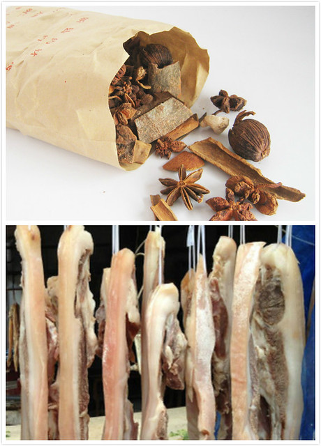
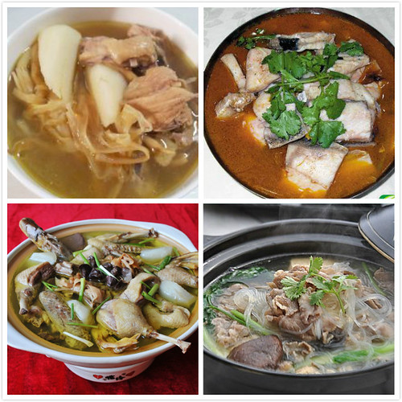

在老家的时候，每年临近春节，家里都会提前买一些五花肉、猪肚、猪大肠、鸡、鸭、鱼、羊腿肉等，先用盐腌上一两天，然后在肉上切一个小孔，用绳子穿起来，放在楼顶上晾晒。晒好的五花肉和鸡称作腊肉和腊鸡，鸭称作腊板鸭，应该是被压成板状的缘故吧。老家的冬天很冷，这些材料晒好以后，就转移到家中悬挂着，吃的时候就割下一块儿。

老家的腊肉无需烟熏。通常有两种吃法，一种是拿来做菜，例如腊肉片炒蒜薹，腊肉片炒花菜。用腊肉和黄鳝同焖，加入蒜苗葱姜红干椒，因为春节前后黄鳝价高，虽然此菜十分美味却不常吃到。第二种是用卤药来卤，将腊肉切片食用。认识hillway以后发现，他们老家却是把晒好的腊肉切成很大一块，一次要用掉一到两条腊肉，放在高压锅里煮，用来做火锅烩菜的汤底。

晒干的鸡和鱼硬邦邦，并没有多少肉可以吃。腊鸡或是和腊肉以及晒好的猪肚、猪大肠等放在卤锅里卤，或是用来焖。卤药通常都是从医药门市部买来的。腊鸡腿是小蜜瓜的最爱，而我则喜欢卤猪肠。

鸡，除了临近过年的时候用来腌制晒干，平时还有焖和炖两种吃法。用来焖的通常是那种肉质鲜嫩的小公鸡，放入粉皮或是葫芦、薄豆腐同焖十分美味。而用来炖汤的是老母鸡。黄花菜老母鸡汤常常作为坐月子的大补之品（下图左上），但油脂太多不易多吃，在这方面，我有着前车之鉴。

读大学时，附近菜市场来了几个外地人，他们卖的鸡肉是切块腌制好的，买回家无需再加任何调料，只需加热炒熟即可，味道比平时直接买来的鸡肉可口，口感更鲜嫩。除了腌制调味的鸡肉，还卖有裹好炸粉的小鸡腿，赠送孜然粉，自己买回去油炸，口味不比肯德基逊色。听小蜜瓜说，他们每天的生意都很好，需要赶早才能买到。后来看多了关于食品安全与添加剂的新闻报道，宁可信其有不可信其无，也就很少买了。

老家很喜欢喝老鸭汤，小蜜瓜尤甚，她不喜欢鸡肉，偏爱鸭肉，将老鸭汤当做下火特效汤，隔三差五或感觉上火的时候就会买一只老鸭回家，放入海带或白萝卜、葱姜来炖汤，连续喝上几碗或是几天都不减对老鸭汤的喜爱（下图左下）。通常家里只要一炖老鸭汤，我的心情就不好了。因为既然炖上一大锅汤，就不会再另外炒菜，而我很排斥喝汤，特别是鸭汤，即使他们把鸭腿分给我，也只能在抗议无效后，默默拧开一瓶辣椒酱，蘸着酱把鸭肉吃下。后来走过很多地方，再也没有遇到哪个地方像老家那样对老鸭汤的热爱和迷恋，在南京见到最多的则是鸭血粉丝汤。在读高中时，大十街开了一家卖馋嘴鸭的店面，每天香味飘的好远， 据说经过腌炸烤等多到工序 ，十分入味。虽然不是原产的家乡小吃，确是至今吃到的最好吃的鸭肉做法。

除了鸭汤，小蜜瓜很喜欢鱼肉的鲜嫩。晒干的鱼吃的比较少，平时买的最多的是鲫鱼和草鱼。临近春节，小蜜瓜则会腌上几坛筒鲜鱼，同样十分喜爱（上图右上）。筒鲜鱼的名字是在网上搜来的，原来自己音译成了土咸鱼。因为这种鱼的制作过程是，将买来的大条武昌鱼洗干净切块，撒上盐搅拌均匀，放入陶制坛罐中密封起来。大概一个月后，就可以开坛食用。闻起来有轻微腐臭的味道。家乡人喜欢吃筒鲜鱼，大概和人们对臭豆腐的喜欢相似吧。按照现代饮食观念来看，筒鲜鱼并不够健康营养。鱼刺因为腌制的缘故和鱼肉脱离，少了挑鱼刺的辛苦，腌制的过程去除了部分鱼腥味，还是可以跟着十分热衷筒鲜鱼的小蜜瓜一起吃上几块，而最感兴趣的倒是煮筒鲜鱼的水在低气温下凝固成的鱼冻。

羊肉同样是小蜜瓜的最爱。腌制晒干的羊肉切块放入大量的红干椒或火锅底料，小火慢炖。吃的时候，烩入的粉条和白菜吸收了羊肉的鲜辣，十分美味（上图右下）。吃着吃着，碗底就会凝固一层油，而我最喜欢羊肉火锅里面的白菜。那时候家中还没有电磁炉，都是围坐在平时做饭的煤炉周围，老式煤炉很重，通常都要等到大地瓜下班回家来。如今回想，虽然条件简陋，但丝毫不影响食物的美味和家的温馨。像那些只需加热无需烩菜的火锅，就拿出那种中间放炭火的老式火锅，如今也不常见了。

野生蘑菇，因为采摘过程辛苦，数量较少，售价并不便宜，记忆中小时候都要卖到三四十块钱左右一斤的价格。生蘑菇在清洗的过程中一不小心就会弄碎，吃法通常是加入肉片等煮汤。野生蘑菇汤因为“鲜”的口感和特点，很受小蜜瓜喜爱，而我对比汤毫无感觉。
