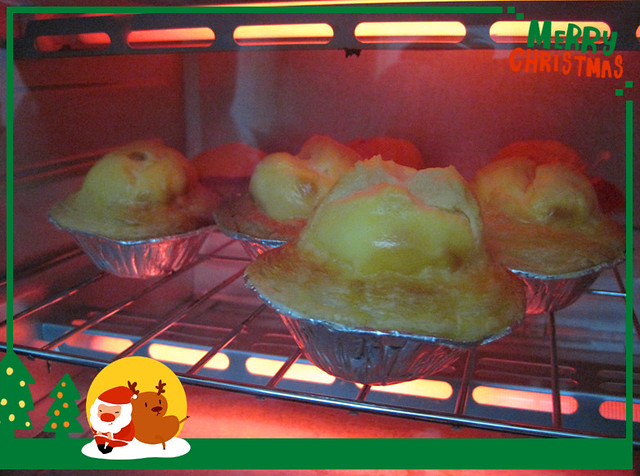

继第一次烤蛋挞之后，又做了三次尝试。

第二次尝试时，将蛋挞水的所有材料全部都倒入大碗中一起搅拌，结果面粉浮在液体上无法充分拌匀，在搅拌过程中产生了很多的气泡，不得不慢慢将小面团和气泡过滤掉，十分费神。

许是鸡蛋黄混入白砂糖被打发的缘故，烤箱里的蛋挞渐渐鼓起，没想到慢慢鼓成了叉烧包的形状。加之采取hillway总结的“小火慢烤”的经验，烤到最后蛋挞皮糊的厉害，然而里层的蛋挞皮还是湿湿的，并没有达到酥脆的程度，可想可知成品模样有多么惨不忍睹。

第三次尝试继续吸取前两次的经验。

在蛋挞水的配制上，先将鸡蛋黄、白砂糖和少量面粉混合在一起搅拌，不仅面粉可以和蛋黄搅拌均匀，而且不会出现气泡。搅拌完成后，再倒入淡奶油和纯牛奶搅拌均匀即可，无需过筛，直接可用。

在蛋挞皮的烤制上，尝试了hillway从网上看来的先烤蛋挞皮的方法，大概180度三分钟后，蛋挞皮被烤发，只能倒入一汤匙的蛋挞水便满满当当。蛋挞皮和蛋挞水分开烤的结果是，蛋挞皮底部仍旧没有酥脆的效果，而外圈因为烘烤时间太长又被烤到焦糊状态。由此看来此法并不可取。

第四次尝试继续吸取经验，将蛋挞水按照第三次方法配制好，直接灌入蛋挞皮中放入烤箱，温度设置在220度，时间为10分钟左右（因为烤箱受热不均匀），取出调整蛋挞摆放位置后，再烘烤5分钟左右即可。这一次的蛋挞水不仅没有鼓成叉烧包，外圈蛋挞皮也没有烤焦，脱模也十分容易，一点可没有站在锡纸碗上，hillway直呼已经达到外卖的水平。美中不足仍旧是底层蛋挞皮没有达到酥脆感。

自己动手做蛋挞不仅节省成本，而且保证一人一次可以吃到两三个。不过再好的美味吃多了也会腻掉，而且也有人根本不喜欢吃蛋挞。

正如喜爱鱼肉的人无法体会旁人对鱼刺的烦躁感和对鱼腥的作呕感。因为小时候被以吃鱼明目变聪明等为理由而强迫吃鱼的经历，让我深切感受被强迫的痛苦，明白自己觉得可口的点心也并非是所有人都喜爱的，因此记着不要强迫别人去吃不喜欢的东西。

我想，这世上没有哪一种食物富含的营养是绝无仅有、其他任何一种食物都无法取代的。后来到沿海吃到许多种类的个头小小的海鱼，惊喜的发现原来这世上真的有按照我的理想而生长的鱼，只有一根主刺，再也无那些十分恼人的细小鱼刺，吃起来十分省力，腥味也不至于很重。既然有些鱼肉品种吃起来那么难受和痛苦，为何不能换换其他种类营养相似的食物呢？

备注：后来家中的淡奶油用光了，便试着用纯牛奶、白砂糖、鸡蛋和面粉四种材料做蛋挞水，吃起来感觉口味也差不多。翻看烤箱附带的烘焙教程，里面的材料表更为简单，只要纯牛奶、白砂糖和鸡蛋三种即可。
