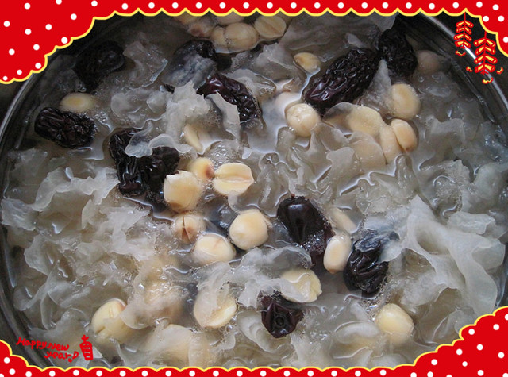
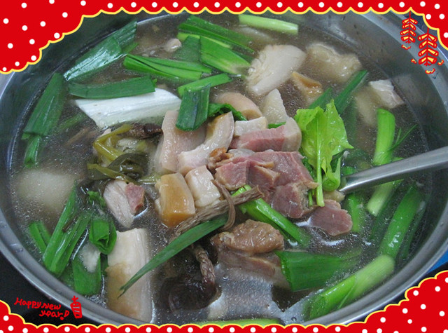
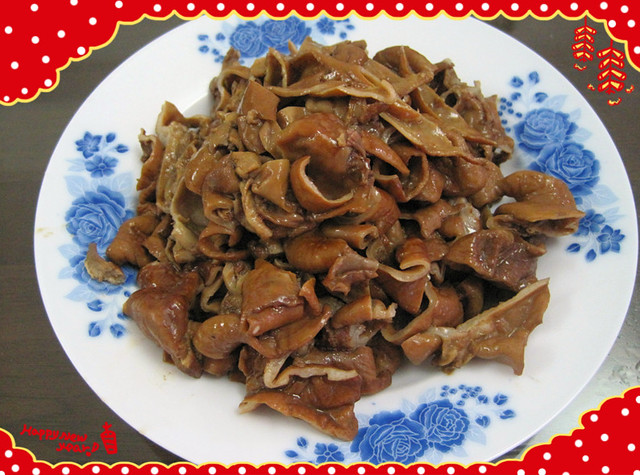
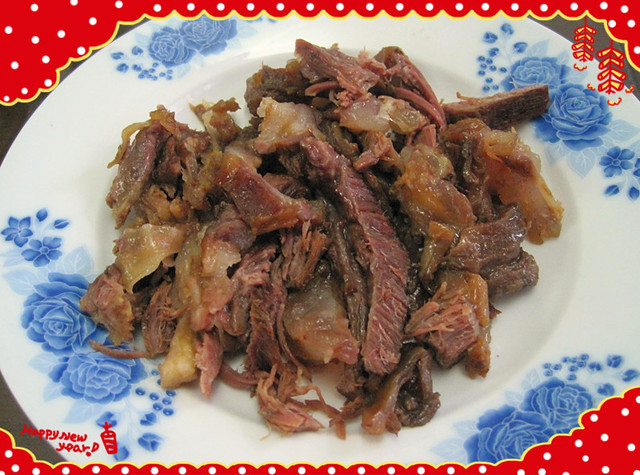
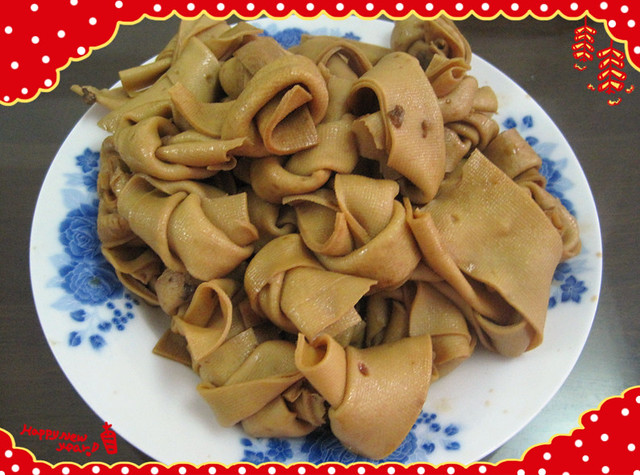
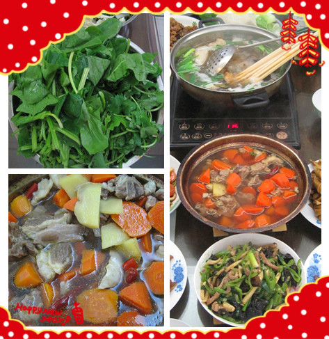
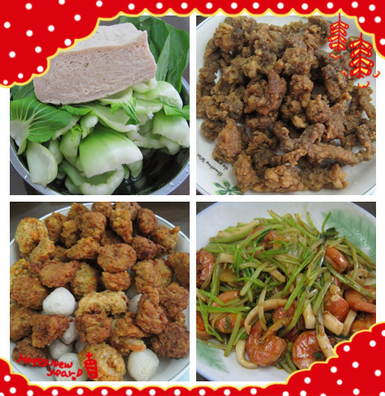
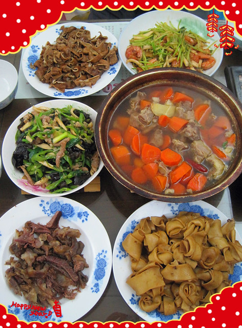
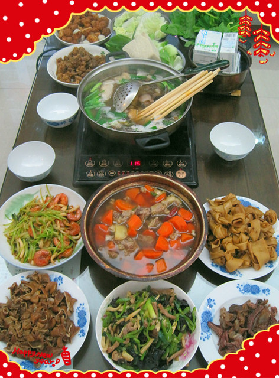

2015年除夕这天，大家一起床就忙碌起来，为年夜饭做准备。

为了能够全神贯注看春晚，便将包饺子的工作提前到了白天。洗了两筒衣服，赶在午饭前将饺子馅剁好（白菜提前一天洗干净晾干，饺子馅出水量会明显减少）。午饭后，和小蜜瓜协作包饺子，再放入冰箱急冻，作为大年初一的早饭。

hillway老家有着很多关于春节期间的规矩，比如除夕年夜饭不能喊“某某，吃饭啦”，而是要自己自觉就座；初一初二不准洗头洗澡，不准倒垃圾倒水；初五之前不能煮稀饭吃，年夜饭的米饭也要做硬一些，寓意是新年做人“硬实”……而我们老家则没有这么多规矩，最重要的就是多说吉祥话，不吉利的话就要忌讳不准说。

因为有着初一初二不能放水洗菜的规矩，hillway妈咪下午忙着把这几天要用到的蔬菜全部摘洗干净。

上午用高压锅焖煮了一锅红枣冰糖银耳莲子汤，煮熟后盛出留作晚饭后食用。哪知，年夜饭后大家的肚子好撑。hillway爸爸想着银耳汤再放入鸡蛋，小火慢炖口感才好，于是，刚吃过年夜饭便急着去厨房开火，被肚子很撑的hillway妈咪大声制止：“妈呀！！！你还没有吃饱吗？你的肚子有那么饿吗？你吃的下吗？现在不准炖！！！”

高压锅在完成煮银耳汤的任务后，又开始了煮腊猪腿肉（老家亲戚寄来）的任务，里面还放有白萝卜和茶树菇等同煮。吃的时候，放在电磁炉上可以烩菜、炸酥肉和萝卜丸子。

高压锅在工作的同时，卤药罐也没有闲着，在咕嘟咕嘟炖着腊猪大肠（老家亲戚寄来）和牛肉（hillway爸爸带来）。

卤熟后热腾腾切好装盘，实在是香啊！

用卤水再接着卤千张（据说不能和肉类放在一起卤），许久未吃卤味，吃起来味道也十分好呀。

腊猪腿肉煮熟后盛出，高压锅再接着炖红萝卜和牛肉，可谓是年夜饭的“功臣”啦。

家中卫生已经由hillway爸妈提前几天打扫干净，因此不必像去年那般手忙脚乱。在准备年夜饭的过程中，hillway和他爸爸开始贴对联和窗花。小熊仔午睡起床，小脸蛋白里透红，瞪着黑亮亮的眼睛看着新贴的大红窗花，感觉很新鲜。

青菜豆腐有些美好的寓意，即使不吃也是需要摆在年夜饭的餐桌上面。小蜜瓜提醒大家年夜饭一定要剩下一些，不能全部吃光光。

火锅的烩菜除了炸酥肉和萝卜丸子，还有炸鱼块，也是有着“年年有余”的美好寓意。

年夜饭有两个炒菜，一个是芹菜炒鱿鱼大虾，另一个是青椒黑木耳杏鲍菇炒肉丝。

小蜜瓜坚持每年看春节联欢晚会，认为“看着春晚才有过年的味道”。然而，今年的小熊仔总是缠着小蜜瓜，结果没能看上几眼。

最后，来一张整体年夜饭照片。祝大家新年快乐，身体健康，平安幸福，万事如意！！！

