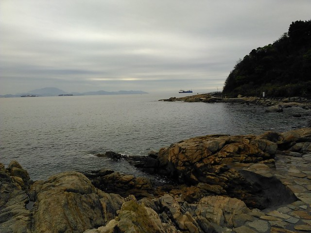
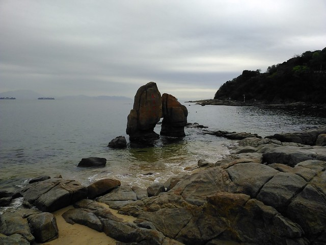
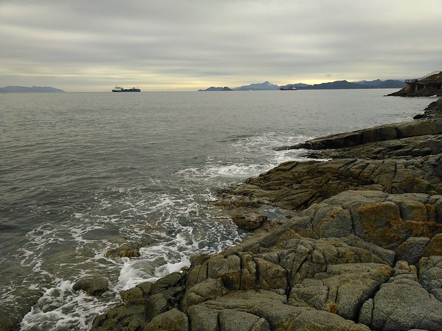

这是我第二次去深圳了，这次住在盐田港附近，所以就逛了附近的大梅沙，耳闻东门的热闹，不远十几公里乘车前往。

盐田附近有个“中英街”，听这名字就想一探究竟，只是去这个地方还需要办证（边境特别管理区通行证，非免费，即办即得）。先到网上看一下如何办证，没想到看到这条街的介绍和图片，短小狭窄的小街道（“长不足0.5公里，宽不够7米”），于是打消了去玩的念头。

我们晚上去了东门步行街，这是一片类似于厦门步行街、上海南京路的商业区，聚集了卖衣服、卖小吃的店铺，我对这种地方是没什么兴趣的，因为没什么要买，而且千篇一律，哪里都有。我们很快走出了步行街，前往地王大厦，网上说这里可以登高看深圳夜景。

用手机导航好不容易到了目的地，却发现这座大厦并不算高，我们真的怀疑它能看到香港的灯光。进入售票处，门票是80元/人，望远镜20元/次。嫌太贵，于是出来，坐公交车返程。

第二天一早计划乘车去大梅沙，谁知刚起床发现外面滴滴答答在下雨。既然决定了就去吧，反正雨也不大。

在路上，公交车跑在盘山的临海公路上，车窗外隐约可见壮阔的海面和海边的大碎石，内心马上激动起来。和第一次去南澳的情景很像。

下车前往大梅沙海滩，进入海滩发现与汕头的北山湾和青澳湾很像，沙滩的左右两边是矮矮的小山，和沙滩一起围成了一个湾儿。这里的沙滩干净很多，也大了好多。

我们打着伞在沙滩上行走，在沙上写字，看沙滩上的海鸟。

很快我们走到沙滩的边缘，发现一处深入大海的断桥。在断桥上驻足远眺，感觉自己被大海环抱。断桥的那边是用大石头修葺的“栈道”，海水在不停地拍打着栈道边的岩石。我们沿着栈道往前走，感觉前往大海的深处。

站在岩石上眺望，那远方的大山应该就是香港了吧。

