**第一天（4月23日）：潮汕站—漳州站—南靖站—云水谣风景区**

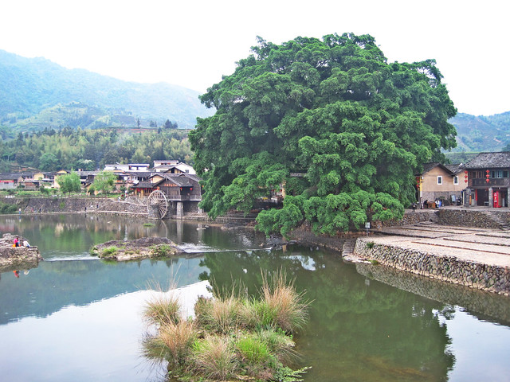

提前一天，网购最早一班09:43由潮汕站至漳州站的动车（49元/人）。为了吸取上次春运时误车的教训，清晨06:30起床吃早餐（炒粿条），08:30便到达潮汕站。时间尚早，在站外摆拍两张照片之后，也无处可逛，便进入候车室等待。

工作日请假外出旅游，为的就是避开大量人群。果然，很多动车车厢都空空如也，俨然成了我和hillway的旅游专车。乘坐动车省时舒适而且快捷，只不过每次过隧道的时候都感觉耳膜震得好难受。

<!--more-->

原以为要到漳州站再转车到南靖站，结果发现我们乘坐的D2352竟然也开往南靖站，无需下车再转，便直接在车上补了两张票（车票+手续费11.5元/人）。

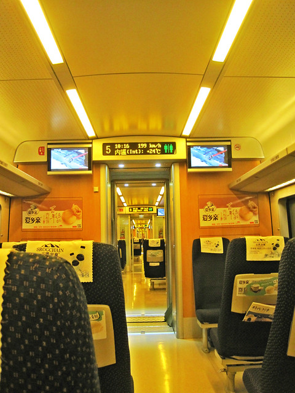

11:22动车到达南靖站。南靖站参照土楼结构而建，伴着旁边几位小黑车司机此起彼伏的拉客叫喊声，我和hillway在站前广场摆拍了几张照片。之前看游记介绍说，南靖站有到云水谣风景区的专线巴士（20元左右），淡季班次较少，比较难等，建议乘公交到南靖汽车站乘坐专线巴士（17元左右），班次比较多。若在南靖站外选择黑车或出租车拼车前往，人均在30—40元左右。

当我们收起相机，准备搭公交车的时候，恰好看见一辆专线巴士正停在广场上，车玻璃上贴着“书洋镇”、“云水谣风景区”等字样。从南靖站直接坐到云水谣风景区是22元/人，售票员称公家车很正规不还价。从南靖站到云水谣风景区的路上，除了县城中心比较热闹，其余大多是山路，比较荒凉偏僻，我便和hillway讲起坐专线巴士的好处：不仅是便宜，而且正规。像我们两个根本不认识路的，这样东拐西拐，尤其是夜里，被小黑车拉去荒郊野岭卖掉数钱都无能为力。专线巴士经过半小时左右的车程，于12:00到达南靖汽车站，13:00左右到达书洋镇，车上的乘客都下车了，剩下我和hillway两位需要到达云水谣风景区的游客。

当我们看到路旁的土房子上写着“坎下村”字样的时候，售票员急忙招呼我们下车，说是不小心忘记我们两人，车已经开过了，要自己再往回走。下车后，hillway指向右手边的一座土楼，原来这就是云水谣风景区里的怀远楼。我们往坡下走，被一位胖胖的保安叫住了，原来是要验票。云水谣风景区门票90元/人，hillway拿出提前网购门票（80元/人，门票包括云水谣古栈道、怀远楼、和贵楼三处景点）的短信给他看，保安说他这里无法兑换电子门票，需要到大门兑换成纸质门票。于是我们只好步行原路返回。

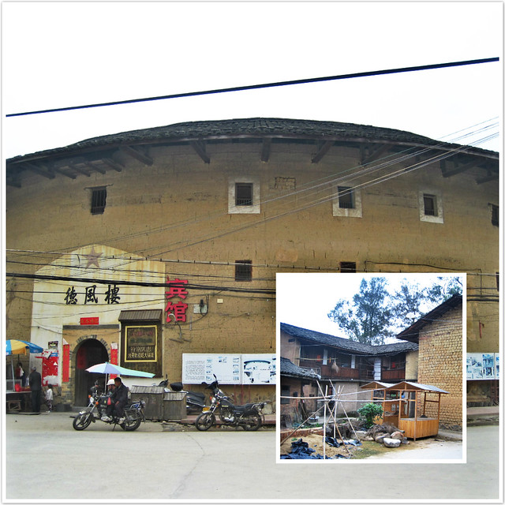

hillway担心到达景区内，旅店比较难找，便提前在网上预定了一间房，据说是土楼客栈，可以更好体验当地生活，地点在云水谣古栈道风车对面150处。我们走着走着，看到一座名为“德风楼”的土楼，上面还标有“宾馆”字样，看上去比较陈旧。有一篇游记里说这里的一些土楼是私自收费的，最好不要随便进入，而且土楼也不允许随意上楼，除门票之外，还需要再收费。鉴于此，我便站在门口伸着脑袋朝里往，试图寻找预定的客栈名称，门口的摩的大哥看到后，笑着说：“可以进去看啦，不要钱的。”

我们找了一圈，仍旧没有找到那家客栈，只好打电话给客栈老板。不到一分钟，老板就出现在我们面前，领着我们往前走进一条小巷里，路口没有任何客栈标志，确实很难找到。路上，前方一处低矮的泥巴楼进入我的视线，泥巴砖块分明，看上去摇摇欲坠，我的心里不由咯噔一下：“该不会要住在这里吧？不要不要不要……”老板带着我们继续往前走，算是松了一口气，心中充满对即将入住的土楼的担忧，步入另一座方形土楼。

客栈老板十分热情，他说这座土楼是他爷爷建的（看来他的爷爷好有银子的），已有百年历史。进入土楼，发现装修布置比较雅致，可以免费上楼拍照和饮茶（自家种茶）。我们预定一楼带木窗的客房（68元/天），内部是现代装修，有独立卫生间、热水器、电视、空调，木门上贴有免费wifi账号和密码。13:40分，我们放下行李，hillway提议出去吃午饭。大概是饭点已过，沿路众多的小饭馆都十分冷清，一位食客也没有。往往选择太多反而难以选择，我和hillway在这条路上来来回回走了两趟，正打算走进其中一间饭馆的时候，一直肥硕黝黑的大老鼠忽然穿堂而过，进入厨房，顿时食欲全无，又饥又困，便折回客栈了。

在客栈里烧水泡了一桶方便面，吃罢便睡午觉了。房间的床铺看上去比较干净卫生，然而床板实在太硬，吱吱作响，像是睡在木桌上一般，硌的骨头有些疼。唯有一个木窗并没有玻璃，只有几根竖木条和窗帘与室外相隔，客栈老板的妈妈在木窗外的桌旁一直忙着拿塑料袋包装客人预订的茶叶，窸窸窣窣的声音响了一下午，我们躺在床上，与她仅有一层窗帘之隔。 hillway轻言细语和我计划着接下来的行程安排，这样“偷偷摸摸”说话做事情，比平时我们和熟睡的小熊仔同处一室还要小心翼翼。本来，两个人独自出门旅游要的就是自由放松的感觉。没成想，在这里不仅没有安全感，而且还总觉拘谨和不自在。也算是懂得为什么同样的客房布局而一楼比较便宜的原因。

午睡后，旺盛的旅游精力恢复了。15:40分，拿起相机，背起背包，开始在云水谣风景区游逛。

第一个目的地是云水谣古栈道，站在桥上望向两旁的风景，左边的风景是电影中由风车、木屋、溪水和老榕树组合而成的经典场景，右边的风景里虽然只有溪水和老榕树，少了人为的痕迹，更显自然静谧。

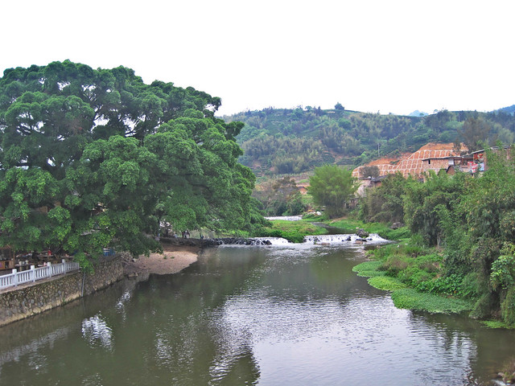

往来游客人手一部相机，而且大多是单反相机。我们的相机还是上学那时，hillway用兼职讲课的钱买来的，对拍照效果并没有太高标准，仍旧能够满足我们的需求。相机可以留影，但是有了相机，旅途中拍照变成了重要活动，静观风景反而变得无足轻重，尤其是跟着旅行团游览，更是挤在人群中“咔咔咔”拍上几张便赶往下一个景点了。

站在不同的角度望向水车处的风景，别有一番韵致。如今很少再去拍单纯的风景照，仅作为博客配图使用。除了单人照，多是寻找附近可以摆放相机的位置，甚至系在树上，和hillway自拍一些合影。

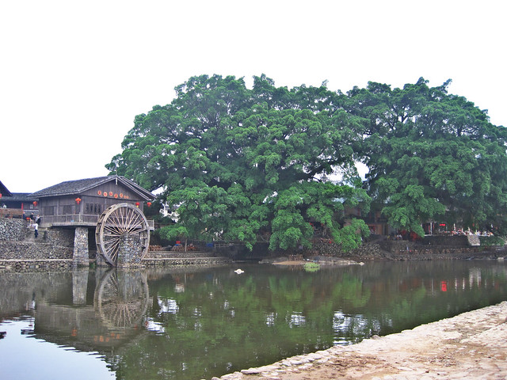

通往木屋水车的石阶桥旁的树上挂着一个用来拍照的葫芦，寓意为“招财”。

经过多次旅游后发现，通常每个风景区的最佳摄影点，都是在收费摄影处的三脚架相机摆放位置。在他们这里，不仅可以参考取景位置，还可以从摆放的照片成品中学习人物和景物的布局比例，拍出效果较为优良的照片。

云水谣风景区的溪水还算清澈，沿途可见洗衣服的村妇，溪水一侧的石子路上少见垃圾，清幽洁净，而溪水另一侧位于公路两旁的建筑布局则和各地的村落区别甚小。

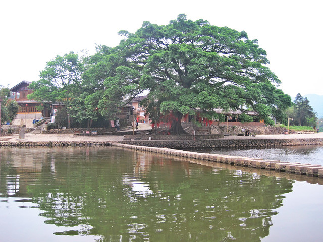

在我看来，云水谣所独具特色的美，并不在于可以随处复制的木屋、水车和石子路，而是美在这里经过千百年的风吹雨打、在大自然阳光雨露滋养下，一株株枝繁叶茂、生机勃勃的大榕树，还有大榕树下缓缓流淌着的溪水，在石阶铺成的小桥缝隙间灵动地向前流淌着。

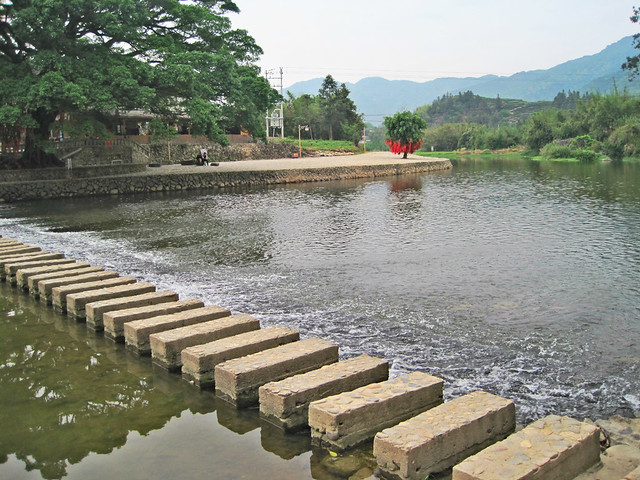

看到风景区里有关《云水谣》电影花絮的介绍方知，这里的水车和木屋都是当时为了拍摄需要，由剧组搭建的，并不是长教村原本所有，而拍摄成名后，村子也更名为“云水谣”，比“长教村”听起来更有意境，充满浪漫气息。

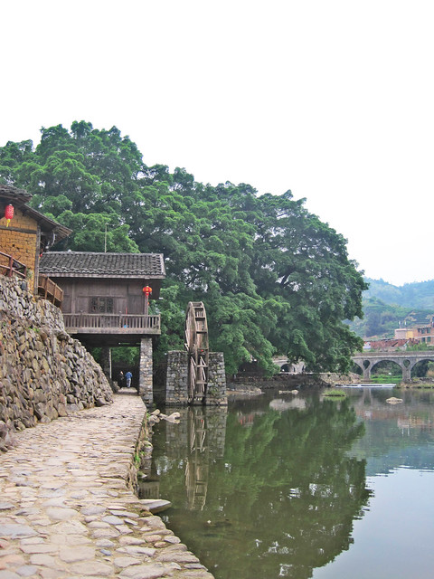

云水谣风景区和田螺坑风景区的门票分别是90元和100元，与北京故宫40元门票相比较，定价有些偏高。被“最大限度省钱”思想主导，我提议此次只选择游览云水谣风景区，因为田螺坑风景区里只有土楼，而云水谣风景区里既有古栈道，还有和贵楼、怀远楼两座土楼，游览这里可以兼具两种风格，性价比相对最优。（后来在hillway的劝说下，第二天还是去游览了田螺坑风景区。）

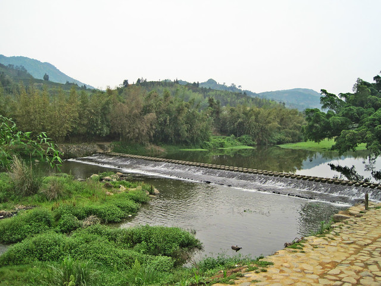

因为怀远楼、和贵楼位于不同方位，既然选择晚上在土楼住宿，时间充裕，便打算晚饭前单单把怀远楼慢悠悠地逛一逛就好了。

怀远楼并没有之前想象的那么远。游览过云水谣古栈道，顺着石子路，拍拍照片，逛逛沿途的小铺子，不知不觉便到达目的地。

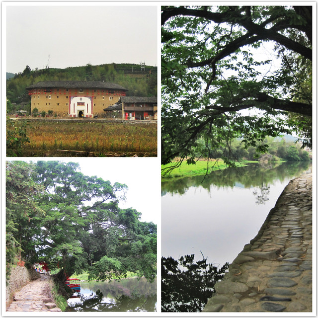

游览过怀远楼，肚子咕咕作响。18:00左右，我和hillway原路返回，在公路两旁寻找解决晚饭的饭馆。意外发现，原来正值饭点却也和中午的情景相似，每家饭馆都没有客人。

hillway对路边一家名为“女朋友”的饭馆十分感兴趣。但是我们发现，从中午到晚上在门口来来回回好几趟，也没有看见店里有什么年轻小姑娘，只有一位中年大妈和两位老伯，到了晚饭时间，既没有开灯，屋内漆黑一片，也没有客人。于是，我们又转悠一圈，看见一家名为“野鸭子”的饭馆门口终于出现了一桌用餐的游客，便抬脚进去了。

这家店的菜单标价普遍偏高。我们点了酸辣土豆丝（18元）和梅干菜扣肉（35元），还有两份米饭（3元/人），hillway觉得不好意思，想再点一个晕菜，又被我制止下来。果然，大家都喜欢选择人气旺的饭馆，我们落座没多久，又进来了三批游客，把小饭馆坐的满满当当，热热闹闹。旁边的几家小饭馆仍旧空空荡荡冷冷清清。

估计是因为风景区位于小村庄的缘故，总感觉厨房不够洁净，乌黑一片。看到老板在门口拿出一大块硬邦邦的、不知道冷冻了多久的带皮肥猪肉在案板上切下一些备用。

我们点的两份菜端上来之后，感觉十分不爽。酸辣土豆丝估计是老板太忙没有洗锅，土豆丝不仅粗细不一，而且上面沾有很多的黑末末。梅干菜扣肉用一个小小的盘子盛着，翻来翻去，数了一下，只有三片薄薄的带皮肥猪肉，剩下全是梅干菜。

以前在浙江读书时，学校食堂里常有梅干菜焖肉，口味独特，十分下饭。放寒假时还专门买一些带回老家，心想着给小蜜瓜尝一尝。结果小蜜瓜看到后，告诉我：梅干菜是他们小时候经常吃到的菜，因为家里穷才吃的，现在生活条件好了，没想到如今还有梅干菜在卖。还有前些年十分流行的韩国大麦茶，也是以前肚子不消化的时候喝的，都是很平民很低廉很有年代的东西，并不是如今新鲜原创的。

福建和浙江两地的梅干菜有所不同。浙江人做梅干菜时切得比较细小，口味偏咸偏干，比较香，有嚼头。而福建的梅干菜切成长条，吃起来有些甜又有些苦涩，吸足了菜水，软趴趴的。一小盘35元的梅干菜扣肉几乎没动，我一边嚼着白米饭一边大呼“不值当”，hillway安慰我说：“好歹算是花钱知道了这里梅干菜的味道，算了吧。”看看其他饭桌上的盘子里，也剩下很多的菜。

结账后，感觉胃里很不舒服，便提议去云水谣自选超市买了一兜小零食调节一下，小超市里的商品售价还算合理，比那家小饭馆靠谱多了。

距离睡觉时间尚早。月光下，我们便沿着云水谣古栈道，在大榕树下散步。一路上，只遇到零零星星的三五个游客。hillway说，旅游的时候，遇上人多的时候总盼着人少一些，如今人气太少了，反而又盼着能多些人出来了。

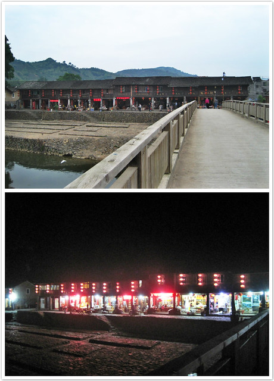

云水谣风景区的特色商业街仅有短短几十米的铺面，大多买的是当地的茶叶，走了一圈，感觉再无处可逛，便步行回客栈了。

双脚被捂了一整天，运动鞋刚一脱下来，hillway一脸嫌弃地连翻几次“白眼”，“卟咚”一声歪倒在床上，随后又从硬板床上坐了起来，四处找出遥控器，看起电视来。

土楼院子里有一对饮茶的中年夫妻，21:00左右回房间后，四周开始安静下来。洗过热水澡，睡到凌晨4:00左右，感觉肚子好饿，实在睡不着便起床翻零食。顶灯怎么按都不亮，原来是跳闸了。只好借助手机微弱的亮光，伴着hillway的呼噜声，吃了几块小面包。躺下后，睡意全无，拿着手机看了一小时的微博才渐渐睡着（据说漆黑环境看手机损伤视力，下次切记多注意）。

**第二天（4月24日）：云水谣风景区—福建土楼游客集散中心**

迷迷糊糊睡又了一个小时。清晨6:00左右，光线透过窗帘洒进房间，右侧木制楼梯不时传来“咚咚咚咚”的脚步声，土楼的小院子开始热闹起来，一些游客在办理退房手续，这里入住并不需要缴纳押金，“退房”也不过是和热情的客栈老板道别而已。平时习惯了安静的环境，住进土楼里有些不太适应。目前正处于淡季，游客尚少，试想下，若是住满了游客，这种木制结构的房间隔音效果又差，声音从四处传来，此起彼伏，岂不是没有半点安宁可言?在床上辗转反侧，再也难以入睡，便起床洗刷了。

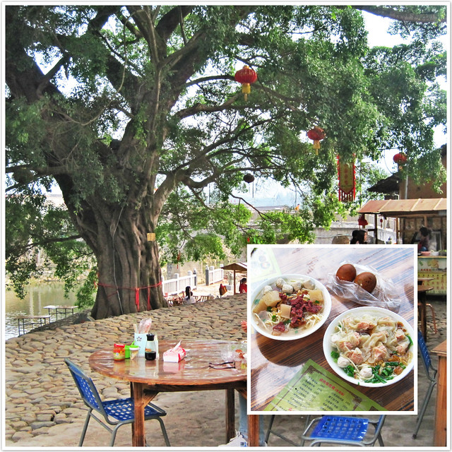

清晨8:00钟的阳光温和地照着云水谣的石子路，我和hillway坐在溪水旁的一处小摊前吃早饭，点了云吞面和牛肉面（均是10元/碗），另加两个茶叶蛋（2元/个），份量和价钱还算实在，口味也不错。

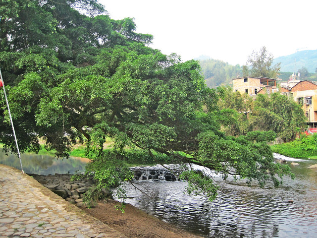

肚子吃饱后，便开始朝着和贵楼的方向前进啦。

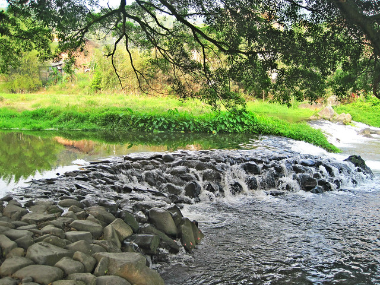

沿途的铺面还关着门，路上也少人行走。通往和贵楼的溪水两岸风景和怀远楼不同，更加平坦开阔。

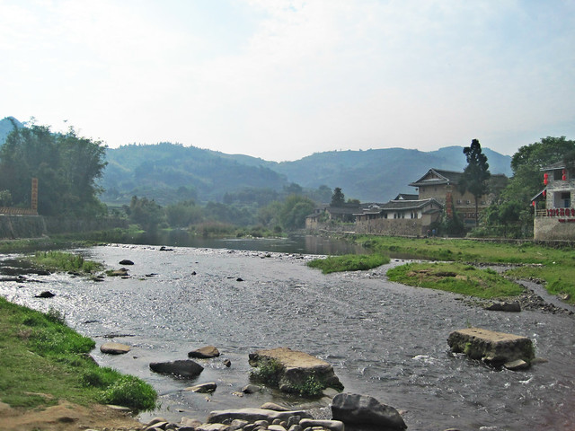

走进一处圆形土楼，一位胖墩墩的老阿婆招呼我们：“云水谣的东倒西歪土楼，进去看一看吧，还没有被开发的。”之前在游记中看到一处私下收费的翠美楼，想必就是这一处了。我摇摇头，继续往和贵楼的方向走。

走了几步，回头看见hillway好像有所留恋，踱着步子走得很慢，便冲他喊道：“前面有我们花钱买了门票的土楼，不需要再另外花钱看这个啦，快点走！”hillway听完，一脸无辜害羞状朝那位老阿婆笑笑，仿佛身不由己似的。

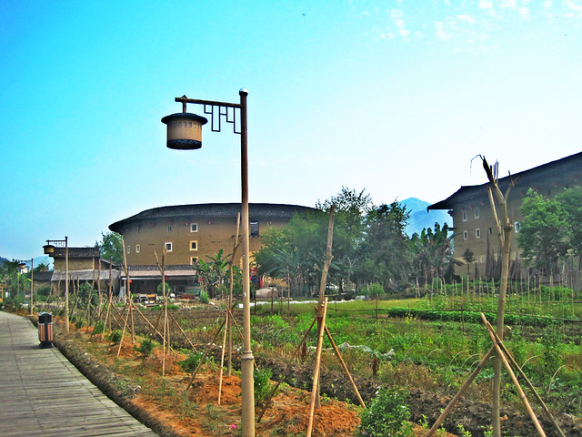

沿途有指向主要景点的路标，步行就可以到达，距离并不是很远，打消了之前需要乘车的担忧。

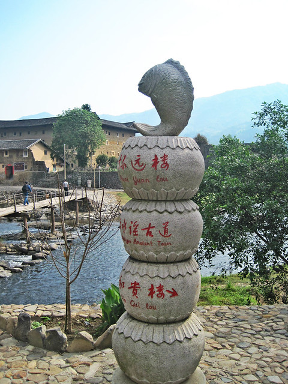

游览过和贵楼，时间尚早。我和hillway一路走着，商量着接下来的打算：是直接退房回家？还是转车再游览田螺坑风景区？

来云水谣风景区的两天时间里，也看了几座土楼的内外结构，结合之前在众多游记中看到的田螺坑风景区里土楼的照片，我和hillway一致认为，其实这里的土楼均大同小异，看过其中的一两个也就差不多了，再每人出百元门票看土楼，觉得不太值当。但是，往返汕漳两地已经用去三百多元的车费和两天时间，若是仅仅只是游览了云水谣就回去，也觉得不值当。

这块“鸡肋”，到底啃还是不啃？纠结数遍，最后下定决心：去！抓紧时间，回客栈收拾东西！

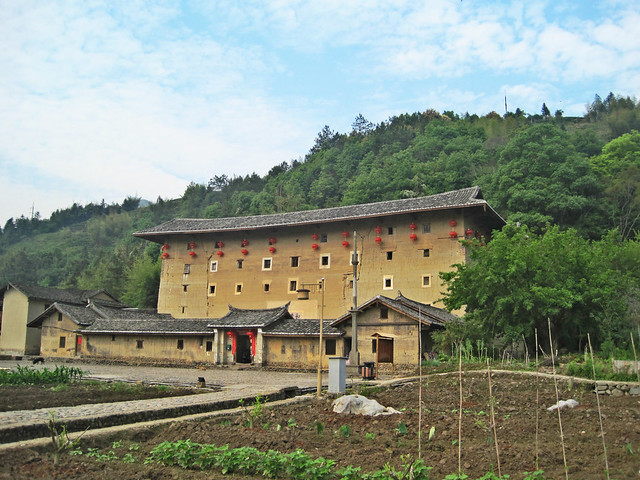

9:00左右，我们背着背包，和客栈老板的妈妈告别。她正在水池旁洗床单，听说我们要离开云水谣，便甩甩手上的水，送我们出门，说：“欢迎下次再来！回去麻烦在网上给好评哦！”

就这样，我们离开了云水谣风景区，赶往下一个目的地：田螺坑风景区。
