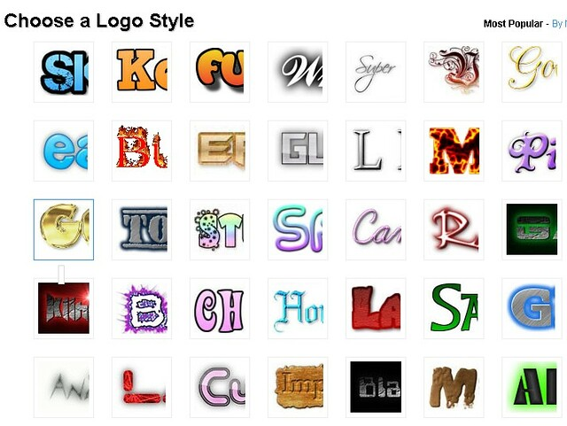

在《[网页title左边显示网页的logo图标](http://www.jfsay.com/archives/39.html)》一文中提到网站的页面如何在浏览器中显示LOGO图标，本文介绍如何在线制作简单的LOGO图标的方法。

一般大型企业的LOGO要找专业的设计公司来制作，需要大的财力支持，这对于小型站长来说经济上根本无法承担。于是好多站长在网络上找张满意的图片，照着[文中的方法](http://www.jfsay.com/archives/39.html)制成favicon.ico文件放到网站根目录中也就完成了。但是找到的照片并不是总是令人满意或者和网站的主旨相符，真正符合自己需求的LOGO还是要自己动手来制作。

以下便是制作LOGO的DIY步骤：

1、登录在线文本图标制作网站：http://cooltext.com/

2、选择一个符合需要的模板（Choose a Logo Style）

3、进入LOGO的设计界面，在这里你可以根据需要调整参数。

Logo Text中输入文本，Add Symbol添加图标，Unicode Arabic选择文本字体，其他的就是调整颜色、大小、阴影、描边等。

4、生成LOGO

这就是我自己制作的LOGO了，献丑了。

话说cooltext上的图标和字体可真多，而且能够在线编辑，功能确实强大，能满足一般的需求了。
