**第一天（12月10日）：广州东站、沙面岛、中山大学海珠校区、广州塔**

为了争取更多的来之不易的旅行时间，提前两天网购了周四最早一班开往广州的高铁车票。买票后忽然想到四年前去广州参加招聘会时坐的黑车，可以省下近一百块钱，便想退票。hillway说：“不要退了，既然出来旅游，就不要太心疼钱了，不然就玩不好啦。”

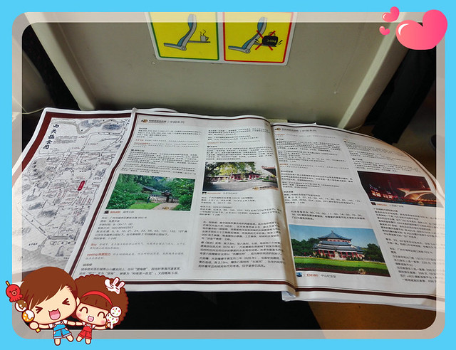

8点25分从潮汕站发车。因为没有准备好足够的时间，7点出门后就开始一路奔跑，换票进站时正好开始检票。上车后心跳仍旧很快，身上的汗歇了半小时才凉快下来。利用三小时的车程，拿出提前打印出来的两本广州旅行攻略来看。

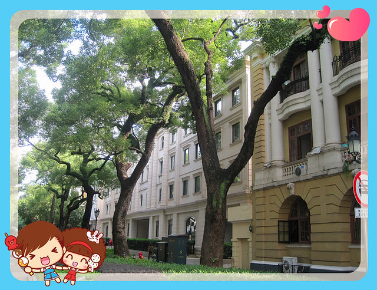

临行前一天，汕头和广州两地都下了一整天的大雨，好在第二天的天空放晴啦。我们回想之前旅游的天气，似乎十有八九都遇上阴雨天，去香港甚至遇上了八号风球，不过好在每次多是阵雨小雨，倒是增添了景区的意韵。

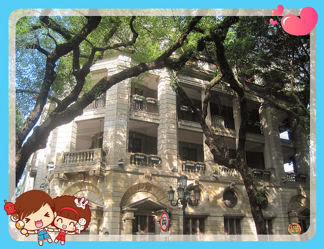

出了广州东站，又急忙赶往地铁站，争分夺秒般于中午12点20分到达黄沙站。此次三天两夜的路程，hillway提前将酒店定在沙面岛上，上次来广州还专门从上下九去沙面看风景，这次就可以置身其中啦。

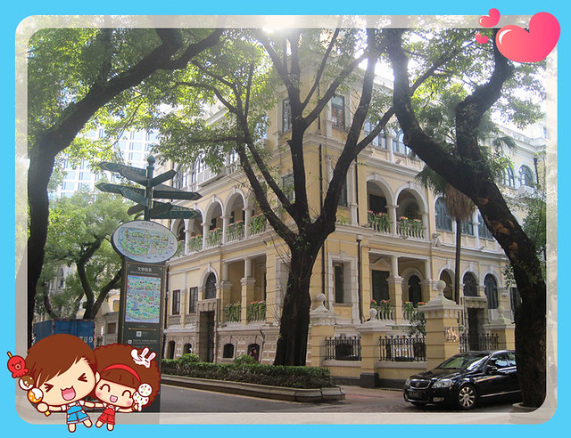

急急忙忙吃过吃饭，稍作休息后就出发啦。hillway提前找好了坐船的码头，我们拿着相机沿途拍了一些沙面岛上欧陆风格的建筑。不管怎样拍，也拍不出单反相机的效果和文艺小清新的感觉。相比较拍照而言，我更好奇的是如今每座楼的用处和内部模样。

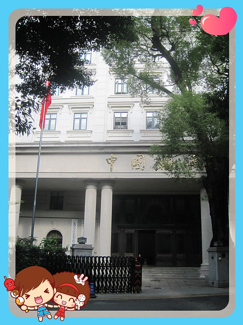

想着两晚都住上沙面岛上，总是会有时间来逛一逛的，因此走的很匆忙。

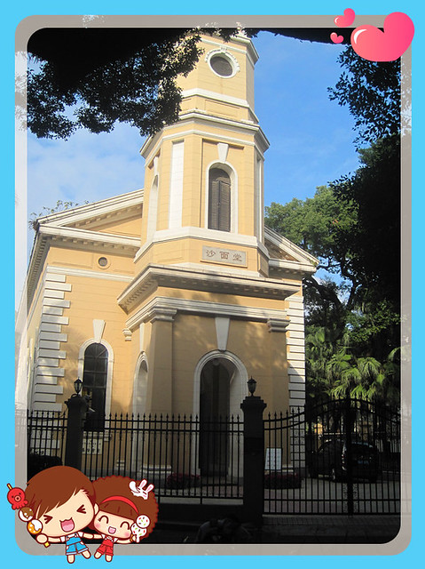

而白天因为赶着去行程计划的景点，晚上回来又累的很，脚疼的厉害，只想立即回酒店休息。 结果，在这里的三天时间里看风景的时间加起来还不到半个小时，真是“景非不住不能逛也”。

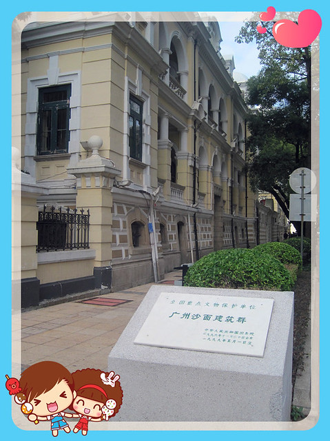

很快走到黄沙码头站。听hillway说，因为修桥，现在轮船只开到中山大学，反正我们要去的目的地就是中大。

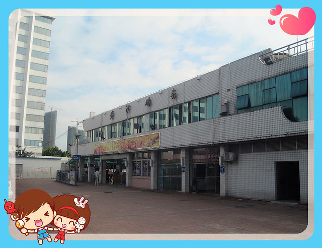

上次傍晚才赶到校园，而且出地铁进的是西门，在灯光昏暗的教职工住宅区绕来绕去又找不到另外的出口，只好原路返回。带着上次的遗憾，再次来到中大（还有顺便看珠江灯光和广州塔的打算）。

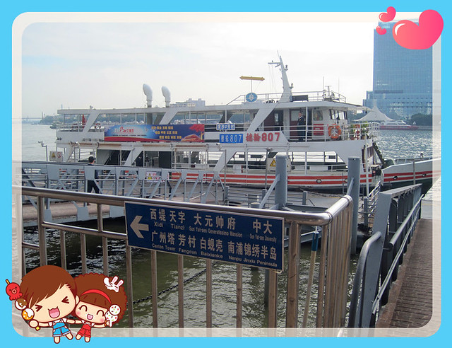

轮船票分一楼二楼两种价格，分别是2块和5块。hillway为了获得更广阔的观光视野，又担心一楼没有座位，便买了两张二楼船票。

行使过程中，我和hillway倍感新鲜，一会儿在船舱座椅上坐着，一会儿又到船头吹着珠江的风，拍着照。

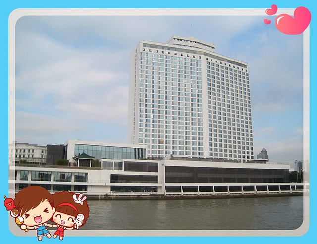

上船后发现每个路线的轮船布局都不一样，我们所乘坐轮船的两层楼座位一致，而在二楼看两岸风景，才大致在一个水上面上。

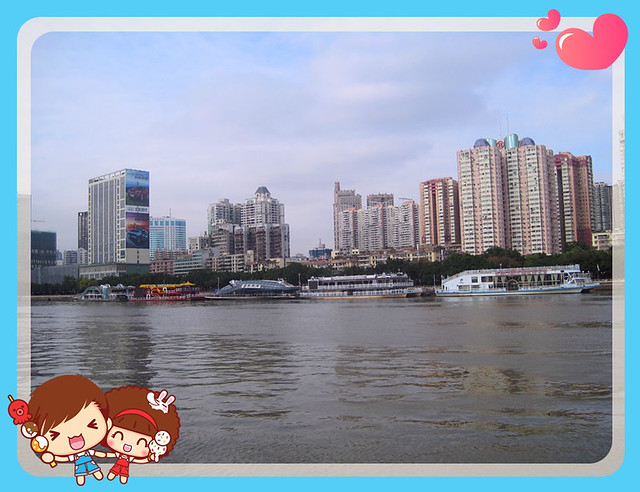

远远处看见广州塔的模样，兴奋的拉着hillway一通拍照。

拍照后，发现中大的码头也到了。

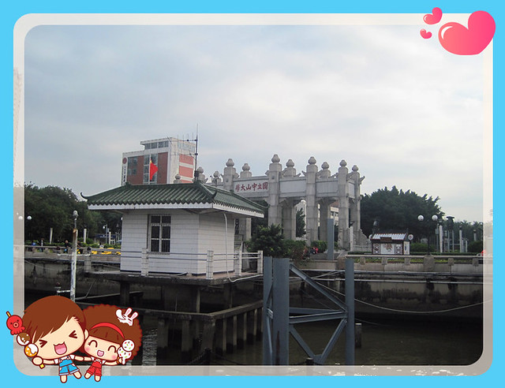

看了中大校园的地图才发现，我们所要寻找的中大牌坊位于北门，与上次来的西门距离甚远，在漆黑的夜里，又问不到明确的指路人，是无论如何也找不到的。

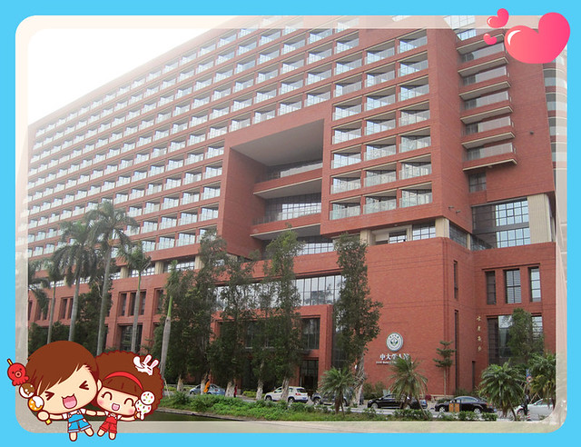

我们沿着校园的中轴线往南走着，沿路随处可见很多充满历史感的老建筑物，整个校园显得很幽静。

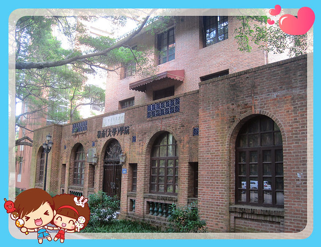

在大片的草坪上拍照，效果自然是美美的。这里草地的绿草和以前学校的品种不同，而且路边几棵连树干上都长满了密密麻麻的绿叶子的树，还真是第一次看到。

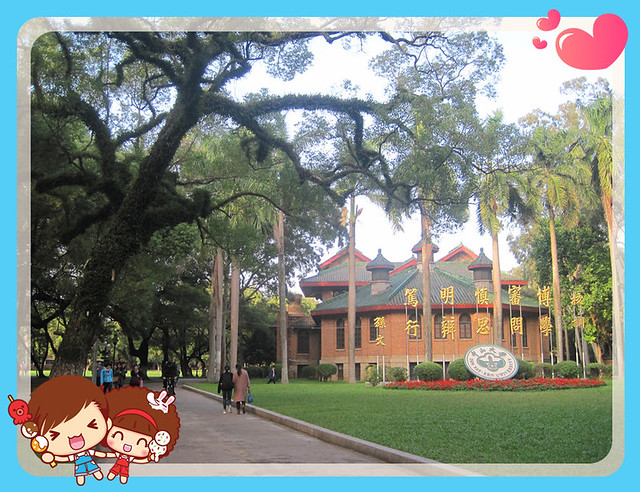

一路慢慢又到了南门，时间还不到饭点，我们重回校园，发现沿路竟然找不到一张可供行人歇息的座椅，考虑到是校园主干道的原因，便往两侧小路走，让有些痛的脚稍许歇息。结果转了好一会儿，才找到一处小亭子，我便把随身带的煮蛋和橙子吃掉了，hillway则在一旁打电话操心着他妹买行李箱和火车票的事情。

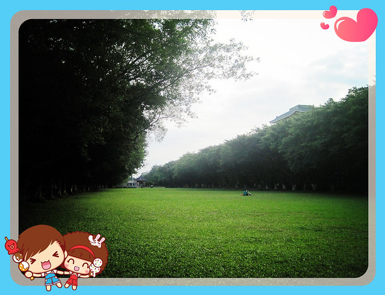

中大的南门是纺织品交易城，也有不少小吃店。我和hillway先买了一大份牛杂汤（第一次吃），13块钱，里面有白萝卜、海带、猪血、牛肠、牛肺还有豆筋，闻起来很香，吃起来超辣（不明真相跟着其他买家勺了点辣椒酱）。白萝卜切的很大块（根据经验，这种切法比较占位置，盛几块纸盒碗就快满了），有些硬但还算入味，不喜欢吃动物心肝肺等内脏的我们，看来还是更适合吃牛肉类的小吃。

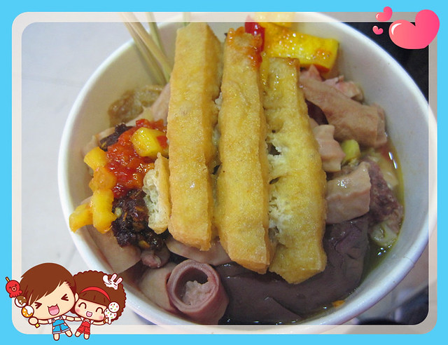

接下来，又买了一份附近的鸡翅包饭，看见汕头也有卖这种小吃，不过没有买过，这个也是第一次吃，10元一份，里面塞的是糯米，吃着口味还不错，但是吃不饱。

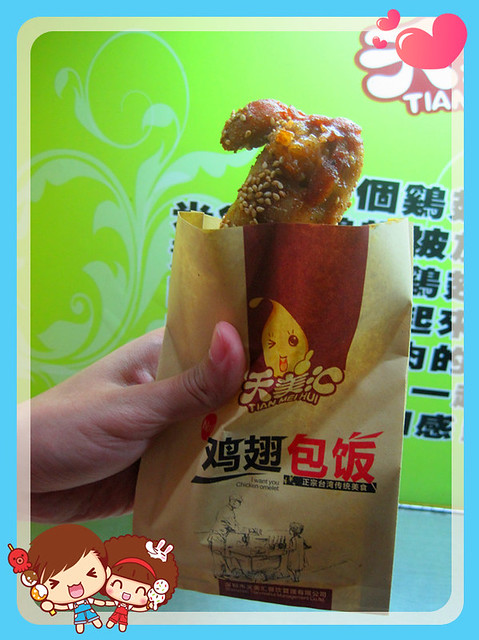

下一个目的地是广州塔，我们打算沿着珠江步行前往，重新从中大南门进入，路过一间食堂，招牌竖在路边，招牌是各式盖饭和套餐，进入一看和学校自选食堂差不多，想要的小吃已经卖完了。hillway拿了一份白切鸡（6元）、青椒炒鸭肉、回锅肉、青菜（1.5元）和一份米饭，共计19块钱。收银员说，因为我们没有校园卡，要加收5.5元，便收了24.5元现金。饭菜吃到肚子里都是拔凉拔凉的，卖相也不怎么好看，与招牌期待的效果相差甚远。我们不禁回想起以前浙师大对外营业的小食堂师大人家，比这里美味和实惠多了，也不会对外校人另外加收费用。

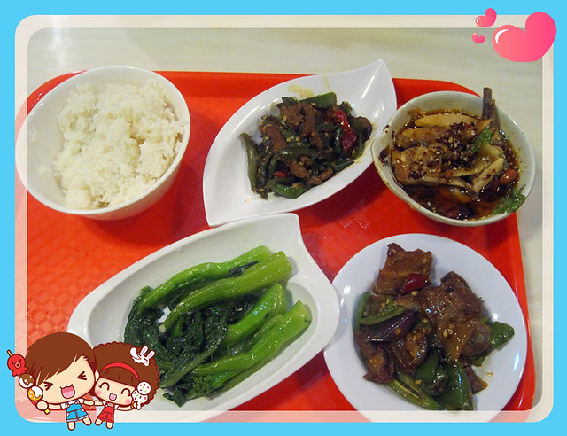

吃过晚饭，我们出了中大北门，沿着珠江往广州塔的方向走着，遇到很多跑步和遛狗的市民。珠江里有缓缓移动的夜游船只，里面坐着稀少的游客。夜游费用从38元至百元不等，听hillway说有些还是我们白天乘坐的船只，路线几乎也是一样的，唯独是晚上看夜景。相比较香港夜游维多利亚港几元港币的收费（船只档次不同），沿路所见景点有些分散（有一些路段只有路灯在亮着没有什么建筑物），毕竟珠江路线很长。

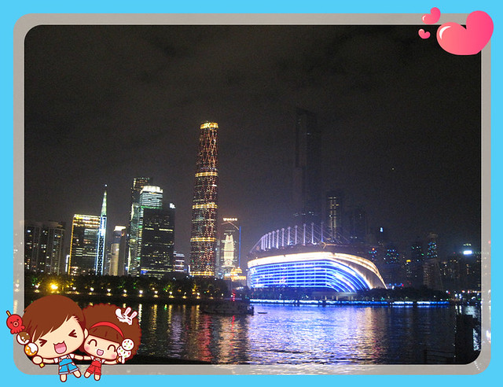

走走歇歇，看着离广州塔很近，但是靠步行还是需要一定的时间，全当锻炼身体减减肥了。靠近广州塔的时候，必然是拿出相机拍照，拍珠江对岸的风景，拍广州塔，还有与风景的合照。因为hillway打开了相机闪光灯，每被拍一张，感觉就要被闪光灯“亮瞎了眼睛”，hillway一直很亢奋地要给我拍照，我连声拒绝，拍几张意思下就可以啦，不然眼睛受不了，闪光灯太亮了。

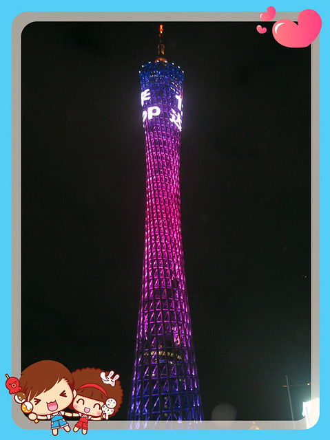

对岸海心沙上的体育馆发出震耳的音乐声，远处可以看到猎德大桥，可是实在没有力气再往前走了。穿过马路，到达了广州塔地铁站出口，本来感到疲惫的双腿似乎感到了希望，恢复了一些战斗力，于是又继续走到广州塔一周看个究竟。夜里的风在身上有些冷，又舍不得出钱（最低观光套餐150元）上塔，就提议乘地铁回酒店休息，完满完成第一天的行程。

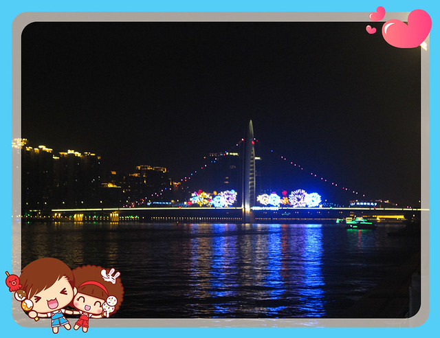
