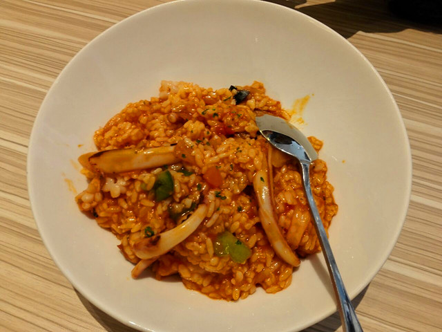
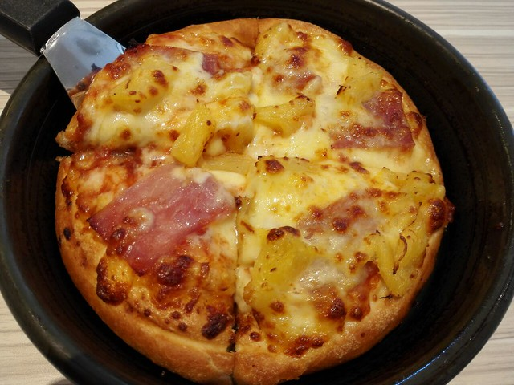
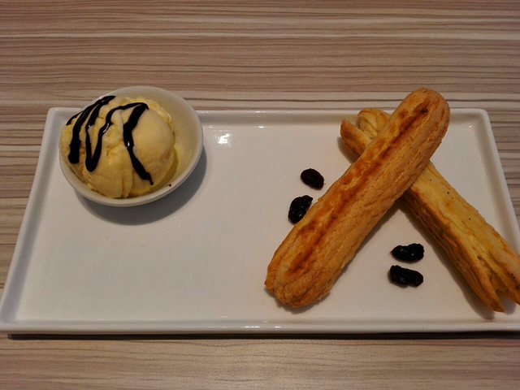
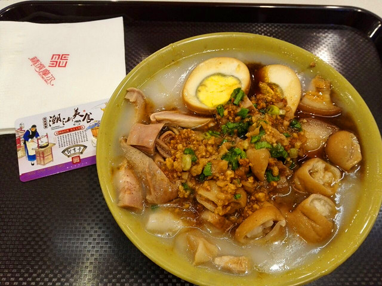

周六，hillway骑着平时买菜用的自行车，载着我和小熊仔，来到卜蜂中心。来此逛商场源于我的提议，看到微信公众号介绍说四楼的美食广场开业，全场五折的折扣很吸引人，便鼓动hillway一起来一看究竟。

小蜜瓜吃不惯外面的饭菜，反倒觉得在家里更自在，就没有一同前往。小熊仔一听说要带她出去玩儿，高兴的不得了，着急着找自己的皮鞋穿，还将出门坐车要戴的围巾抱在怀中，一个劲儿地催着“爸爸妈妈快换鞋。”

本想着开业第一天又是五折肯定是人山人海，结果上四楼一看，并没有太多的顾客，很多店家还忙着收拾打扫，一股装修过的油漆等味道，并没有开始营业，据说全部营业要等到晚上，hillway抱着小熊仔本想着大吃一顿，看到这种情形不免有些抱怨。

距离中午的饭点还早，我们便带着小熊仔在商场里逛商店，在小蜜蜂卡通塑像前给小熊仔拍照，又把超市会员卡中的积分兑换成代金券买了沙虾和火锅丸子。

hillway近期总是跟我强调：“虽然现在还要攒钱买车，但是经济条件已经比前两年有所改善了，所以不要太舍不得花钱，想买什么想吃什么就尽管去买吧。”既如此，都已经出来逛了就不回家做饭了，于是，便去了一楼的必胜客餐厅。

没想到必胜客餐厅内已经没有空位，门口排起了等餐的队伍，我们也不得不加入其中，坐在门口提前研究起了菜单。点了一份夏威夷风光铁盘披萨（小份）（30元）、希腊风情海鲜烩饭（36元）、芝士培根薯蓉（18元）、香草冰淇淋手指泡芙（20元）。

看上去小熊仔的肚子已经饿了，海鲜烩饭一端上来她就立马拿勺子开动了，吃光了里面仅有的四颗虾仁和几片蘑菇，并不肯吃米饭，里面的鱿鱼须比较硬，被我消灭掉了。除了虾仁、蘑菇和鱿鱼须，还有青椒和洋葱，米饭中的酱料味道不错。其实汕头的海鲜价钱并不贵，平时几十块钱就可以买上好几种，这种海鲜饭算是比较普通的用料了。

记得上次在卢家妈妈点了一份薯蓉，小熊仔并不肯吃，本以为她现在口味有所改变，结果还是不肯吃这种烂呼呼的食物，只是用勺子戳了几下。薯蓉中加了培根，甜中带咸。

hillway前两天和同事在萨贝尔餐厅吃到一种芒果口味的披萨，据说口感很软很美味，因此这一次也点了一份口味偏甜的披萨。小份披萨切成四块，分量比上次那种最大号差距很远，看上去披萨还是越大越划算。小熊仔让我把披萨上面馅料的培根和菠萝夹走，吃了一整块之后就不肯再吃了，自己趴在椅背上看邻桌的小朋友。夏威夷风味的披萨也很好吃，最关键的是要趁热吃。

最后等了好久，总算等到了甜点，本来微信会员有甜点买一送一的优惠，可是在店里网络不好，怎么也打不开优惠码，只好作罢，倒是折腾hillway一番，没有吃踏实。现在这个天气吃冰淇淋有些太凉了，给小熊仔一根泡芙那些吃，看模样像极了油条，她不喜欢里面的奶油，吃了两三口就给我了。近来发现甜品中浓郁的奶香具有一种治愈的良效，心情低落的时候吃上几口，幸福感顿时就扑面而来了。

吃过午饭，虽然不觉得肚子饿，但总觉得有些不够饱不够尽兴，小熊仔还让我们带她坐电梯去看小蜜蜂和大象，于是，又进了商场，慢慢悠悠转悠到了四楼。这个时候，已经有半数的店家在营业，也有一些顾客在就餐。

纠结了一会儿到底要不要再吃的问题，hillway决定去办卡。工作人员首推充值卡，有赠送活动，不过考虑到这里没有长期吸引我们就餐的店家，也不会有长期五折的优惠，便办了一张即享卡，押金10元，里面还有20元现金。

先是点了一份我并未吃过的粿汁，刚来汕头市还曾经以为是果汁。一碗15元，任选4食料，有卤肉卤蛋猪肠猪肚，半价7.5元。和果汁相比，这一碗吃起来要肥腻的多，猪肠有些嚼不烂，卤蛋卤肉很咸，给小熊仔吃了一些没有什么味道的面片。若是大清早就吃这样的早饭，实在有些不习惯。

看见卖炸鸡的橱窗前围的人最多，又去服务台充了10块钱，跟着买了一份香辣鸡翅在（4支），原价28元，半价14元。盛在盘子里，看上去分量比kfc大很多，不过吃起来口味却差很远，外面的“壳”一咬下去全掉了，除了外面的辣椒酱的辣味，没有什么其他的味道，吃在嘴里油乎乎的，感觉炸鸡的油应该不怎么好。

看来不管是购物还是吃饭，还是去吃品牌的店家比较好，品质有保证，价钱也稳定，购买失败的几率也相对较低一些。

吃过肥腻的粿汁和油腻的炸鸡，只想喝些解腻的饮料。今年的贡茶在汕头像雨后春笋一般遍地开了很多的连锁店，便跟着一堆学生妹挤在一起买奶茶，店员点来点去发现机器坏掉了，大家便一哄而散了。

一顿饭吃到了下午三点多钟，小熊仔和我们都困了。尽管工作人员一再劝我们不要退卡，但总觉得这个美食广场今后再次消费的可能性极小，便执意退了卡，取回18.5元现金回家了。
