**第三天（2月22日）：龙亭公园 天波杨府 翰园碑林 延庆观 大相国寺 山陕甘会馆 鼓楼广场南书店路**

在开封旅游的时间还有两天，为了让小蜜瓜和小熊仔能够玩好、休息好，我和hillway商量决定将比较热闹和好玩的景点安排在上午，午饭后将小蜜瓜和小熊仔送回酒店休息，由我们两人再拿着旅游年票去逛一逛小蜜瓜不敢兴趣和比较冷清的景点。

早上在酒店吃过早饭，我们抱着小熊仔来到第一站：龙亭公园。

公园入口处仍旧排着长队，湖面的风仍旧很大，吹在脸上感觉有些冷。

龙亭公园作为大宋上元节灯会的主会场，公园里确实摆设了很多造型各异的灯笼，等到晚上灯光亮起来应该很好看。<!--more-->

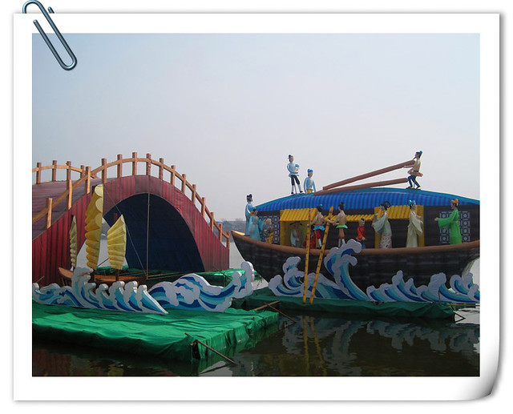

我们购买的旅游年票只限白天时段下午四点钟之前参观，若想看晚上的灯盏需要另买票入园，票价40元。

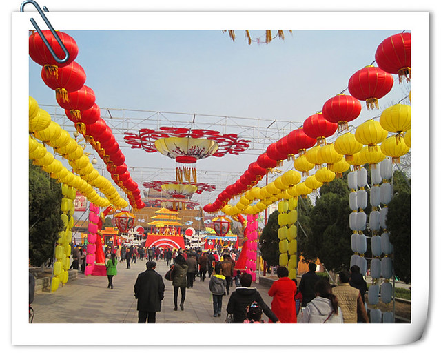

龙亭公园除了灯盏，每隔一段时间还有表演节目，我抱着小熊仔在广场看了一会儿舞狮表演，表演技术等级比较低，两只狮子都是摇头换脑来回走动，道具样式也不太好看，比较陈旧。

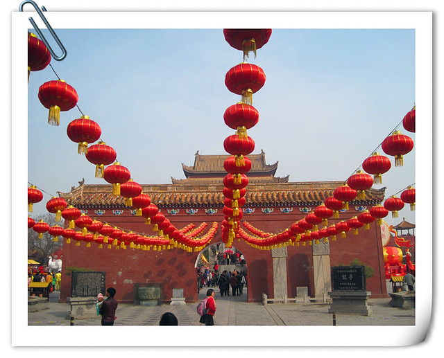

小蜜瓜对广场里抬花轿的活动很感兴趣，带着小熊仔在一旁看热闹。

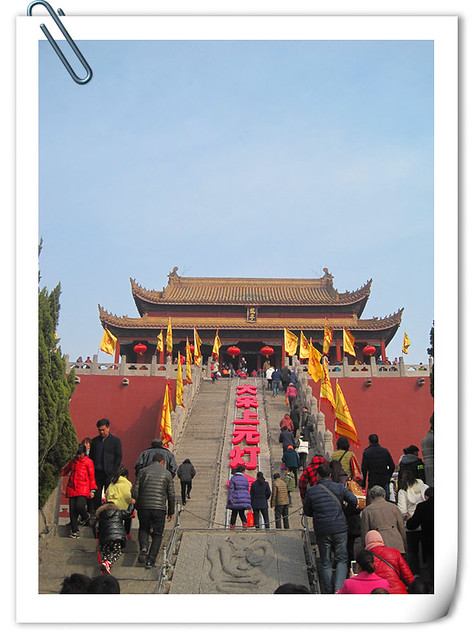

我和hillway两人登上高高的台阶，一直登到顶层，主殿里摆放的是金灿灿的龙椅。

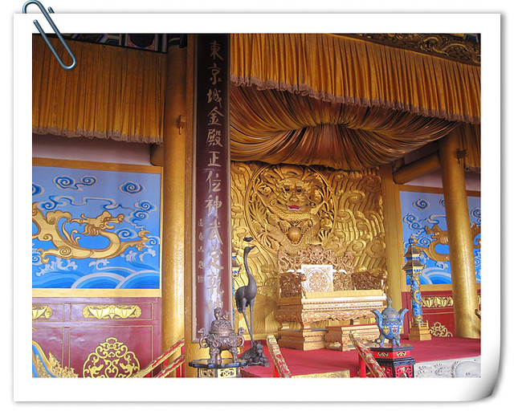

之前远远地站在龙亭公园外看景区，还以为只不过是两片湖泊和一处大殿。登上大殿顶层才发现，左右和后方还另有天地。

从龙亭公园一处偏僻的小路走出来，开到了天波杨府的入口。

这里也在举办上元灯会。

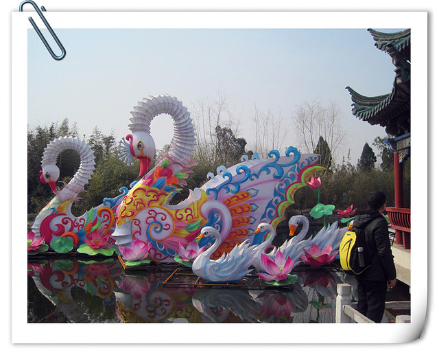

我们抱着小熊仔在园子里转悠一圈，回想杨家将的故事，仍觉十分悲壮。在天波杨府没有遇到有节目表演，便出来了。

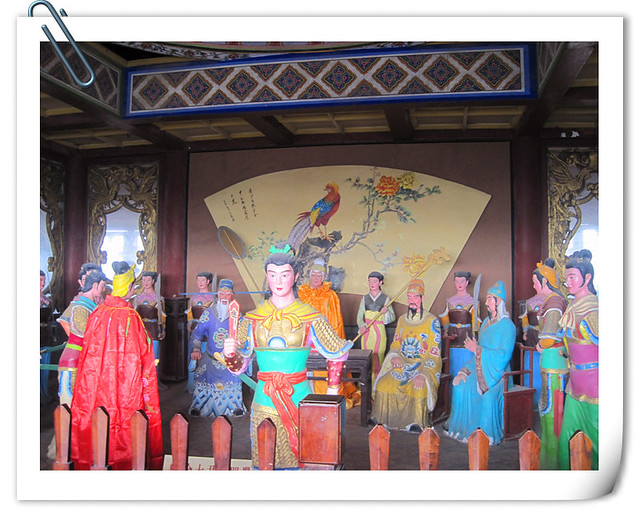

本以为翰园碑林文人气息浓厚，会比较无趣和冷清，没想到却是最热闹的地方，估计是正在举办春节祭祖庙会的缘故，不仅有很多售卖旅游纪念品和小吃的摊位，小蜜瓜很喜欢这里，给小熊仔买了一条尾巴会摆动会前进会唱小苹果的塑料金鱼，10块钱。

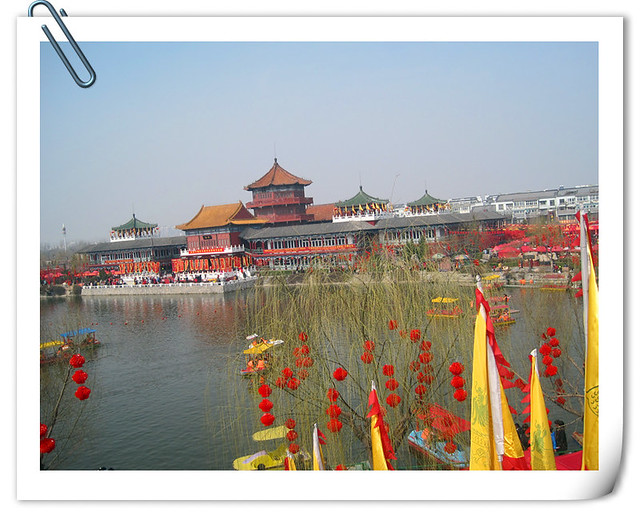

除了充满着市井气息的小摊位，还有两个广场不断表演着民间特色节目。我们走到正门附近，看了一个完整的陕西腰鼓表演，演员表演动作也很到位，现场感受到锣鼓唢呐声比电视上看的要震撼很多。小蜜瓜在一旁说：“看他们跳的多认真多卖力呀，脸上全是汗，一会儿我要给他们热烈鼓掌！”

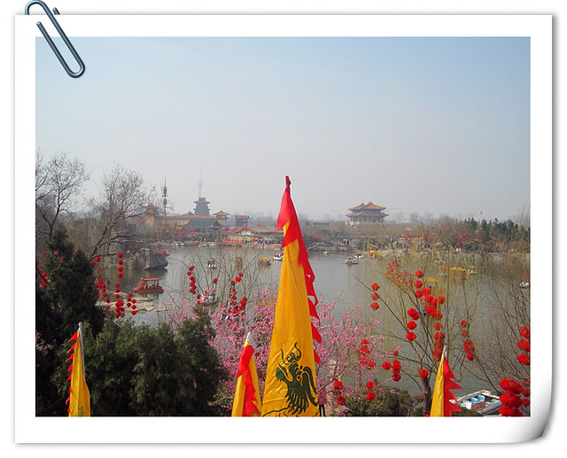

游览过龙亭公园、天波杨府和翰园碑林，时间已经到了下午一点半钟，我们不觉得肚子饿，只觉得有些累了。在附近的七盛角商业街转悠一圈，也没有什么想吃的午饭。hillway想着让大家吃得丰盛一些，可我们抱着小熊仔实在有些走不动了，不愿意再四处寻找，便在这里的小吃摊上随便两个夹菜饼（5元一个），又买了一份热干面和一份炒凉粉（10元一份），不仅分量少，而且味道也不好，又很咸。

下午两点半钟，我们将小蜜瓜和小熊仔送回酒店休息后，一边等公交车，一边翻出开封旅游年票指南研究下一个目的地。出于时间考虑，我们首先排除了七个距离比较远和不感兴趣的景点：兰考县焦裕禄烈士陵园、刘少奇纪念馆、繁塔、宝珠寺、禹王台公园、朱仙镇岳飞庙和朱仙镇清真寺。 翰园碑林对面就是清明上河园，游人很多。hillway本打算去铁塔公园，因为我尿急，加之公共厕所距离远又排长队，虽然我一路来回小跑，还是耽误了hillway十分宝贵的二十分钟时间，令他万分气恼。后来又因为等公交，左等不到右等不到，又浪费了四五十分钟，直到近四点钟，我们才挤上去大相国寺的公交车。

乘车后发现，我们想去的大相国寺景点并非公交站上标注的相国寺站，好在这路公交车下一站延庆观也算是一处景点，我们便下车进去参观了。

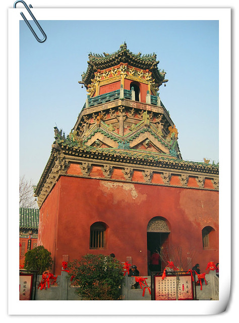

我没有信奉任何宗教，对佛教道教等也没有太多了解，所以到了延庆观、大相国寺这类的景点，只不过走马观花看一眼就出来了。大相国寺面积比较大一些，而延庆观面积就比较小了，主要的景点也就是玉皇阁。我和hillway随着人流又进入地下宫殿一看究竟。

本以为大相国寺和延庆观相距不远，根据景点工作人员和路人指点，我和hillway一路快步前行，路过大相国寺市场，为了换一些乘公交车零钱，hillway给我买了一支玉米，3元。

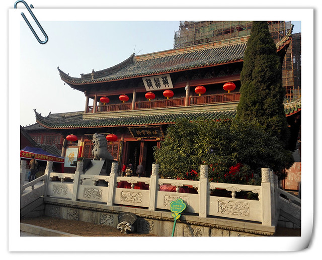

游览过大相国寺，根据hillway的方位感和手机导航，继续暴走模式，一路走街串巷，来到了鼓楼广场附近的山陕甘会馆。

山陕甘会馆面积不大，但建筑很精美。虽置于闹市中，环境却很幽静。

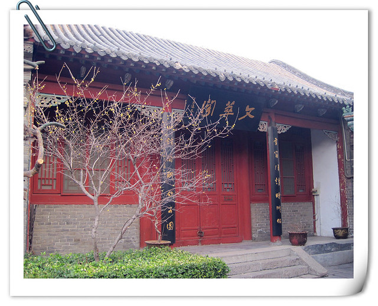

据介绍，整个建筑布满了砖雕、石雕和木雕，堪称会馆三绝。去年，我们在广州参观的陈家祠也有很多的民间雕饰艺术作品，比这里更加繁丽。

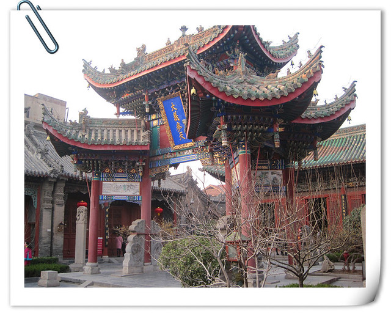

夕阳映照下的钟楼，也很美。

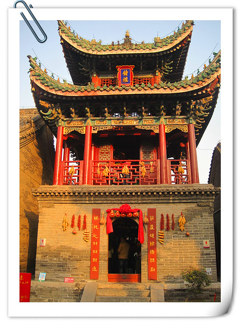

我们坐在长廊里休息的时候，听见身后商铺门外悬挂的两只八哥鸟在说“你好”和“恭喜发财”，感觉很有意思。鸟笼上写着“请讲文明语”，老板是担心游客会把八哥鸟给教坏吗？哈哈哈~

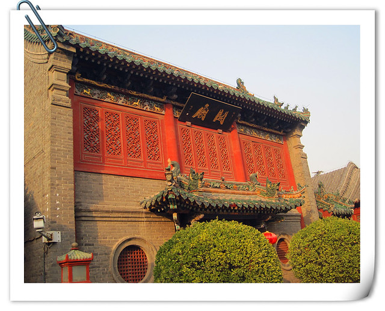

出门游玩，我最担心的问题是在晚上在哪里住？而hillway最担心的问题则是每天三顿饭都在哪家饭店吃？点些什么菜？而且如果不下馆子炒上三五个小菜，他总觉得没有吃好。

这次来开封，网上订好了四天的七天连锁酒店，我最担心的问题解决了，可是hillway最担心的问题却要每隔几个小时重复一次？以至于有时候明明正在吃着午饭，他便开始向我发问：“你赶快想想我们晚上在哪里吃饭呀？”

参观过山陕甘会馆，已经到了五点半闭馆的时间，我们两人紧赶慢赶，虽说走马观花，一天下来也算是完成了游览6处景点的艰巨任务。摆在hillway心头的问题要面临啦：晚饭怎么解决呢？

在来山陕甘会馆的路上，途径鼓楼广场右侧的南书店街，有很多我很感兴趣的小商铺和饭馆，当时一直后悔那天晚上来鼓楼夜市怎么不知道往右边走呢？一个劲儿地抱着小熊仔在广场左边找饭馆，结果一无所获。

我和hillway沿着来时的路往回走，看到一家烧饼店前排着长队，心想应该不错，便也跟着买了起来。

我站在一旁看，发现这家的烧饼和老家的不同，在烤制的时候没有夹猪肉和香葱，而是售卖的时候用刀划开，根据顾客需要，往里面夹豆干、鸡蛋或麻花，刷上调味料。烧饼卖2.5元一个，确实很实在，我和hillway合吃一个就七成饱了。我们买了两个，一个什么馅都没有夹（方便携带），用两个围巾包起来带给小蜜瓜和小熊仔吃，还有一个夹了豆干和麻花，一共7块钱。

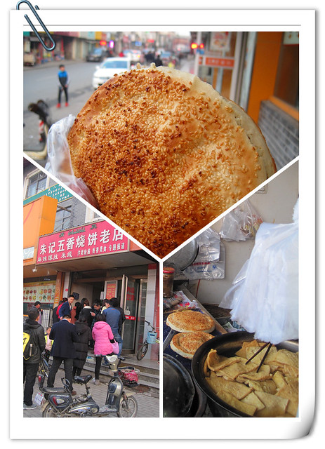

天色渐渐暗了下来，南书店路上开始多出了很多摆摊位的小贩，让我一下子找到了当年在开封逛夜市的感觉。那时候，卖小吃的摊位不多，也没有统一装饰的小吃车，大多数都是卖小商品的商贩，在网购尚未兴起的时候，品种和价钱方面的优势还是很吸引游客的。在快速行走寻觅饭馆的过程中，买了一个手拿包，10元。

打电话询问小蜜瓜晚上是否有兴趣外出？她说让我们直接打包带饭回酒店。hillway跟着我进了一家食客比较多的三妞米皮店，我们点了一份砂锅土豆粉和一份砂锅刀削面，加上一瓶汽水，共计21元。吃过饭，给小蜜瓜打包了一份鸡丁烩面，10元。

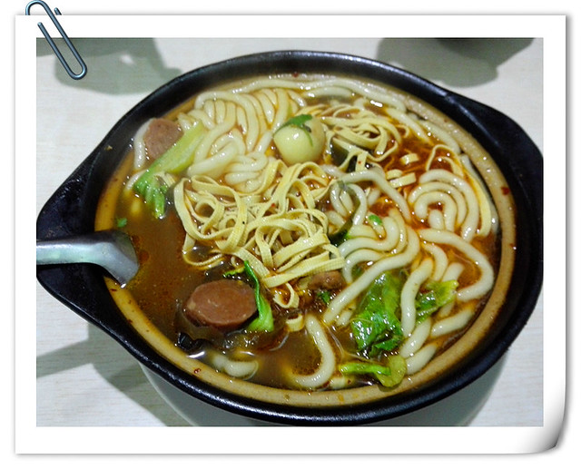

这一碗砂锅土豆粉是近期吃到的最好吃的土豆粉了。里面的配料很多，有鹌鹑蛋、海带丝、千张丝、黑木耳、蘑菇和鸡肉等等，十分符合我的口味，后来在开封其他地方和西安吃到的土豆粉都没有这家的好吃，现在想想真有些怀念。

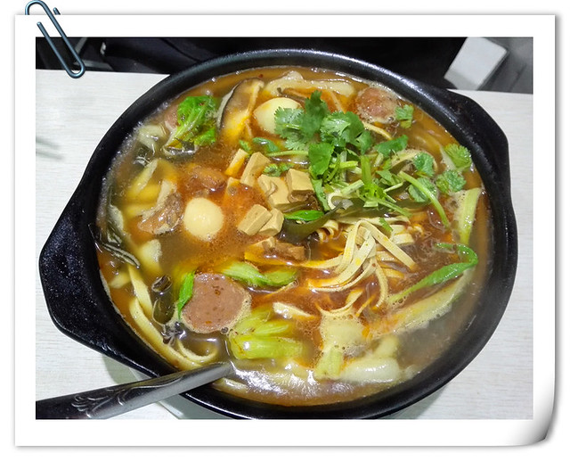

北方的气候相对比较干燥，除了继续在郑州出现的嗓子干痒症状，又多出了一个小腿痒的问题。

小蜜瓜和小熊仔吃过我们带回来的烩面和烧饼，看电视的时候，hillway忽然想起来是2月22日：“今天是正月十五元宵节呀，我们中午和晚上都吃的很简单呀，按说过节应该好好吃一顿的，都忘记了。”小蜜瓜说：“出外旅游，不比在自己家里，等以后有机会再丰盛些也行嘛。”
