**第四天（2月23日）：清明上河园 鼓楼广场 包公祠 铁塔公园 万岁山春节大庙会**

开封之行的“重头戏”是游览清明上河园。

我们早早起床，领取了酒店的双人早餐，叫醒小熊仔，吃饱肚子就出发啦。上午九点半左右，我们三人拿着7折门票（淡季门票100元，7折后共210元），抱着小熊仔，怀着很期待很兴奋的心情入园啦。

清明上河园内的工作人员统一穿着宋朝服饰，连入口处检票员都穿着宫女服装，据说可以让游客产生穿越时空之感。但工作人员数量毕竟占少数，在游人如织的人潮中，实在起不了“改朝换代”的作用。小蜜瓜对一位“叫花子”打扮的工作人员很感兴趣，“叫花子”头发凌乱衣着破烂，头上戴着一朵花脸上抹着几道灰，总是做出一副很凄苦不心甘的表情。小蜜瓜跟在他后面笑个不停，后来跟到城门下，主动要求和他合影留念一张。

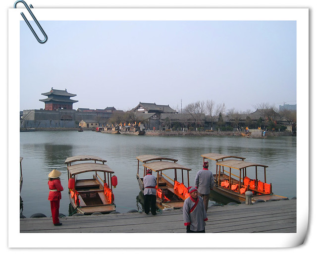

据称，清明上河园是以画家张择端的写实画作《清明上河图》为蓝本，以宋朝市井文化、民俗风情、皇家园林和古代娱乐为题材的文化主题公园，实际建筑与画作有不少差异。整体游览一番，给人印象最深的景点是城门楼、骆驼、虹桥和码头。

进入园区，最先映入眼帘的景点就是汴京码头。不一会儿，看到游人都往虹桥上拥挤，原来是有节目表演，演的是包公巡视汴河漕运。有一位演员十分敬业，在打斗过程中直接被“踢”入河中，我们站在岸上观看都感觉风很大很冷，而他每天表演裸睡再全身湿漉漉的从水中爬出来，真是一份很辛苦的工作。

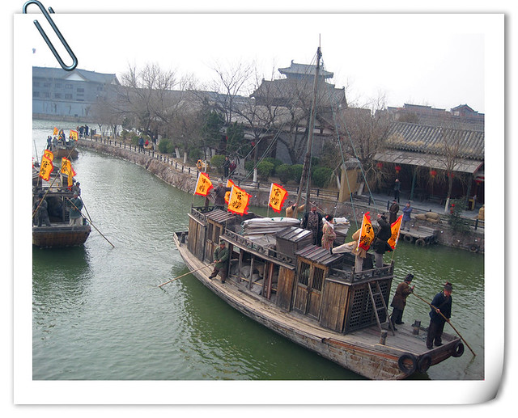

接下来是舞狮表演。虽然前一天在龙亭公园也看到了舞狮表演，但技术含量和道具服装都差距很大。龙亭公园里的狮子只是来回走动，最多晃晃脑袋，而清明上河园里的舞狮表演堪称精彩，有很多高难度的动作，特别是最后，四个狮子（八个演员）共同踩在跷跷板上的圆球上来回滚动，让围观的游客们都连声叫好。

这处大宋公平秤很有意思，就像称量物品一般，游客可以坐在成盘里称体重。当然，天下没有免费的午餐，收费十元一次。

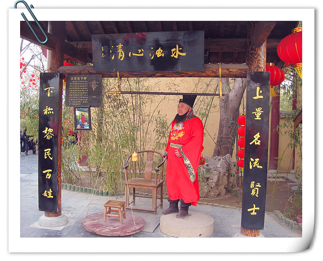

气功吞火表演时，演员没有佩戴话筒，嗓子有些沙哑，说话听不清数。

王员外招女婿的节目吸引了很多的游客，王员外家的女儿相貌的确十分漂亮，抢到绣球的男游客十分兴奋，高高兴兴上楼去扮女婿了。估计女婿也不是白当的，“事成之后”定有一些收费。

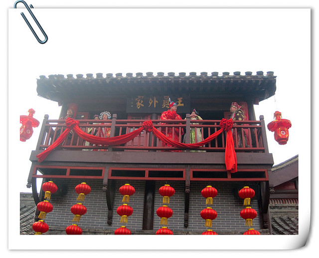

宣和殿二楼的皮影戏演的是孙悟空去东海龙王那里讨要兵器的故事。

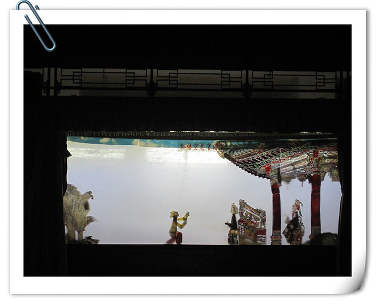

竞技馆里看斗鸡比赛，唯独这一处表演，我们去的时间比较早，还有座位可以坐，先从电视节目里了解一番斗鸡的知识。

刚开始，两位穿着宋装的胖老头抱来两只斗鸡，它们带有表演性质的略微比划几下，而重点在于后面的斗鸡押注。一共有三只斗鸡在台上比赛，十元一注，最后掉下台的斗鸡是冠军，若是押赢了，可以得十五元。很多游客都踊跃出钱押注，让人印象最深的一位游客一口气买了三注，三只斗鸡每鸡一注，不知道他是如何盘算的？很显然无论哪只鸡赢得比赛，他都要损失十五块钱，是稳赔不赚的买卖呀。

本以为真正的斗鸡比赛会很精彩，定有一番“厮杀搏斗”。而结果是，“擂台”相对比较小，两只斗鸡几乎没怎么打斗，稍一跳跃，就掉下台去了，也就不到十秒钟的事情。

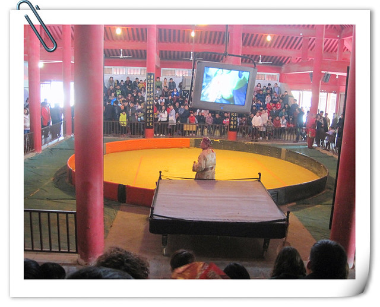

此外，我们还看到了踩高跷、布袋木偶、岳飞枪挑小梁王的表演，也因为带着小熊仔游玩步伐很慢，错过了其他的表演。即将离园时，我们在迎宾门外广场又遇上了一场盘鼓表演。回想来，若是没有这些贯穿前后的表演，这个游园过程定会乏味不少吧。相比其他景区的表演，清明上河园里的表演技术和票价还是相当的，特别是岳飞枪挑小梁王的飞奔骑马打斗表演，十分精彩，没有一定的功底是无法完成很多高难度马上动作的。

离开清明上河园，我们乘公交车到鼓楼广场。小蜜瓜不喜欢昨天晚上砂锅面的味道，选择去沙县小吃，点了馄饨面，hillway和我吃的鸡腿饭和酸菜米线，共计28元。

吃过午饭，我们将小蜜瓜和小熊仔送回酒店休息，又开始了两人的暴走旅行模式。

下午的第一站是包公祠。远远望去这一处枚红色的梅花十分艳丽，走近一看原来是塑料假花。hillway忙着接电话应对公司里的事情，无心看风景，我则一个人到处无趣的走了一小圈。

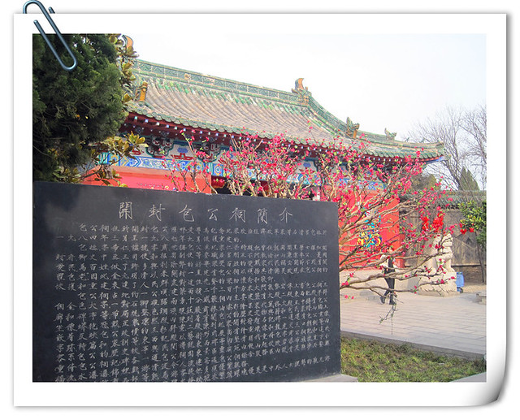

下一个目的地是铁塔公园，距离市区有些远，等我们从公交车下车走到铁塔公园门口已经是四点十分。工作人员很坚决地告诉我们，按规定，四点以后持旅游年票不能入园，因为铁塔公园和龙亭公园、天波杨府一样，也在举办上元灯会，需要另外买票才行。我们和其他一批被拒绝入园的游客一起，带着遗憾离开了。

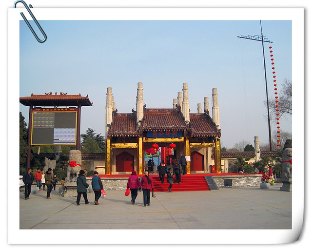

hillway根据手机导航，我们步行从铁塔公园到万岁山大宋武侠城。本以为穿过城墙就不远了，结果还要左转，本以为左转很快就到了，而且看到了万岁山大宋武侠城的院墙和里面的小树林，但是没有想到院墙竟然如此的长。时间已经接近下午五点钟，我们疲惫而慌忙地快步走着，争取尽快入园。

在入口处取了一张演出时间表，上面密密麻麻排了很多很多的演出节目，可惜我们入园时间太晚，也都错过了。慌忙进入景区，并不知道该往那条路走，被一阵很热闹的音乐声吸引到了一处表演场，有一位中年男演员在模仿赵本山，后来又出来一位女演员模仿宋丹丹，模仿的都是小品中的台词，我们看了一会儿就去别处了。

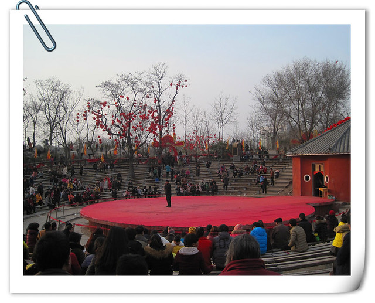

演艺场搭建的比较简单，连观众席上的座椅也是用石块和木板组成的，给人一种“原生态”的感觉。不仅是演艺场，万岁山大宋武侠城里的很多房屋、亭子还有小桥，都是使用最原始的木材和茅草搭建，在刚刚满足实用功能后，再也没有一点装饰感，风格质朴粗犷。

也许正是因为这种原生态的布置，让人更身感回到宋朝。如果说清明上河园是喧闹繁华的大宋都城，那么万岁山大宋武侠城便是武侠人士曾经生活和打斗的郊野。

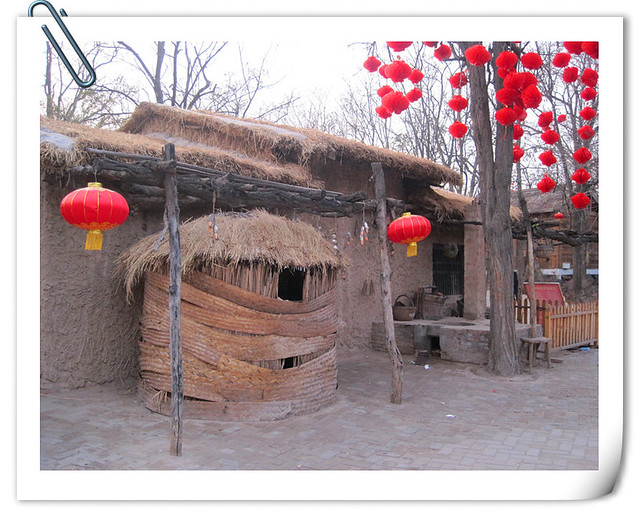

万岁山大宋武侠城中还设有很多游乐设施，有几处更像是儿童游乐场，可玩性很高。而相比较一般的城市公园，这里的游乐设施更具有一定的冒险性。

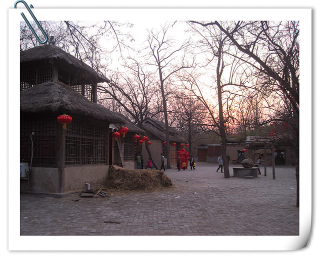

万岁山大宋武侠城正在办春节大庙会，和翰园碑林一样，也很多售卖旅游纪念品和小吃的摊位，十分热闹。

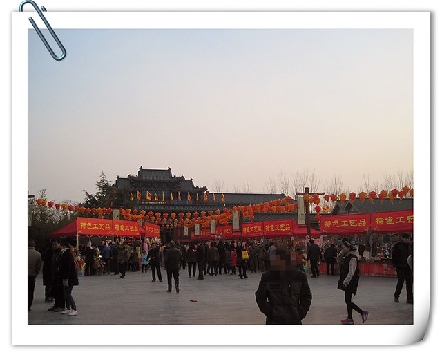

我们在景区闲逛，hillway禁不住大妈的叫卖声，要给我买豌豆糕。因为游客都即将离园，大妈慷慨地说：“本来五块钱一块儿，给你们切两块啦！”拿在手中对比下，比上午在清明上河园切的厚多了，一个都有两个多，很划算。

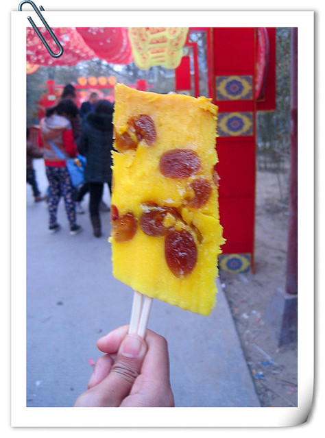

万岁山大宋武侠城门口没有直达汴京公园的公交车，我们要先转车到苹果园站，车里挤满了游客。小蜜瓜仍旧让我们带饭回酒店，给她们买了一大份馄饨和蒸饺，我和hillway吃的是鸡丁泡馍和砂锅麻辣粉，共计31元。为了换乘公交车零钱，想着小熊仔的指甲长长了， 便买了一个指甲钳，3元。

一路上，我和hillway回顾总结了这两天我们一起游玩的十处景点发现，上午带着小蜜瓜和小熊仔一起游玩的景点交通方便，人气旺，可玩性也比较高。而下午我和hillway单独去的景点比较冷清，乘车和参观过程都比较耗费体力，特别是名称中带有“寺”、“庙”、“观”、“祠”等景点，更是可游览性极低。整体来看，我们的旅行安排还是比较合理的。

**第五天（2月24日）：开封火车站——郑州火车站**

早上八点钟，我们叫醒小熊仔，草草吃过酒店的早餐就出发啦，乘坐10点15分开往郑州火车站的火车离开了开封。

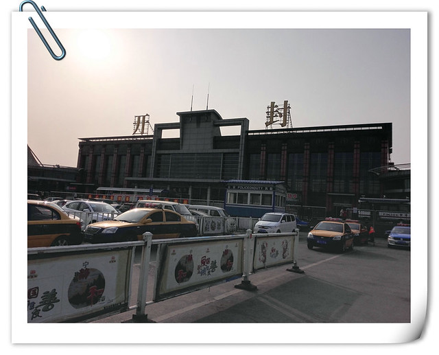

**附：开封四天四夜游费用清单：**

- 火车票：12.5\*3+18\*3=91.5元
- 打的、公交费：63元
- 住宿费：119\*4+5=481元
- 餐费：30+25+12+40+101+30+3+7+31+28+5+31=343元
- 年卡门票费：60\*3+70\*3=390元
- 其他：15+10+3+10=38元
- 共计：1406.5元
