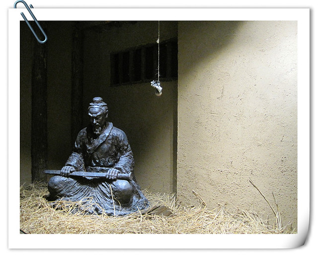

**第一天（2月25日）：郑州火车站——西安火车站 秦始皇兵马俑博物馆 秦始皇帝陵遗址公园(丽山园)**

本着对肉夹馍和羊肉泡馍的向往，几年前就在心中无数次萌发去西安旅游的念头。然而，当我和hillway带着一身疲惫，用一双瞌睡的眼睛环顾着西安火车站广场的一切，置身西安城之中，却没有太多兴奋和激动的感觉，或许是因为每个城市的模样都太相似，或许是熬夜加上睡眠不足导致神经大条……

在开始游览景点之前，要先填满肚子。考虑到要在西安火车站东广场乘坐公交车去秦始皇兵马俑博物馆，便决定就近在广场附近的kfc解决早餐问题，点了两个帕尼尼和鸡肉粥，25元。

西安火车站东广场入口处有几位招揽生意的“女售票员”，热心招呼着来往游客乘坐她们的蓝色大巴车，去往秦始皇兵马俑博物馆，hillway背着背包一直往前走，让我不要理会，径直走到306路（游5）公交车上。车开后才售票，每人7元，途径华清池，每人5元。前排乘坐的情侣听到我和hillway讨论旅行安排，扭过头和我们聊天，说他们刚才差点上了“假游5”，又讲起前一天爬华山的经过，先是半夜被黑车司机扔在半路，电话报警后到达华山，由于路人错误指点又走了很长的错路，爬到北峰便坐索道下山了。看来，旅行之前还是要做足功课，才能不被蒙骗，节省费用，科学合理利用时间。

大约十点半钟，我们到达了秦始皇兵马俑博物馆前广场，迎面而来的是众多招揽生意的人，不明真实用意。景点就在眼前，这些人却朝着我们喊“走错路啦，方向错了。”我和hillway没有理会，背着背包一直往售票处走去。目前正值淡季，门票120元每人。

秦始皇帝陵博物馆门票包含两个景点：秦始皇兵马俑博物馆和秦始皇帝陵遗址公园(丽山园)。

本以为买票后很快就可以参观到传说中的场面异常震撼的秦始皇兵马俑，却要走很长一段的路，旁边是种植的是树苗和青草，像是一个单调的大公园。进入检票处后，我们看到了秦始皇兵马俑一号坑，此时游客很多，迎面走来招揽生意的导游更多。hillway带着我走向右侧广场，几位导游热情地围上来，告诉我们前面是资料馆，没有什么好看的，走进去就是出口了，要先参观一号坑，请导游带领游览才有意义之类……我和hillway没有理会，心想着，既然买门票进了博物馆，每一处藏馆反正都要参观的，先后顺序无所谓，重要的是避开大批人流。

进入参观之后，我们发现这里并不是秦始皇兵马俑博物馆的出口，也并非展示的全是书籍资料，而是一个小型博物馆。其中，“帝国之路 陇东记忆：秦文化与西戎文化考古成果展”中陈列着包括张家川回族自治县马家塬遗址出土的车辆和车马饰件在内的128组300多件文物。据推测，按马家塬出土车辆遗骸复原的“中国古代第一豪车”就是《芈月传》中义渠王的座驾，原车上镶配有很多造型精美的金饰品。

越王勾践卧薪尝胆的场景复原。《史记》记载“越王勾践返国，乃苦身焦思，置胆于坐，坐卧即仰胆，饮食亦尝胆也。”勾践数年来忍辱负重，重要的收获到苦尽甘来的结果。

展馆中陈列的还有两乘秦始皇陵铜车马，一前一后排列。据当时出土时的照片来看，破碎十分严重，特别是车身部分，经过人工修复成功。铜车马大小约为真人真马的二分之一。车马均有大量金银装饰，工艺水平非常之高，被赞为“青铜之冠”。

在这里也可以近距离隔着玻璃看到秦始皇兵马俑，只不过都是“形单影只”。站在旁边，感觉兵马俑的体型比我们现代人还要高大许多。

随后，我们来到了秦始皇兵马俑的三号坑和二号坑。

三号坑几乎处于半挖掘状态，远远望去都是波浪状的土包，并没有兵马俑可以看。旁边有很多导游围着我们招揽生意：“看文物不是看风景，七分靠讲三分靠看，既然门票都出了，就请个导游跟着好好听一听讲解吧……”

秦始皇兵马俑被发掘时都不免倒地破碎的“命运”，若要全部修复完成还需要很多一段时间。据说秦始皇兵马俑原本是彩色的，因为出土后遇到外界空气作用，就变成灰突突的了。

接下来，我们来到了最著名的秦始皇兵马俑一号坑参观，仍旧围满了游客。虽说远远望去，规模也不小，但是却没有想象中那种异常震撼的感觉。展厅的前半部分摆放的是修复完成的兵马俑，后面的场地还处于挖掘和修复过程中。

俗话说，坟前不留影，佛前不留像。秦始皇兵马俑博物馆摆放的都是当年从地下挖掘出土的陪葬品，因此也很少拍照留影。据导游介绍，这些站在前排没有穿铠甲的士兵，在战争中充当的是冲锋陷阵的“炮灰”的角色。

估计是长期间在低于地表的展馆里参观，环境异常压抑低沉，空气闷热，加之前一晚没有休息好，身体感到十分疲惫，参观过程也没有太大的动力。

从秦始皇兵马俑一号坑出来，我们坐在外面的长椅上休息，大口呼吸着外面的新鲜空气。已经到了晌午时间，肚子并不觉得饿，只是感觉累的很。hillway提议先吃过午饭再乘车去秦始皇帝陵遗址公园参观。

当我们正在寻觅秦始皇兵马俑博物馆出口处，有两个男人站在远处朝我们吆喝：“出口在这里！”我们走过去一看，原来他们并不是景区的工作人员，而是兜售秦始皇兵马俑模型的小商贩。我对这些模型没有什么兴趣，便径直走了出去。左边的道路被拦起来了，工作人员大声告诉我们要往前走。走了一段路发现，这里是一条长长的售卖各种旅游纪念品的商业街，还有一些饭馆。不管游客是否要购买东西或吃饭，总归要把这条路走完才能到达乘车返回的广场。

这条商业街也有很多招揽生意大声吆喝“biangbiang面”的饭馆，凭经验还是不进为好。沿途遇到一家麦当劳餐厅，正值星期四有微信支付满25减10元的活动，虽然景区附近不能使用优惠券，满减活动也是很给力的。我站在点餐台前思来想去，本着吃饱肚子和节省银子的考虑，分为两单，一共点了四个麦香鸡汉堡，一份薯条和一份冰淇淋，共计32.5元。

填饱肚子，我们便乘坐免费巴士去秦始皇帝陵遗址公园。一下车，有一位声音洪亮的工作人员把我们这群没有导游带领的散客叫到一起，说有专门的免费导游带我们参观，因为遗址公园面积很大，如果自己乱走，一天的时间也未必走的出来。就这样，大群的游客便跟在这位拿着小旗子的导游身后，hillway心存戒备，总觉得天下没有免费的午餐，想要自己游览。而我觉得，虽然外出旅游要谨慎一些，但也未必都是心存不轨的“坏人”，在我的强烈要求下，hillway慢慢走在队伍后面。

虽然我们在秦始皇兵马俑博物馆没有请导游，这位导游一边带路一边讲解了很多关于秦始皇帝陵和兵马俑的故事，还有西安的特产和风土人情，也算是小有收获。据导游介绍，秦始皇赵政从13岁即位时就开始营建陵园，修筑时间长达38年，整座陵区总面积为56.25平方公里（相当于78个故宫的大小)。

我在感叹秦王奢侈和劳民伤财的同时，也感叹若是日积月累持之以恒去做一件事情，若干年后才能才就这样气魄宏伟的浩大工程。秦王并非西安人，将陵墓选在此处，是因为有山有水有美玉。秦始皇陵墓至今还不曾有人偷盗挖掘，不知道这个埋藏在地下千年的古墓，到底有多少不为人知的秘密？

整个秦始皇帝陵遗址公园是动员周边村民迁移后建成的，种植了很多的松柏，一路走着，实在没有什么风景和文物可以看，除了一些路标和最后看到的刻有“秦始皇帝陵”的墓碑，从地表上看，和普通城市的绿化园区没有两样。导游说，秦始皇帝陵遗址公园(丽山园)中的文吏俑坑和陪葬坑等都已经挖掘，但是目前还未对外开放，后来，他还要带着我们经过一条卖玉器的商业街，去看望当年第一个发现秦始皇兵马俑的杨老先生，我和hillway总觉得身体疲惫，想早早回市区休息，就没有再跟着队伍走了。

仍旧是乘坐306路（游5）公交车返回西安火车站，再转公交车去西门站，hillway提前用微信预定了西安七天连锁酒店西门店的大床房（首次入住77元每晚）。和前几天开封七天连锁酒店标准间相比，房间比较拥挤，条件和配置也差了一些，而且我们入住打算休息的时候是五六点钟，耳边不停传来走路声说话声小孩的哭声，房间隔音效果很差，感觉很吵又很累。

昏昏沉沉一直睡到晚上九点多钟，临出门前在手机上找了一家团购，结果没有开门，便和hillway在附近某家清真拉面馆里吃了一碗牛肉拉面和蛋炒饭，分量很多，味道也不错，两份只要16元，看来远离景点的小街巷里，才有比较实惠的店家。吃饱肚子后，我们又继续回酒店睡觉了。
